# Not So Smart OCR

Evidence-linked OCR for structured and clinical documents. Research software, not validated for unattended clinical use.

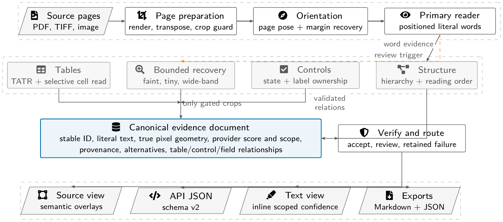

## Pipeline

`input -> orientation -> positioned OCR -> structure -> bounded specialists -> canonical evidence -> review -> UI and exports`

- Nemotron reads positioned literal text; geometry establishes tables, forms, controls, and reading order.
- TrOCR handwriting and Falcon formula readers receive only eligible source-resolution crops.
- Specialist output stays an alternative until independent evidence or human review accepts it.
- Accepted revisions replace consumed fragments once. Source boxes, raw responses, alternatives, and review state remain attached.
- Text, Markdown, Copy, and Download render the same canonical revision.

## Demo

| | |
| --- | --- |
| 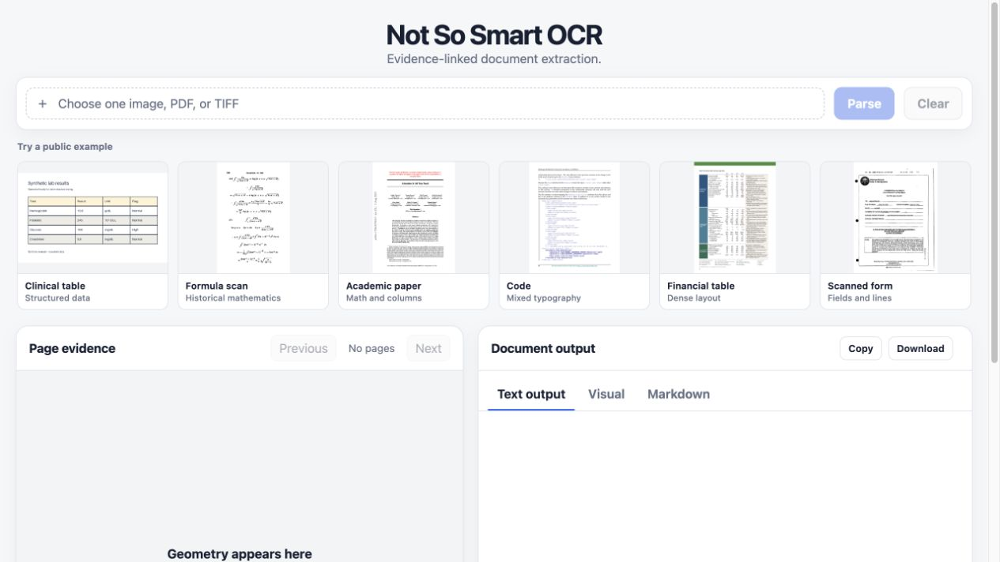 | 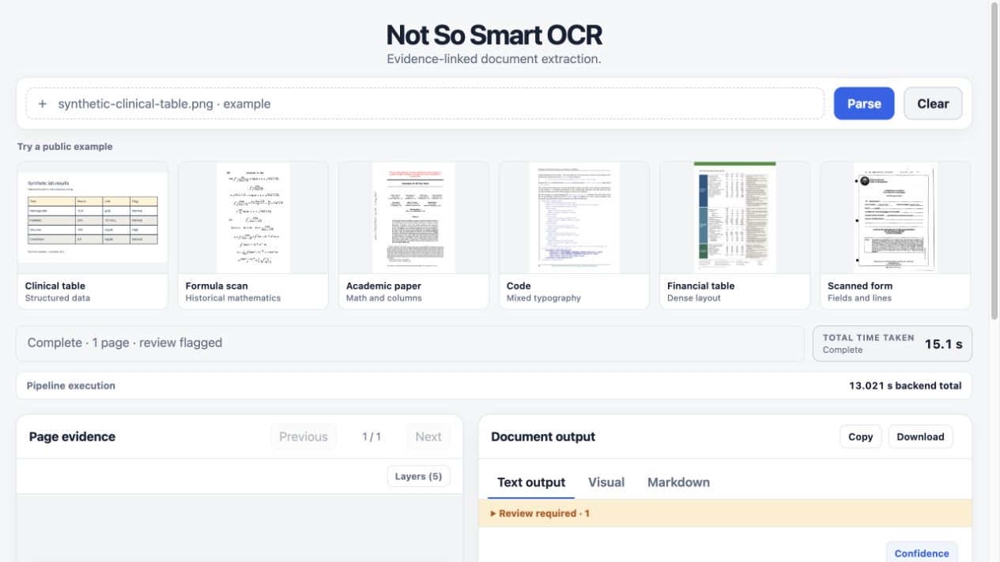 |
| 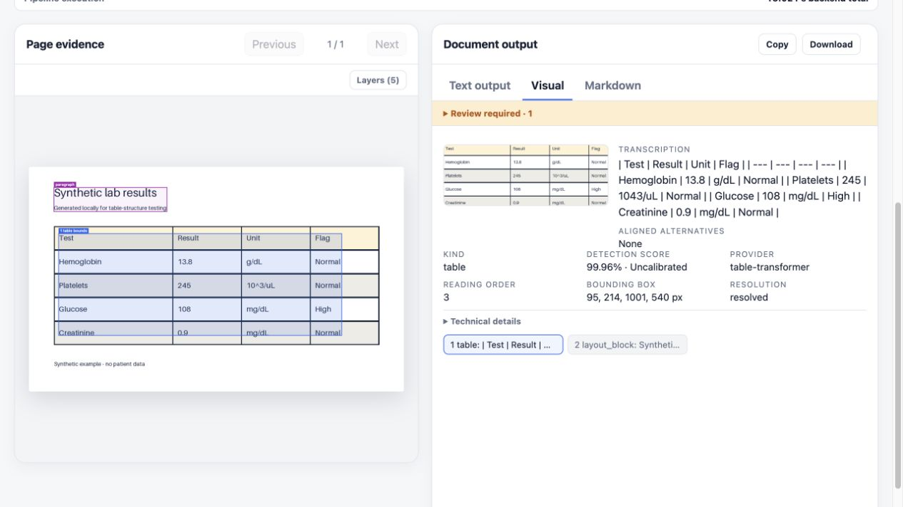 | 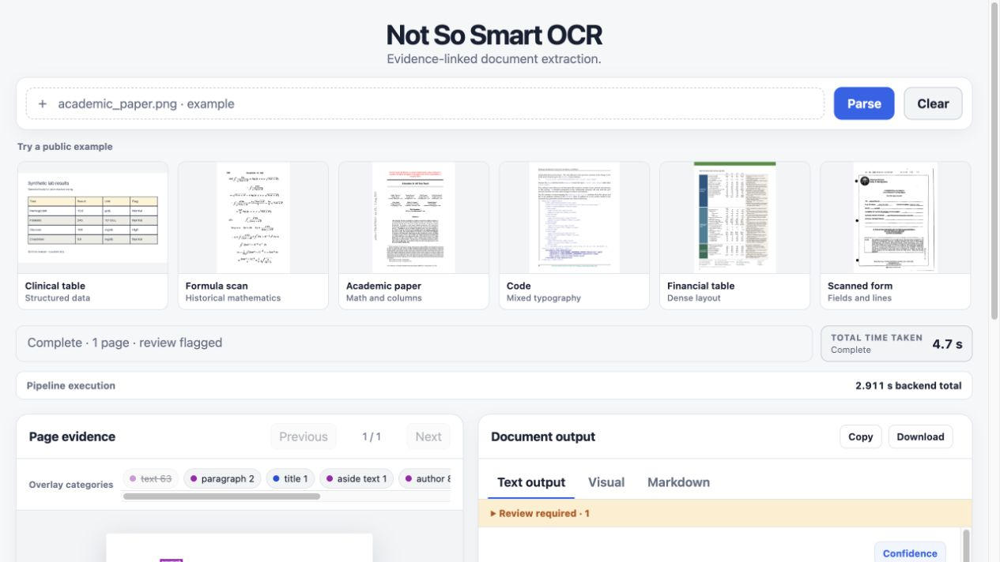 |
| 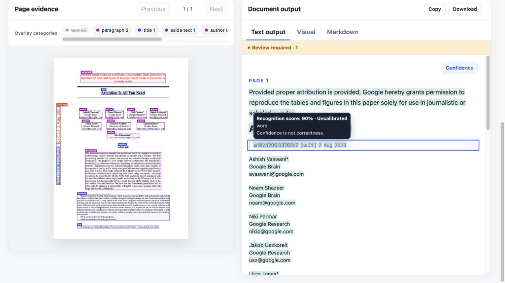 | 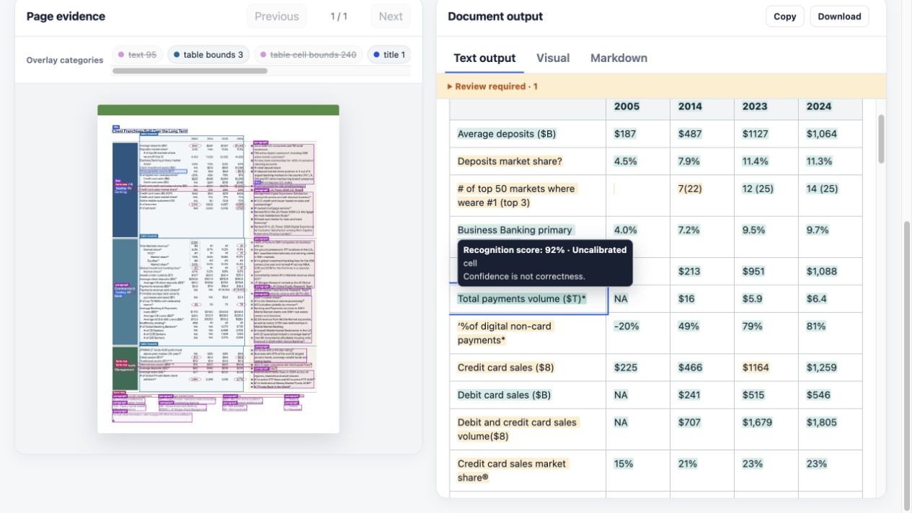 |
| 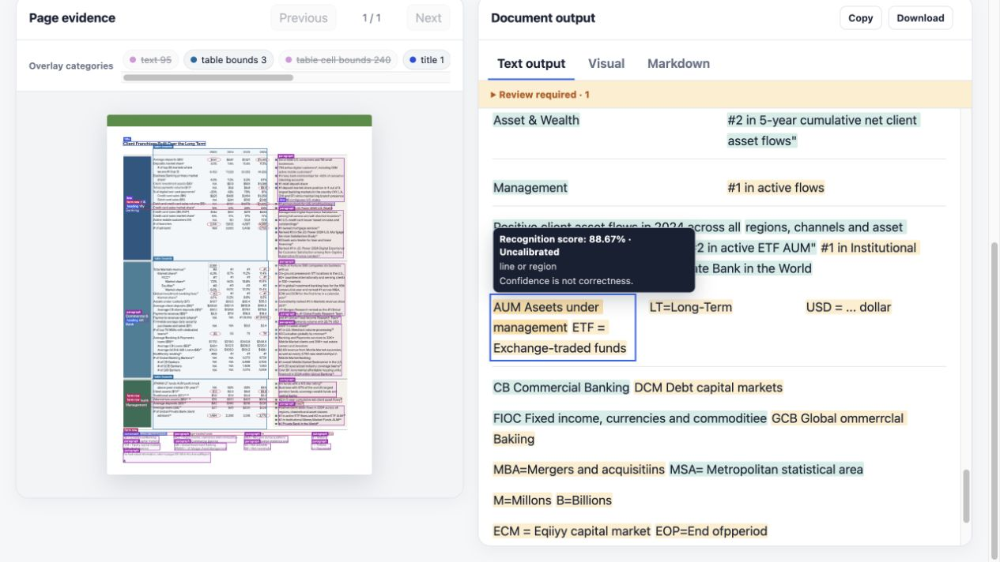 | 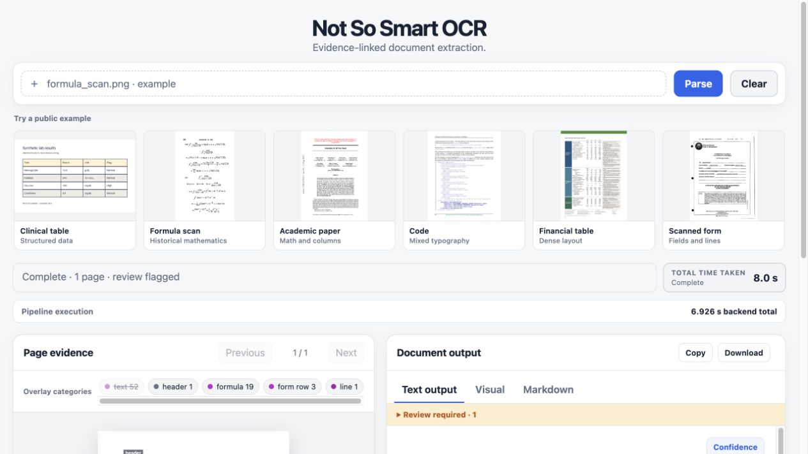 |
| 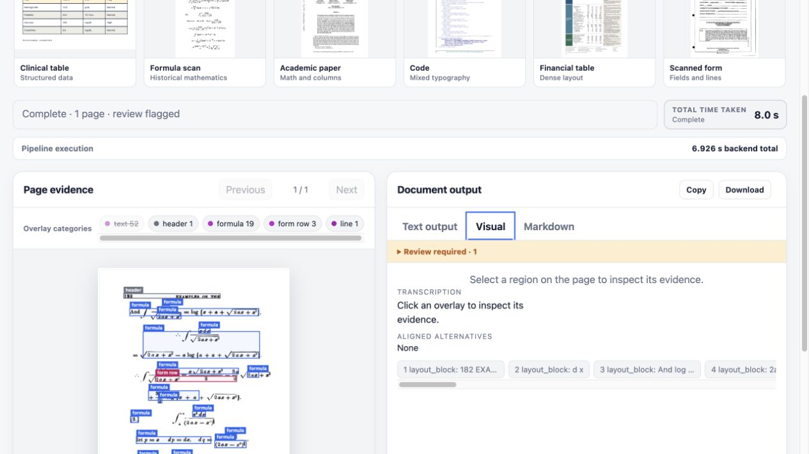 | 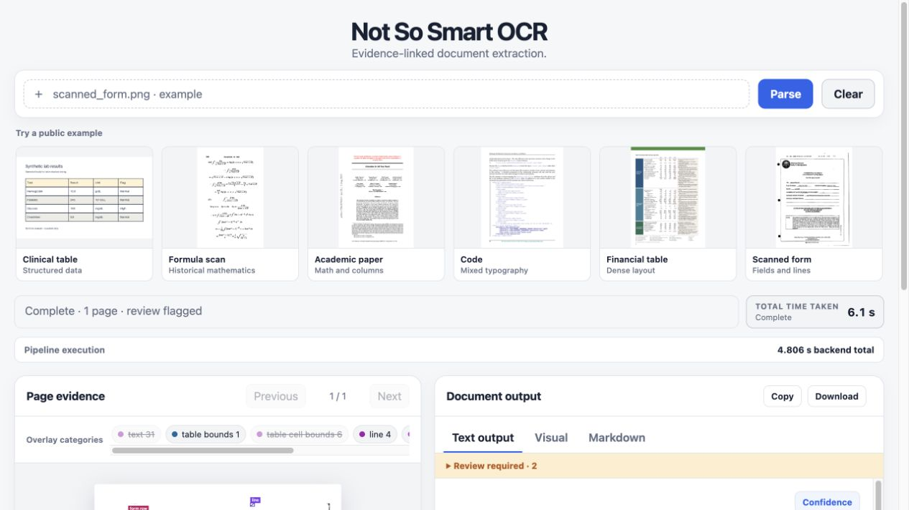 |
| 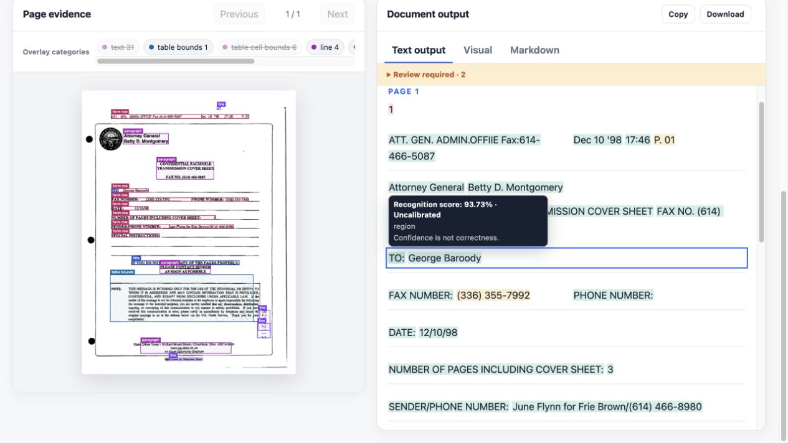 | 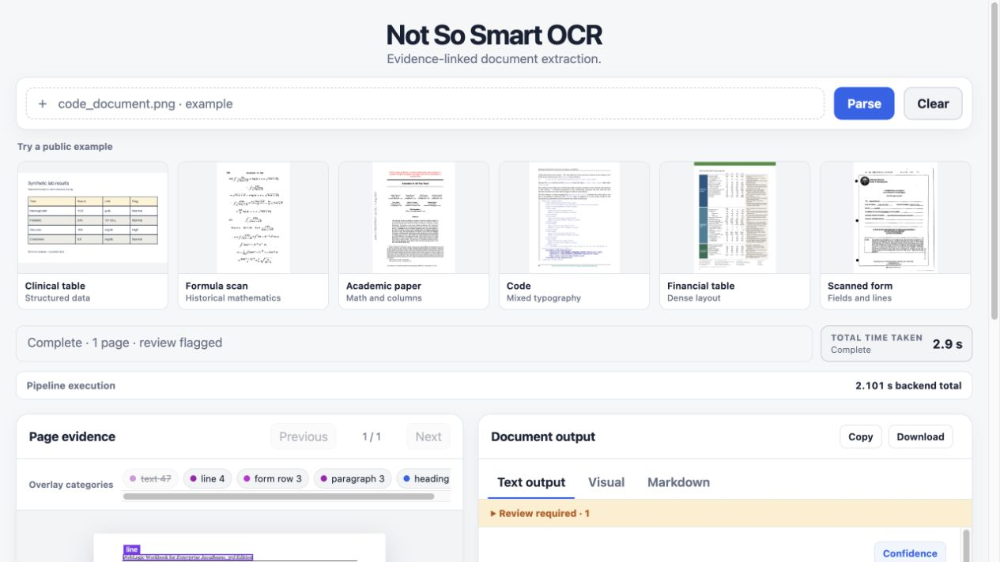 |
| 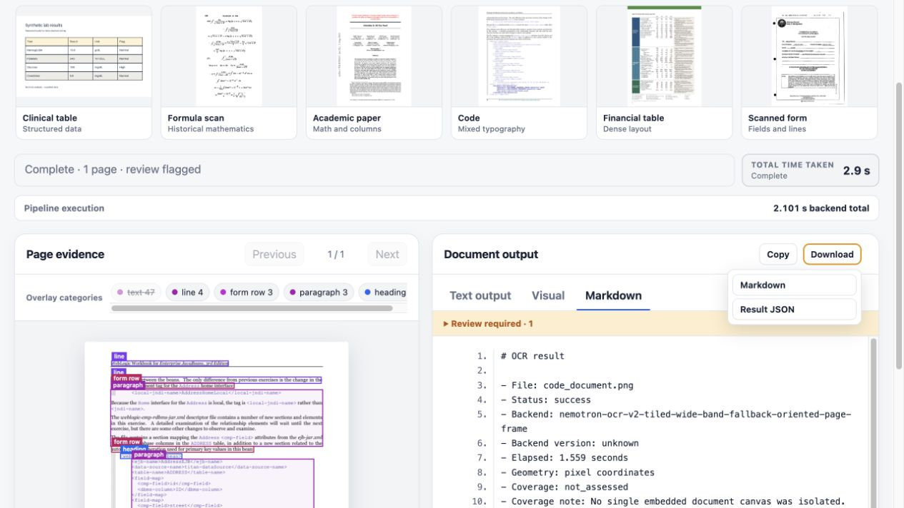 | |

## Measured limits

| Evaluation | Result |
| --- | ---: |
| Financial diagnostic cells | 187/187 exact |
| Public table structure | 60 tables, 0.977380 cell exact |
| IAM pilot, TrOCR | 3/15 exact, 6.19% CER |
| Notebook sentence, page pipeline | 20.55% CER |
| Formula source crops, Falcon | 1/5 exact |

Execution, confidence, and valid LaTeX are not counted as correct recognition. Page-level handwriting localization and handwritten mathematics remain unvalidated; formula alternatives require review.

## Run

```bash
python3 -m venv .venv
source .venv/bin/activate
python -m pip install Pillow fastapi uvicorn python-multipart
PYTHONPATH=src python -m ocr_pipeline.demo
```
