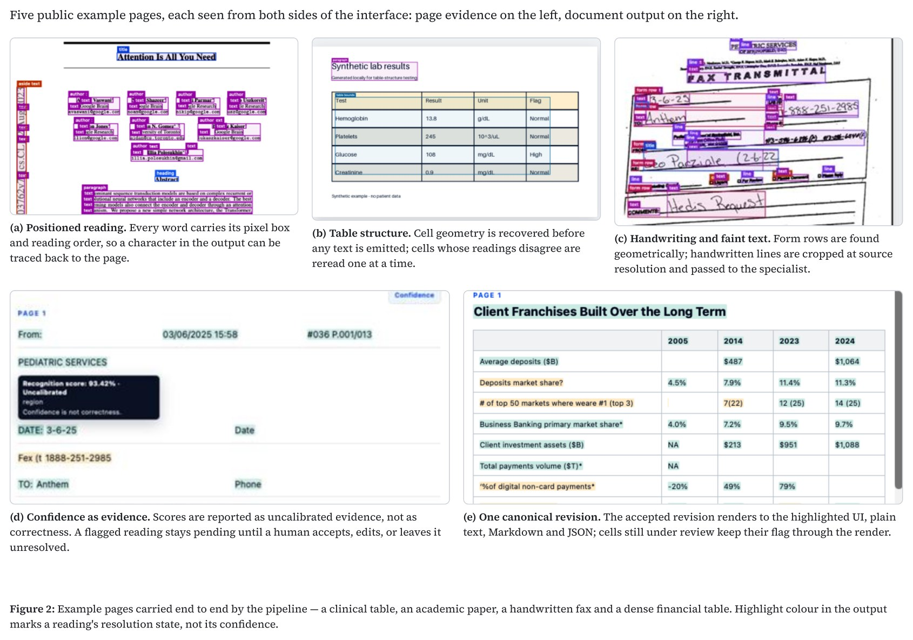

# Not So Smart OCR

Evidence-linked OCR for structured and clinical documents. Research software, not validated for unattended clinical use.


## Pipeline

Every stage reads and writes the same positioned evidence record. Specialists are asked only about eligible crops and return alternatives, never replacements, and no stage deletes a reading it did not create.

- Nemotron OCR v2 reads positioned literal text; geometry establishes tables, forms, controls, and reading order.
- TrOCR handwriting and Falcon formula readers receive only eligible source-resolution crops.
- A specialist reading stays an alternative until independent evidence or a human accepts it.
- An accepted revision supersedes what it consumes, once. Source boxes, raw responses, alternatives, and review state stay attached.
- Text, Markdown, Copy, and Download all render the same canonical revision.

## Demo



## Measured limits

| Evaluation | Result |
| --- | ---: |
| Financial diagnostic cells | 187/187 exact |
| Public table structure | 60 tables, 0.977380 cell exact |
| IAM pilot, TrOCR | 3/15 exact, 6.19% CER |
| Notebook sentence, page pipeline | 20.55% CER |
| Formula source crops, Falcon | 1/5 exact |

Execution, confidence, and valid LaTeX are not counted as correct recognition. Page-level handwriting localization and handwritten mathematics remain unvalidated; formula alternatives require review.

## Run

```bash
python3 -m venv .venv
source .venv/bin/activate
python -m pip install Pillow fastapi uvicorn python-multipart
PYTHONPATH=src python -m ocr_pipeline.demo
```
