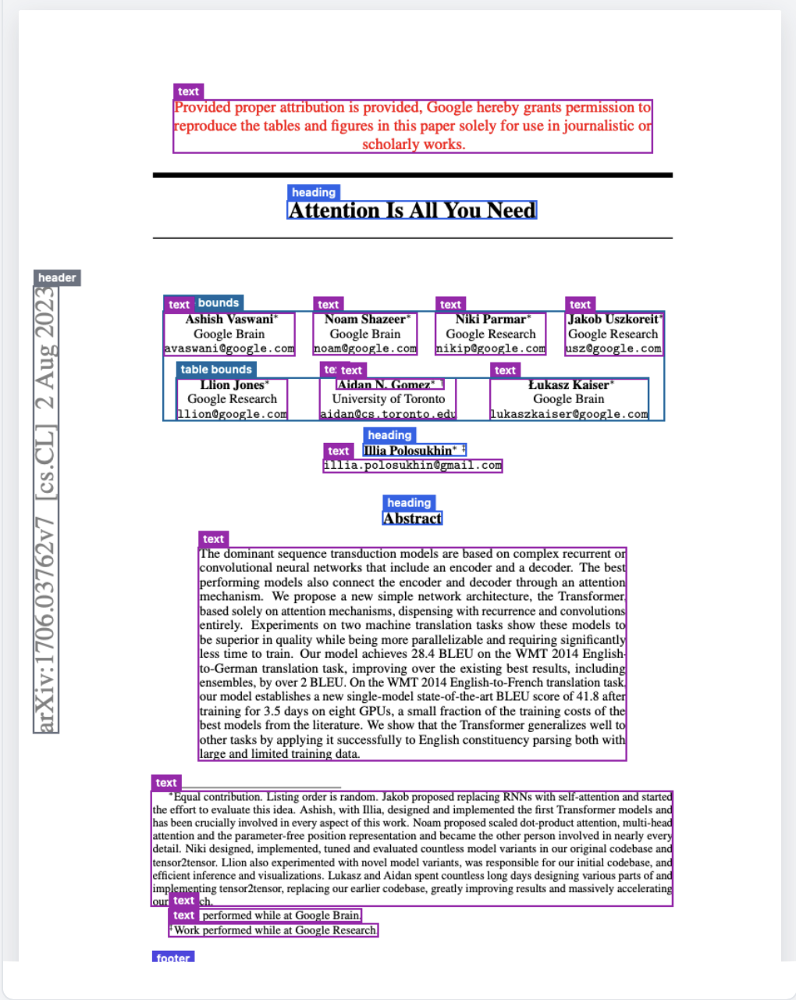
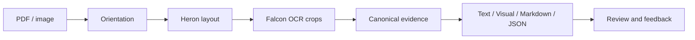

# Not So Smart OCR

**Document extraction you can inspect.**

Text · Tables · Handwriting · Formulas · Source-linked review

[Examples](#examples) · [Pipeline](#pipeline) · [Walkthroughs](#walkthroughs)

## Features

- Extract text and structure from PDFs and images.
- Inspect colored layout boxes and download full-resolution source crops.
- Review formulas, tables, images, and detected checkbox states.
- Explore text, visual, Markdown, and JSON views of the same evidence.
- Save feedback with its image and result, retaining 1,000 records locally.

## Examples

| Type | Example | View |
| --- | --- | --- |
| Paper | Attention Is All You Need | [Output](artifacts/demo/paper-ui.png) |
| Handwriting and math | Physics notes | [Output](artifacts/demo/notes-ui.png) |
| Tables | Public financial report | [Output](artifacts/demo/table-ui.png) |
| Screenshot | GSoC Final Evaluation | [Output](artifacts/demo/gsoc-ui.png) |

| Academic layout | Handwritten formulas |
| --- | --- |
|  |  |

Screenshots show actual output, including errors. Overlapping regions can still produce duplicates; handwriting, numeric fields, and reading order remain imperfect. Model scores are uncalibrated. Private documents and datasets are excluded.

## Pipeline

DocTR and Tesseract OSD provide orientation evidence. Heron detects document regions; Falcon-OCR reads their crops and generates text, table markup, and formulas. Images retain source pixels. Shared evidence drives rendering and review, with local KaTeX for math.

This is the restored Heron + Falcon route. The PP-OCRv5/Docling/TATR experiment is not active.

## Walkthroughs

1. [From an image to recognized text](docs/walkthroughs/01-from-image-to-text.md)
2. [Layout, tables, formulas, and visual elements](docs/walkthroughs/02-layout-tables-and-crops.md)
3. [Confidence, exports, and review](docs/walkthroughs/03-confidence-exports-and-review.md)

## Acknowledgements

Thank you to the teams behind [Falcon-Perception](https://github.com/tiiuae/Falcon-Perception), [Heron and Docling IBM models](https://github.com/docling-project/docling-ibm-models), [DocTR](https://github.com/mindee/doctr), [Tesseract](https://github.com/tesseract-ocr/tesseract), [Poppler](https://gitlab.freedesktop.org/poppler/poppler), and [KaTeX](https://github.com/KaTeX/KaTeX) for their open implementations and models. Their respective licenses apply.
