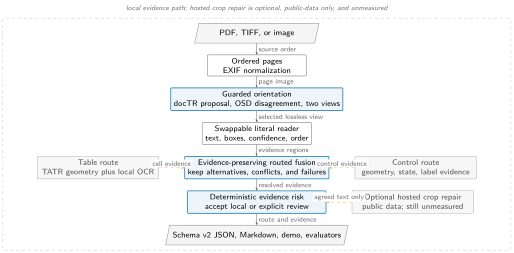
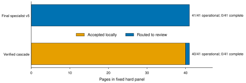

# notSoSmartOCR

An evidence-preserving OCR research pipeline for clinical and structured documents. It keeps literal text, pixel geometry, reading order, alternatives, provider provenance, and explicit failures in one swappable schema instead of flattening a page into an untraceable text blob.



## What is implemented

- Ordered PDF, TIFF, and image ingestion with EXIF normalization.
- Swappable local readers for Tesseract, NVIDIA Nemotron OCR v2, and IBM Granite Docling.
- Mindee docTR orientation proposals with OSD disagreement and two-view coverage recovery.
- Ordered region stages with schema v2 alternatives and `resolved`, `conflicting`, or `unreadable` outcomes.
- Microsoft Table Transformer detection and structure geometry with local OCR challengers.
- Review-only geometric control extraction and deterministic evidence-risk signals.
- Evidence-safe tiny-text and crop repair: new text is retained as an alternative unless independent evidence supports promotion.
- A local workbench with linked overlays, dynamic category filters, copyable
  structured JSON, stage timing, inspectable rejected structure proposals, and
  evidence-risk diagnostics that are explicitly not a calibrated probability.
- Failure-inclusive public evaluators for transcription, layout, tables, forms, controls, reading order, and multi-page structure.

Chinese-origin models and backbones are excluded from the deployable path. Paddle, GLM, Qwen, and DeepSeek remain explicit public-data comparators only.

## Run it

The lean path needs Python, Pillow, Tesseract, and Poppler `pdftoppm`.

```bash
PYTHONPATH=src python -m ocr_pipeline.cli page.png \
  --reader tesseract --output result.json

PYTHONPATH=src python -m ocr_pipeline.cli page.png \
  --reader nemotron-ocr-v2 --nemotron-language multi \
  --nemotron-merge-level paragraph --output result.json

PYTHONPATH=src uvicorn 'ocr_pipeline.demo:create_app' --factory \
  --host 127.0.0.1 --port 8080
```

Nemotron and table specialists use their official isolated GPU runtimes. The
default demo factory uses the local routed Tesseract reader. The verified GPU
workbench is assembled by `experiments/serve_gpu_demo.py` with Nemotron OCR v2,
tiny-text evidence reruns, docTR orientation, Table Transformer, controls, and
evidence-risk routing. The UI exposes that configured stack as read-only
metadata instead of offering a model picker that can silently change results.

## Measured evidence

All benchmark failures remain in the denominator. Component rows are single fixed-panel runs unless an interval is stated.

| Capability | Fixed panel | Result |
| --- | --- | --- |
| Transcription floor | ClinOCR eval, 328 pages | Tesseract: 91.2% coverage, 0.488293 CER, 0.611352 WER |
| Eligible local candidate | Same 328 pages | Nemotron selective: 86.0% coverage, 0.331423 CER, 0.417869 WER |
| Guarded orientation | ClinOCR rotated eval, 56 pages | 56/56 covered and minimum-CER view selected; case-mean CER 0.100211, WER 0.121439 |
| Table detection | PubTables-1M test, 60 tables | TATR: 1.000000 recall and 0.991736 F1 at IoU 0.50 and 0.75 |
| Table structure | PubTables-1M test, 60 tables | TATR: 0.990225 GriTS Top, 0.991262 Con, 0.984719 Loc, 0.977380 cell exact |
| Targeted table fusion | 2 reviewed financial tables, 187 cells | Nemotron 182/187; tri-source fusion 187/187 exact |
| Clear controls | 52 reviewed controls | State macro-F1 1.0000, label association F1 0.9903; dense grids remain review-only |
| Handwriting rejection | 46 reviewed clinical fields | Strict exact: PyLaia 0/46, TrOCR 1/46; both rejected |
| Private hard track | 41 generated clinical-style pages plus 3 supplied failures | 44/44 operational success, 0/44 manually complete, 44/44 review-routed |
| False-table guard | 2 supplied application screenshots | Both page-sized false tables rejected; OCR preserved and proposals retained for review |
| Tiny-text hard-track ablation | Frozen 41 clinical pages | 3,780 crop alternatives, 235 unsupported tile-only candidates, 0 promoted; primary text preserved |

On the paired 328-page ClinOCR panel, Nemotron reduced CER by 0.156870 with a 16-template-cluster 95% interval of [-0.185387, -0.113176]. This proves improvement over the Tesseract CPU floor, not over a frontier model. The guarded orientation result uses a gold-free selector, but its 56/56 minimum-CER count is a post-selection diagnostic and aggregate guarded latency is unavailable. The 187-cell table result is a targeted two-table failure panel with no repeated-run uncertainty, not a general benchmark. Operational `success` is schema completion, not correctness; the private hard track remains unsuitable for unattended use.




## Verify and reproduce

```bash
PYTHONDONTWRITEBYTECODE=1 PYTHONPATH=src \
  python -m pytest -p no:cacheprovider tests -q
ruff check src experiments tests
ruff format --check src experiments tests

MPLCONFIGDIR=/private/tmp/notso-ocr-mpl \
  python artifacts/table-cell-comparison.py
tectonic --outdir artifacts artifacts/ocr-pipeline-architecture.tex
```

Dataset revisions, licenses, and acquisition notes are in [data/README.md](data/README.md). The concise measured report, figure captions, limitations, and exact evidence paths are in [artifacts/ocr-evidence-report.md](artifacts/ocr-evidence-report.md). The expanded 44-page visual audit is summarized in [experiments/PRIVATE_HARD_CASE_EVALUATION.md](experiments/PRIVATE_HARD_CASE_EVALUATION.md). The broader research and fine-tuning plan is in [OCR_PIPELINE_RESEARCH_AND_PLAN.md](OCR_PIPELINE_RESEARCH_AND_PLAN.md).

Hosted paired baselines remain blocked until a fresh inherited `OPENROUTER_API_KEY` and exact provider pins are available. No private clinical page is sent to Jina or a hosted model. No frontier-superiority claim is made.
