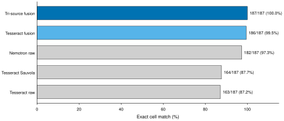

# Not So Smart OCR: evidence report

Date: 2026-09-02

## Executive result

Not So Smart OCR is now a modular, evidence-linked document pipeline rather
than a single OCR model call. It keeps literal text, pixel geometry, reading
order, structure, provider provenance, alternatives, confidence, and failures
in one ordered representation. Table, control, orientation, and handwriting
specialists can add evidence without silently replacing the incumbent reading.

The strongest measured results are:

- selective NVIDIA Nemotron OCR v2 lowers CER from 0.488293 to 0.331423 and
  WER from 0.611352 to 0.417869 versus the Tesseract floor on all 328 ClinOCR
  evaluation pages, although coverage falls from 299 to 282 pages;
- the orientation guard covers all 56 frozen rotated pages and its gold-free
  choice matches a minimum-CER cached view on all 56 cases;
- Microsoft Table Transformer reaches 0.991736 detection F1 and 0.990225 GriTS
  topology on separate 60-table PubTables panels;
- the Phi-4 handwriting adapter improves fixed C14 crop exact match from
  32/88 to 50/88 and CER from 0.401471 to 0.135294;
- every page in the 44-page private hard panel completes operationally and is
  routed to review, but none is manually complete.

The project has **not** established end-to-end superiority over a frozen
frontier model. The final claim is narrower: specialist stages improve several
fixed components while preserving evidence and exposing unresolved failures.

## System architecture

**Figure 1. Evidence survives every stage.** Solid navy arrows show the
implemented page path. The amber sidecar is an optional, user-triggered
handwriting challenger. It returns a candidate and provenance to the ordered
intermediate representation instead of overwriting the incumbent text.

The executable contract is intentionally small:

| Layer | Responsibility | Current implementation |
| --- | --- | --- |
| Page preparation | Normalize EXIF, choose orientation, preserve original coordinates | lossless page preparation plus docTR and OSD evidence |
| Literal reader | Return positioned text evidence | Tesseract floor or Nemotron OCR v2 with selective tiles and wide bands |
| Ordered IR | Carry kind, text, box, reading order, provider, alternatives, and structure | `TextRegion` in schema v2 |
| Specialist stages | Enrich existing evidence | Table Transformer, geometric controls, selected-crop Phi-4 handwriting |
| Verification | Expose missing, conflicting, or unsupported evidence | deterministic risk reasons and recorded failures |
| Rendering | Present without changing literal evidence | JSON, Markdown, layout, processed, raw, and failure views |

This structure incorporates the useful architecture recipes found in recent
document parsers while keeping model roles replaceable. The reader, each
specialist stage, verification, and rendering can be changed independently.

## Evaluation policy

All reported denominators include failed, missing, invalid, and abstained
cases unless a row explicitly describes an already-localized crop subset.
Public benchmarks, private aggregate measurements, manual review, and
literature claims remain separate.

- CER, WER, missed-character rate, and hallucinated-character rate measure
  literal transcription.
- Precision, recall, F1, mAP, GriTS, cell exact match, and label-association F1
  measure different structure tasks and are never pooled.
- p50 and p95 latency are reported only with their work unit. Crop, page, and
  table latency are not comparable.
- Every apparent hard-case success is checked against source pixels. Manual
  review diagnoses failure mechanisms but does not replace fixed denominators.
- Private pages, labels, and predictions remain local or on the authorized
  private GPU host. Only redacted aggregate evidence enters this report.

Except for the paired ClinOCR comparison, component rows are single runs of a
fixed panel and have no confidence intervals. The paired ClinOCR intervals use
16 template clusters, 10,000 bootstrap draws, and seed 0.

## Public transcription

**Figure 2. Selective Nemotron improves transcription but serves fewer
pages.** CER and WER are failure-inclusive over all 328 ClinOCR evaluation
pages. Coverage is shown alongside quality so the lower error rates cannot hide
46 unserved pages.

| Reader | Covered | CER | WER | Missed | Hallucinated | p50 | p95 |
| --- | ---: | ---: | ---: | ---: | ---: | ---: | ---: |
| Tesseract | 299/328 | 0.488293 | 0.611352 | 0.331191 | 0.027070 | 1.844 s | 5.990 s |
| Selective Nemotron | 282/328 | **0.331423** | **0.417869** | not retained in the paired summary | not retained in the paired summary | 1.862 s | 2.355 s |

The paired CER change is -0.156870 with cluster 95% interval
[-0.185387, -0.113176]. The WER change is -0.193483 with interval
[-0.223458, -0.151314]. Holm-adjusted sign-flip p-values are 0.0026 and
0.0004. This supports improvement over the Tesseract floor, not over a hosted
frontier model.

## Component results

| Capability | Fixed panel | Measured result | Decision |
| --- | --- | --- | --- |
| General forms | 50 FUNSD test forms | 50/50 covered, micro CER 0.565042, micro WER 0.790239, missed-character rate 0.236543, hallucinated-character rate 0.086457 | Tesseract-only public floor; no structure claim |
| Orientation | 56 ClinOCR rotated pages | 56/56 covered, 55/56 docTR and OSD agreement, micro CER 0.104300, micro WER 0.122360 | Keep the guard; report oracle match only as a diagnostic |
| Table detection | 60 PubTables test tables | precision 0.983607, recall 1.0, F1 0.991736 at IoU 0.50 and 0.75; one false positive; p50 38.212 ms | Keep the detector |
| Table structure | 60 PubTables test tables | GriTS topology 0.990225, content 0.991262, location 0.984719, cell exact 0.977380; 60/60 valid | Keep the structure specialist and broaden clinical validation |
| Layout | 61 OmniDocBench pages, 1,136 boxes | mAP 0.342071, AP50 0.433447, micro F1 0.688645 | Research-only baseline; several classes remain weak |
| Clear controls | 52 controls on two pages | detection 52/52 with no false positives, state macro-F1 1.0, label association F1 0.9903 | Keep as narrow review evidence |
| Table text fusion | 187 cells from two financial tables | Tesseract 163, Sauvola 164, Nemotron 182, tri-source 187 exact | Promising targeted fusion; no broad claim |

**Figure 3. Geometry-first fusion resolves the reviewed table cells.** The
chart covers exactly two tables and 187 manually reviewed cells. One targeted
run has no uncertainty interval and does not establish clinical-table
generalization.

## Handwriting adaptation

The generic handwriting models passed their public health check but failed the
clinical form distribution. On 46 reviewed private crops, PyLaia reached 0/46
strict exact and TrOCR reached 1/46, despite IAM CER of 7.60% and 5.47%.
Granite, Florence-2, Ministral, and stock Phi-4 were then compared on a matched
44-crop panel. Stock Phi-4 was the strongest candidate but still produced 23
critical substitutions and roughly 29% insertion rate.

The v4 experiment updated the released Phi-4 vision-conditioned decoder LoRA
on 356 real training fields from 68 families. Six unseen families supplied 43
resolved development fields and four abstention fields. C14 remained excluded
from training and development.

| Training property | Measured value |
| --- | ---: |
| Trainable parameters | 369,098,752 |
| Runtime-ready adapter size | about 704 MiB |
| Effective batch | 8 |
| Training time | 1,028.09 s, or 17.13 min |
| Throughput | 1.731 samples/s |
| Peak GPU memory | 18,612 MiB |
| Reported loss | 1.580020 |

On family-held development, resolved exact rises from 11/43 to 37/43 and
correct abstention rises from 0/4 to 3/4. CER falls from 2.529630 to 0.200000.

**Figure 4. The adapter improves recognition after localization.** Each arm
contains 44 native and 44 scaled C14 crop inferences. The adapter raises exact
match from 36.4% to 56.8%, lowers CER from 0.401471 to 0.135294, and lowers
hallucinated-character rate from 0.301471 to 0.044118. Missed-character rate
rises from 0.020588 to 0.029412.

The result does not measure handwriting detection, page-level recall, or
unattended safety. Native exact is 24/44, below the predeclared 36/44 adoption
threshold, and 28 of 78 critical field-view pairs still contain substitutions.
The adapter is therefore available only after a user selects an existing crop.
Its output is retained as alternative evidence.

## Hard-document behavior

Two hard tracks expose the gap between component success and useful document
parsing.

| Track | Denominator | Result | Interpretation |
| --- | ---: | --- | --- |
| Frozen private hard route | 44 pages | 44 operational successes, 0 manually complete pages, 44 review routes; p50 0.895 s, p95 4.178 s | Safe disposition improved; extraction is still incomplete |
| Challenging-formats aggregate | 169 annotated cases | 167 covered, 2 orientation failures; p50 4.504 s, p95 12.255 s | Broader distribution remains difficult |

On the 169-case track, handwriting exact recovery is 35/228 for legible spans.
The control specialist safely matches 21 of 1,521 annotated controls with
macro-F1 0.468013 on those matches. Table presence F1 is 0.862191, but
row-count accuracy is 0.017699 and column-count accuracy is 0.049242.

**Figure 5. Clean-slice success does not transfer automatically.** Clear
controls and PubTables geometry are strong, while broad clinical controls,
handwriting, and table descriptors remain weak. The panels have different
units and protocols, so they are separated rather than averaged.

The most important manual findings were:

- faint top bands and light gray rows can remain visible to a person yet be
  absent from the literal reader;
- handwritten names, dates, medications, and orders are often localized
  poorly or mixed with neighboring printed labels;
- table presence can be correct while row, column, and cell relationships are
  unusable;
- dense ruled grids create false checkbox proposals;
- rotated pages recover orientation without solving the text, controls, or
  handwriting on those pages;
- page-sized layout regions can create a plausible rendered block while hiding
  missing fine-grained evidence.

## Five-page development snapshot

**Figure 6. Selective wide-band recovery makes a small trade.** The final safe
v5 configuration slightly improves CER, WER, and hallucinated-character rate
on the same five pages, while missed-character rate rises.

| Configuration | CER | WER | Hallucinated | Missed | Completion | Warm latency |
| --- | ---: | ---: | ---: | ---: | ---: | ---: |
| Frozen baseline | 0.559161 | 0.766033 | 0.282490 | 0.146711 | not retained | not retained |
| Final safe wide-band v5 | **0.550873** | **0.760095** | **0.281256** | 0.154117 | 5/5 | p50 2.786 s, p95 6.523 s |

These values are retained only in the project README. The matching redacted
per-page result was not preserved in the tracked evidence tree, so this panel
is a development snapshot, not primary reproducibility evidence.

## Rejected and deferred routes

| Route | Measured outcome | Decision |
| --- | --- | --- |
| Automatic handwriting classifier | 18 proposals, 8 matches, 9/44 box recall, warm p50 7.497 s | Reject automatic routing |
| Phi-4 full-page challenger | Lower CER on three fully referenced pages, but 42% more insertions and p50 33.470 s | Reject as page replacement |
| GOT-OCR2.0 full-page challenger | 2/5 usable outputs, CER 2.220879, p50 268.344 s | Reject |
| Generic PyLaia and TrOCR | 0/46 and 1/46 strict exact on clinical crops | Reject |
| Research Heron layout route | mAP 0.342071 with origin-policy exclusion | Research only |
| Global thresholding | Recovered selected faint text but regressed broader transcription in development | Keep only selective, risk-triggered crops |
| Global high resolution | No fixed end-to-end measurement retained | Defer until it is paired against selective high-resolution crops |
| RLVR, OPD, checkpoint soups, vocabulary pruning | No local evidence of end-to-end benefit | Defer |

## Research ideas incorporated

The following mechanisms come from technical reports and official model
materials. They are design sources, not local benchmark results.

| Source | Reused idea | Local interpretation |
| --- | --- | --- |
| [LightOnOCR 2](https://arxiv.org/abs/2601.14251) | native-resolution vision, 2x2 spatial merge, 200 DPI and 1,540-pixel training, assistant-only loss, blank targets, deterministic output checks | selective high-resolution recovery and the handwriting training recipe; no LightOnOCR weights in the eligible path |
| [Infinity Parser 2](https://arxiv.org/abs/2607.07836) | ordered type, text, geometry, and reading order; weakness-driven data flywheel; separate text and structure rewards | `TextRegion` IR, specialist seams, and failure-cluster evaluation |
| [dots.mOCR](https://arxiv.org/abs/2603.13032) | hard-regime sampling, render-back checks, structured targets, retained general data | family-first challenge-set design and canonical rendering |
| [Phi-4 Multimodal](https://arxiv.org/abs/2503.01743) | variable-resolution image path and released vision-conditioned decoder LoRA | bounded handwriting adaptation on an A10G |
| [STRAug](https://arxiv.org/abs/2108.06949) | handwriting-specific augmentation families | mild train-only transforms, parent lineage, context-padded pairs, and blank-field abstention examples |

The design deliberately does not copy a monolithic parser. A specialist can be
replaced without changing the schema, and a better decoder can challenge a crop
without making every page pay its latency or hallucination risk.

## Claim ledger

### Supported

- The schema v2 pipeline preserves evidence and records specialist failures.
- Selective Nemotron improves ClinOCR CER and WER over the Tesseract floor.
- The orientation, PubTables, and clear-control specialists are strong on
  their stated fixed panels.
- Phi-4 adapter v4 substantially improves already-localized handwriting crops.
- Review routing removes silent acceptance on the 44-page hard panel.

### Not supported

- Frontier-model superiority.
- Unattended clinical use.
- End-to-end handwriting improvement from the adapter.
- General clinical table, control, or layout accuracy from public component
  benchmarks.
- A service-level latency, throughput, GPU-memory, or cost guarantee.

## Evidence index

- Public transcription: `experiments/results/tesseract-clinocr-v1.0-metrics-v3.json`,
  `experiments/results/nemotron-osd-selective-eval-frozen-v1.json`, and
  `experiments/results/tesseract-vs-nemotron-selective-clinocr-eval-paired-v1.json`.
- General forms: `experiments/results/tesseract-funsd-original-metrics-v4.json`.
- Orientation: `experiments/results/orientation-guard-rotated-eval-frozen-v1.json`
  and [orientation evaluation](../experiments/ORIENTATION_HARD_CASE_EVALUATION.md).
- Tables: `experiments/results/pubtables-tatr-v1.1-pub-even-60-r4.json`,
  [detection evaluation](../experiments/PUBTABLES_DETECTION_EVALUATION.md), and
  [financial fusion evaluation](../experiments/FINANCIAL_TABLE_FUSION_EVALUATION.md).
- Layout: `experiments/results/heron-omnidocbench-v1.5-balanced-61-v1-score.json`
  and [layout evaluation](../experiments/OMNIDOCBENCH_LAYOUT_EVALUATION.md).
- Controls: [checkbox evaluation](../experiments/CHECKBOX_SPECIALIST_EVALUATION.md).
- Handwriting: [generic specialist evaluation](../experiments/HANDWRITING_SPECIALIST_EVALUATION.md),
  [adapter evaluation](research/phi4_finetuning_cost.md), and
  [fine-tuning record](research/finetuning_plan.md).
- Hard cases: [private evaluation](../experiments/PRIVATE_HARD_CASE_EVALUATION.md).
- Architecture research: [model architecture review](research/ocr_model_architecture_review.md)
  and [augmentation review](research/handwriting_augmentation.md).
- Figure source and reproduction commands: [figure captions](research/figures/captions.md).

All source links were accessed on the dates recorded in their linked research
reports. Figure scripts read tracked tables or reports directly. Every figure
uses a zero baseline, vector output, and an explicit single-run or uncertainty
disclosure.
