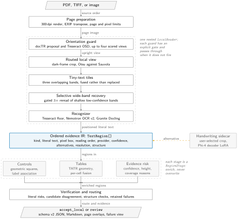
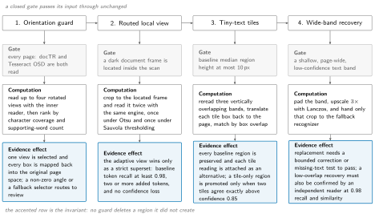
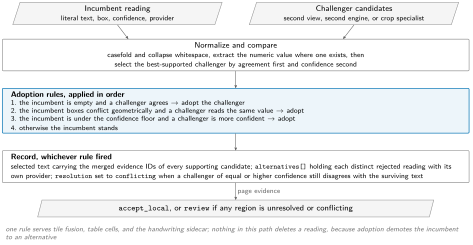
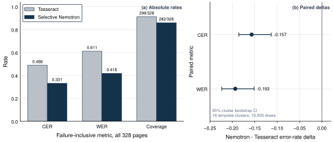
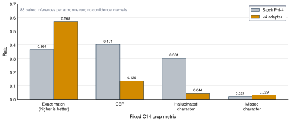
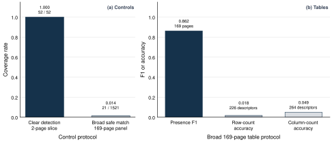
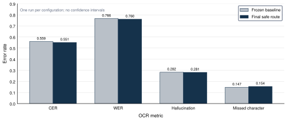

# Not So Smart OCR: An Evidence-Preserving Pipeline for Clinical and Structured Documents

Technical report, 2026-09-02.
Research snapshot; not production-ready and not a demonstration of frontier-model superiority.

Companion documents: the [evidence report](ocr-evidence-report.md) is the claim ledger with per-panel denominators, and [figure captions](research/figures/captions.md) records the source and protocol of every figure reproduced here.

## Abstract

We describe Not So Smart OCR, a document pipeline built on the premise that the useful unit of a document reading is not a string but an ordered set of evidence records, each tied to the pixels it came from.
A single intermediate representation carries literal text, pixel geometry, reading order, provider provenance, confidence, competing alternatives, a resolution state, and structure.
Every recovery mechanism and every specialist model is expressed as a transform over that representation, and none of them is permitted to delete a reading it did not create.
The result is a system in which orientation recovery, adaptive thresholding, tiny-text tiling, band-level rereads, table structure, control extraction, and handwriting transcription can each be added, measured, and rejected independently, while the failures they cannot handle stay visible in the output instead of being smoothed into plausible text.

The measured picture is mixed and reported as such.
Selectively routing NVIDIA Nemotron OCR v2 lowers character error rate from 0.488293 to 0.331423 and word error rate from 0.611352 to 0.417869 against the Tesseract floor on all 328 ClinOCR evaluation pages, at the cost of coverage falling from 299 to 282 pages.
The orientation guard covers all 56 frozen rotated pages and its gold-free choice matches a minimum-error cached view on every one.
Microsoft Table Transformer reaches 0.991736 detection F1 and 0.990225 GriTS topology on separate 60-table PubTables panels.
A Phi-4 vision-decoder LoRA raises exact match on a fixed already-localized handwriting panel from 32/88 to 50/88 and lowers character error rate from 0.401471 to 0.135294.
On a 44-page private hard panel every page completes operationally and every page is routed to review, and none is manually complete.
We do not claim end-to-end superiority over a frozen frontier model, unattended clinical usability, or general clinical accuracy for tables, controls, or layout.

## 1 Introduction

A modern document parser is usually a single vision-language model that consumes a page and emits Markdown.
That design is attractive because it is short, and it is dangerous for clinical documents for a specific reason: the output has no seam at which a reader can tell recovered text from invented text.
When a faint gray band at the top of a scanned form is silently absent, the Markdown looks complete.
When a handwritten drug name is read as a visually similar printed label three millimeters away, the Markdown looks confident.
Both failures are invisible in the artifact that downstream systems consume.

The pipeline described here starts from the opposite constraint.
The unit of output is a region: a literal string, the box it occupies in the original page's coordinate space, the provider that produced it, its confidence where the provider reports one, its position in reading order, the competing readings that were considered and rejected, and an explicit resolution state that says whether the evidence is settled.
Rendering is a projection of that record, not a separate generation step, so every character in the rendered text can be traced to the region that produced it.

That constraint has an engineering consequence that turned out to be the most valuable part of the project.
Because a stage cannot overwrite, each recovery idea has to earn its place through an explicit gate and an explicit adoption rule, and both are cheap to measure in isolation.
Adaptive thresholding, tiling, band rereads, table geometry, and a fine-tuned handwriting decoder were all added this way.
Several of them worked on the slice they were built for and failed to generalize, and the architecture made that visible rather than absorbing it.

### Contributions

1. **An ordered evidence representation** (`TextRegion`, schema version 2) that carries text, geometry, order, provenance, alternatives, resolution, and structure in one JSON-serializable record, and two protocols (`LocalReader`, `RegionStage`) that are the only contract a reader or specialist must satisfy.
2. **A gated reading stack** in which orientation selection, frame-routed adaptive thresholding, tiny-text tiling, and band-level rereads each fire on a measured condition, pass their input through unchanged when they do not fire, and record what fired in a per-page coverage assessment.
3. **One candidate-resolution rule** shared by tile fusion, table cells, and the handwriting sidecar, under which adoption demotes the incumbent reading to an alternative rather than deleting it, and an equally confident disagreement marks the region `conflicting`.
4. **Deterministic, training-free verification** over the representation: impossible and truncated dates, empty content, invalid geometry, duplicate reading order, malformed table markup, repeated-phrase loops, and exact edit-distance disagreement between candidates, all of which drive a two-valued route rather than a score.
5. **A bounded handwriting adaptation** that updates the released Phi-4 Multimodal vision-conditioned decoder LoRA on 356 real clinical fields and improves already-localized crop transcription, together with the measurement showing why it is exposed only on user request.
6. **Fixed-denominator evaluations, including the negative ones**: an automatic handwriting classifier, a full-page Phi-4 challenger, GOT-OCR2.0, generic handwriting recognizers, and global thresholding were each measured and rejected, and those results are reported at the same weight as the accepted routes.

## 2 Overview

### 2.1 Architecture



**Figure 1. Evidence survives every stage.**
The prepared page passes through one nested `LocalReader`, becomes an ordered `TextRegion[]` record, and is enriched by region stages that may add readings but never delete them.
The accented block is the intermediate representation, which is the contribution: it is the only contract shared by the reader, the specialists, verification, and rendering.
The orange dashed edge is the optional handwriting sidecar, which returns a candidate as an alternative rather than as a replacement.

The executable core is 22 modules and 11,521 lines under `src/ocr_pipeline`, with 71 test files and 49 experiment scripts around it.
`process_document(source, reader, stages=(...))` is the whole entry point.
It prepares pages, calls the reader once per page or once per batch, runs the ordered stages, restores coordinates, computes a route, and returns a `DocumentResult`.

| Layer | Contract | Current implementations |
| --- | --- | --- |
| Page preparation | Decode to an ordered page sequence without changing pixel geometry | `pdftoppm` at 300 dpi, TIFF frame split, EXIF transpose, page and pixel limits |
| Reader (`LocalReader`) | `read(image_path, page_number) -> list[TextRegion]` | Tesseract, Nemotron OCR v2, Nemotron Parse 2.0, Granite Docling, Ministral OCR, plus research-only comparators |
| Region stage (`RegionStage`) | `apply(image_path, page_number, regions) -> list[TextRegion]` | tables, controls, evidence risk, handwriting, handwriting classifier |
| Result | Pages, regions, alternatives, provenance, failures, route | `DocumentResult`, `schema_version = 2` |
| Workbench | Inspect the result without changing the model route | page overlays, evidence detail, stage timings, JSON and Markdown export |

Two optional reader capabilities are discovered by attribute rather than declared in the protocol, which keeps the required surface to a single method.
A reader may expose `read_batch` and `batch_size` to consume several pages in one call, `stage_view` to hand downstream stages a different rendering of the page than the one the caller passed, `restore_regions` to defer a coordinate transform until after the stages have run, `page_needs_review` to force review from inside the reader, and `coverage_assessment` to report what it did per page.
The orientation guard uses four of the five, which is why it can read a rotated page, let the table detector see the upright view, and still return boxes in the original page's coordinate space.

### 2.2 The evidence record

```python
@dataclass
class TextRegion:
    id: str                                 # stable per page and stage
    kind: str                               # page_text, word, table, checkbox, coverage_risk, ...
    text: str                               # literal, never normalized for display
    confidence: float | None                # None when the provider reports none
    bounding_box: BoundingBox               # original page pixel space
    reading_order: int
    provider: str                           # which component produced this reading
    text_provenance: dict | None            # tile number, crop box, model revision, merge level
    resolution: Literal["resolved", "unreadable", "conflicting"] = "resolved"
    alternatives: list[TextAlternative] = []
    structure: dict | None = None           # cells, control state, label links, risk reasons
```

Four fields carry the design.
`provider` makes every reading attributable, so a mixed page can be audited by component.
`alternatives` is where rejected readings go, each with its own provider and confidence, which is what makes a non-destructive challenge possible at all.
`resolution` is the only field a stage may use to say "I could not settle this", and it is what routing reads.
`structure` is deliberately untyped, because a table's cell grid, a checkbox's state and label links, and a coverage-risk stage's reasons have nothing in common except that they are structured facts about one region.

A `DocumentResult` holds pages, and a page holds its regions, an `EvidenceText` (the rendered string plus the ordered IDs of the regions it was built from), the reader name, the route, and the IDs of failures attributable to that page.
Failures are first-class: a `Failure` records the stage, a machine code, a message, and the page.
A document with failures but at least one clean page has status `partial`; the failures are still in the JSON.

### 2.3 Design rules

Four rules are enforced in code rather than by convention, and they explain most of the structure that follows.

**Coordinates never leave the original page space.**
Every crop, rotation, tile, and upscale is accompanied by an inverse transform applied before the region is returned.
A reader that rotates a page to read it must map boxes back; a stage that crops a band must add the offset back.
This is what allows a reviewer's overlay to be drawn on the untouched source image.

**A stage receives a deep copy.**
`_apply_stages` passes `copy.deepcopy(regions)` to each stage and only adopts the result if the stage returns without raising.
A stage that raises `ReaderError` produces a recorded `Failure` and the previous region list survives, so one broken specialist cannot destroy a page.

**Enrichment is additive.**
Stages append regions rather than replacing them, and mark superseded readings by role instead of removing them.
The table stage keeps the OCR regions it consumed, tagging them `table_source` so rendering skips them while the evidence remains in the JSON.
The tile fusion keeps every baseline region and attaches tile readings as alternatives.

**Presentation is a projection.**
`render_evidence` sorts by reading order with a stable index tiebreak, drops unresolved regions, checkboxes, and table sources, and returns the joined text alongside the IDs it used.
Nothing in the rendering path edits a region.
The Markdown renderer works on the serialized dictionary form and reconstructs headings, tables, fields, and controls, emitting unresolved and conflicting evidence as block quotes with their alternatives so a download cannot hide a disagreement.

## 3 The reading stack

This is the part of the system the rest of the report depends on, and it is where most of the engineering went.
The reading stack is not a set of preprocessing options: it is four composable readers, each wrapping the next, each with a measured gate.

Two compositions are in use, and they differ.
The local workbench runs the frame-routed Tesseract view alone.
The verified GPU composition wraps Nemotron OCR v2 at word merge level in tiny-text tiling, wraps that in selective wide-band recovery whose fallback and confirmation readers are Tesseract, and wraps the result in the orientation guard with coordinate restoration deferred until the stages have run.
The four guards are described below in the order a page meets them.



**Figure 2. Each recovery guard has an explicit gate, and a closed gate changes nothing.**
The four guards run in order inside a single reader.
The gate row states the measured condition that triggers the guard, the computation row states what it runs, and the accented row states what it is permitted to change.
No guard deletes a region it did not create; a rejected candidate is retained as alternative evidence and every fired gate is recorded in the page coverage assessment.

### 3.1 Page preparation

PDFs are rasterized with `pdftoppm` at 300 dpi under a 180-second timeout, with `pdfinfo` consulted first under a 30-second timeout when a resource limit is configured, so that a 900-page document is rejected before a renderer is started rather than after.
Three limits are available and are all enforced before decoding: maximum page count, maximum decoded pixels per page, and maximum decoded pixels for the document.
For PDFs the per-page pixel count is computed from the reported point size and the target DPI, so the check does not require rendering.
Pillow's decompression-bomb error is caught and converted into a `pixel_limit_exceeded` ingest failure rather than propagating as a library exception.

Images take a deliberately narrow path.
Multi-frame TIFFs are split into pages with each frame transposed and normalized to a safe mode.
Single images are touched only if their EXIF orientation tag is in the range 2 to 8, in which case the transposed copy is written; otherwise the original file is used unmodified.
There is no deskewing, no denoising, no contrast normalization, and no resampling at this layer.
Every enhancement that exists in the system is applied later, to a bounded region, under a gate, with the original retained.

The local workbench applies its own request limits on top of these: 25 MiB upload, 32 pages, 32 million pixels per page, and 200 million decoded pixels per document.

### 3.2 Orientation guard

The orientation guard exists because a rotated clinical page produces plausible, entirely wrong text, and because the two obvious detectors disagree often enough that trusting either alone is a measurable error.

`OrientationReader` wraps an inner reader.
On each page it normalizes EXIF orientation, then asks two independent detectors for a proposal: docTR's `mobilenet_v3_small_page_orientation` classifier at a pinned revision, and Tesseract's own orientation and script detection with a confidence floor of 15.
A confident agreement narrows the candidate set; otherwise all four of 0, 90, 180, and 270 degrees are read by the inner reader and scored.

Scoring is gold-free and deliberately crude.
Each view's regions are scored on character coverage and on the number of supporting words, capped at 50 scored words with a floor of 10 supporting words, and a coverage-recovery rule allows a view with at least twice the character coverage to win even when the confidence signal is within a 0.03 tolerance.
The winning angle, its score margin, the losing views' scores, and any view that failed to read are all written into the page's coverage assessment.

Two mechanisms make this safe for downstream stages.
`stage_view` yields the selected upright rendering of the page while stages run, so the table detector and control detector see the page the way a human would.
`restore_regions` then applies the inverse rotation to every region, including boxes nested inside `structure` payloads such as table cells and control label links, after the stages have finished.
The result is that specialists reason in upright space and the caller receives original-space geometry.

Review is forced, not inferred: a non-zero selected angle, a fallback selector, any failed view, or a nested reader that itself wants review all set the page's status to `review_recommended`.
On the frozen 56-page rotated panel the guard covers 56/56, the two detectors agree on 55/56, and the gold-free selection matches a minimum-error cached view on all 56 cases.

### 3.3 Routed local view

Adaptive thresholding recovers faint text and also invents it.
Applied globally in development it recovered selected faint bands and regressed broader transcription, which is the reason it is confined here.

`RoutedTesseractReader` first locates the document canvas: the page is downscaled to at most 512 pixels on its long side, pixels below intensity 40 are treated as dark, and a frame is accepted only when the dark ratio inside the candidate border reaches 0.85 and the enclosed area is at least 0.35 of the page.
If no framed canvas is found, the baseline reader runs on the untouched page and the assessment records `not_assessed`.
If a frame is found, the page is cropped to it and read twice with the same engine, once under Otsu and once under Sauvola thresholding, so that the only variable is the threshold.

Adoption is a strict superset test rather than a quality comparison.
The Sauvola view is selected only when the baseline's token recall in the adaptive view is at least 0.98, at least two tokens are added, the adaptive token count does not exceed 1.25 times the baseline, and mean confidence does not fall by more than 0.01.
In other words the adaptive view must contain what the baseline found and then some.
Selected regions are translated back by the crop offset, and review remains recommended for the page regardless of which view won, because both views share one engine and agreement between them is not independent corroboration.

### 3.4 Tiny-text tiling

Small type is the failure mode that a page-level engine handles worst and that a clinical form contains most.
`TiledReader` addresses it without changing the recognizer.

The gate is the baseline's own geometry: if the median region height exceeds 10 pixels the tile path never runs, and the page is returned unchanged with a `not_routed` assessment.
When the gate fires, the page is cut into three horizontal bands with a 6 percent vertical overlap on each side, so a text line falling on a boundary appears whole in at least one tile.
Each tile is read separately, or in one call when the inner reader exposes `read_batch` with a batch size above one, and every tile region is translated back into page coordinates with its tile number recorded in `text_provenance`.

Fusion is where the no-overwrite rule does real work.
Every baseline region is preserved.
Each tile candidate is matched to the best-overlapping baseline region at an overlap threshold of 0.5 and appended to that region's `alternatives` whether or not it agrees, with agreement and conflict counted separately in the assessment.
Tile candidates that match nothing are grouped by mutual box overlap at 0.75 and resolved as a group: a group is promoted to `resolved` only when it has at least two members drawn from at least two distinct tiles, their normalized text is identical, and every member's confidence is at least 0.85.
A group whose members disagree becomes `conflicting`; a group that is confident but unsupported becomes `unreadable`.
Both non-resolved cases route the page to review and are marked with the role `tiny_text_candidate`.

The per-page assessment reports preserved baseline regions, exact overlap candidates, conflicting candidates, tile-only candidates, promoted regions, and unresolved regions as separate counts, because collapsing them into one "recovered" number is exactly the information loss this stage exists to avoid.

### 3.5 Selective wide-band recovery

The most expensive recovery in the system is a second recognizer, and this is the only place it runs on the automatic path.
It sees a band, not a page.

`WideBandFallbackReader` scans the baseline for shallow, page-wide, low-confidence text: regions whose confidence is below 0.9, whose width covers at least 0.65 of the page, and whose height is at most 0.08 of the page.
Adjacent qualifying lines are grouped into a band, the band's union box is padded by 8 pixels, and the crop is upscaled by 3 times with Lanczos resampling before being handed to the fallback recognizer.
Nothing else on the page is touched, and a page with no qualifying band is returned unchanged.

The replacement gate is two branches with a shared floor, and it is the most conservative rule in the codebase.
Both branches require the fallback regions to be individually valid, to have plausible text density, and to be free of repeated-text risk.

- **Correction.** The fallback token count is at least the baseline count and at most `max(baseline + 2, ceil(1.25 * baseline))`, the character coverage ratio lies in [0.9, 1.35], text similarity against the baseline band is at least 0.6, and fallback mean confidence is at least 0.8 and at least 0.05 above the baseline.
- **Missing-text recovery.** The baseline band's mean confidence is at most 0.55, the fallback's is at least 0.8 and at least 0.15 higher, the fallback token count is between `ceil(1.25 * baseline)` and `3 * baseline`, the coverage ratio lies in [1.1, 3.0], and the baseline's token recall in the fallback text is at least 0.5.

A missing-text candidate that fails only the recall condition is not discarded and not adopted.
It becomes a confirmation candidate, and an independent confirmation reader must agree with it: recall of at least 0.98 in both directions, text similarity of at least 0.98, and exact agreement on the literal token sequence.
Only then is the band replaced, and even then the baseline reading is retained as an alternative.
If the gate fails in any branch, the baseline stands, the fallback candidate is attached as alternative evidence, and the page is routed to review.

This is the mechanism behind the final safe wide-band v5 configuration in Section 8.3, and its measured effect is small and honest: character error rate, word error rate, and hallucinated-character rate all improve slightly while missed-character rate rises, which is the expected shape for a gate tuned to refuse.

### 3.6 Recognizers and batching

Readers are interchangeable and each records its own provenance, including the pinned model revision and license where one applies.
The Tesseract floor exposes language, page segmentation mode, and thresholding method.
NVIDIA Nemotron OCR v2 supports a language variant, a word, sentence, or paragraph merge level, and native multi-page batching.
Nemotron Parse 2.0 is wrapped separately because it emits normalized region boxes in its own output grammar, which are parsed, validated for range and finiteness, and transformed into the target 1664 by 2048 space before being converted to integer page coordinates.
IBM Granite Docling can emit text or Markdown, and Ministral OCR runs at a pinned revision with its origin and license recorded in the module.

Batching is opportunistic and fails closed.
When the document has more than one page and the reader advertises `read_batch` with a batch size above one, the pipeline calls it once for all pages.
A batch that raises is converted into one `ReaderError` per page rather than failing the document, and a batch whose length or element types do not match the request is replaced wholesale with `invalid_batch_output` errors.
The same path is reused for tiles, so a batching recognizer reads three tiles in one call.

Readers whose weights are excluded from the eligible deployment path (PaddleOCR-VL, GLM-OCR, and the direct GLM-OCR variant) are reachable only behind an explicit `--public-comparator` flag on the command line, and the flag's absence is a hard argument error rather than a warning.

## 4 Region stages

### 4.1 Tables

The table stage builds structure while retaining every OCR region it consumed.
Detection and structure recognition both come from Microsoft Table Transformer at pinned revisions, using the unchanged official postprocessing from a pinned source revision rather than a local reimplementation.

Detected tables are sorted top-to-bottom and left-to-right and filtered before use.
A candidate is rejected and recorded as a `table_candidate` diagnostic region, not silently dropped, when it duplicates another detection at 0.98 containment, or when it covers more than 0.65 of the page while having fewer than 3 rows, fewer than 3 columns, or fewer than 9 cells.
That last rule is the guard against the failure mode in which a dense ruled form is detected as one page-sized table and a plausible but useless grid is rendered over the whole page.

Cell text is assembled from the incumbent OCR regions assigned to each cell by span grid, and then optionally challenged.
A `TableChallenger` pairs a name with a reader, a scope of `table` or `page`, and an optional image preparation function, and up to four challengers run in parallel threads when enabled.
The shipped GPU composition configures two of them, both reading the table crop with Tesseract at page segmentation mode 3, the second under Sauvola thresholding, so the only variable between them is the threshold.
Each cell is then resolved by the shared rule in Section 4.6, and the consumed regions are marked `table_source` so that rendering does not print the same text twice while the JSON keeps both the cell and its sources.

The tri-source result quoted in Section 8.2 is an offline experiment rather than the shipped configuration.
On the two-table, 187-cell financial fusion panel, single sources reach 163 exact cells (Tesseract), 164 (Sauvola), and 182 (Nemotron), and fusing all three reaches 187.
That is one targeted run on one panel with no uncertainty interval, and it does not generalize to clinical tables, where Section 8.3 shows row and column descriptors remaining unusable.

### 4.2 Controls

Checkboxes and radio buttons are extracted geometrically with OpenCV rather than by a model, because the shapes are simple, the recall requirement is high, and a geometric detector is auditable.

Square proposals come from morphological analysis of the binarized page.
Proposals are deduplicated, and dense input grids are removed as a class: a run of equally sized, evenly spaced squares that forms a ruled entry field is rejected rather than reported as a row of unchecked boxes, which was the largest source of false positives on ruled clinical forms.
Marks inside a slot are classified by connected-component shape rather than by ink coverage alone, so a printed character that happens to fall inside a box is not read as a tick.

Labels are associated by geometry: the nearest readable text region is linked, its ID recorded in `label_evidence_ids`, and the label region is suppressed at render time so the control's line reads as one item.
A detection whose selection is not supported by an independent signal is retained but not asserted.

On the two-page, 52-control clear panel the detector reaches 52/52 with no false positives, state macro-F1 of 1.0, and label-association F1 of 0.9903.
On the broad 169-case panel the same detector safely matches only 21 of 1,521 annotated controls, with macro-F1 of 0.468013 on those matches.
Both numbers are real, they measure different protocols, and Section 8.3 keeps them apart.

### 4.3 Evidence risk

`EvidenceRiskStage` changes no text.
It reads the page's primary text regions and emits at most one additional `coverage_risk` region, always with `resolution="unreadable"`, whose `structure` names the reasons and the metrics behind them.

Four reasons are computed: mean confidence below 0.75; a table present on the page while mean confidence is below 0.92; a median glyph height of at most 10 pixels combined with mean confidence below 0.9; and at least two regions whose height is at least twice the median while their confidence is below 0.8.
The last is the signal for a page where the engine merged several lines into one oversized low-confidence block, which reads as fluent text and is usually wrong.

Because the stage emits an unresolved region, it routes the page to review through the same mechanism as any other unresolved evidence, with no separate scoring path.

### 4.4 Handwriting sidecar

The handwriting stage is the only component in the system that is deliberately not on the automatic path, and the reason is measured rather than cautious.
An automatic handwriting classifier was built, evaluated, and rejected: on the 44-crop panel it produced 18 proposals with 8 matches and 9/44 box recall at a warm p50 of 7.497 seconds, which is not a usable localizer.
Without localization, an accurate crop recognizer cannot improve a page.

What ships is a reread of a region a reviewer has already selected.
`HandwritingStage.review_region` marks one region as a manual candidate, checks eligibility, and transcribes it; `apply` will process at most 8 eligible regions per page, ordered by ascending confidence.
Eligibility is narrow: the region's kind must be handwriting, text, or word, it must carry bounded geometry, and roles that indicate a table source, a control, or a coverage risk are excluded.

Two views are cut per region, a tight crop and a crop padded by 12 pixels of context, and both are transcribed in one batch.
Two views exist because a tight crop loses the diacritics and descenders that fall outside a detector's box, while a padded crop pulls in neighboring printed labels; disagreement between them is itself a signal.
The reader may return an abstention token, `<no_handwriting>` or `<unreadable>`, which is treated as a valid answer rather than an empty string.

Adoption is bounded on both sides.
The incumbent text is capped at 64 characters and the candidate at 96, so the stage cannot rewrite a paragraph from a field-sized crop.
A candidate that is a literal rejection of the incumbent, or that lacks independent support from the second view, is retained as an alternative and the region is marked for handwriting review rather than replaced.
Crop provenance, including both boxes and the model's own provenance dictionary, is recorded on the alternative.

Adapter weights stay on the authorized private GPU host and outside Git, the service binds to loopback, and crop bytes remain in memory.

### 4.5 Evidence-scoped repair

A separate, optional cascade exists for the case where a hosted model is permitted, and it is built so that the model cannot do anything except replace text in regions it was explicitly authorized to touch.

`identify_risky_regions` computes deterministic reasons per region: empty content in a region whose kind is not a non-text visual, invalid or out-of-page geometry, duplicate or out-of-range reading order, malformed or non-rectangular HTML table markup, a repeated-phrase loop, and the literal date risks of Section 5.1.
`build_patch_request` then emits an authorized region list, and `apply_region_patches` refuses a patch that names an unauthorized ID, duplicates an ID, carries an unsupported field, supplies empty text, or attempts to change `kind`, `bounding_box`, or `provider`.
Only four reason codes are patchable at all: empty content, malformed table markup, non-rectangular table markup, and repeated text.

The result is checked rather than trusted.
`regions_have_fewer_risks` requires the post-patch reason set for each patched region to be a strict subset of its pre-patch set, so a patch that trades one risk for another is rejected.
An optional independent verifier model, required to differ from the repair model, can be required to agree before a patch is kept.
Private pages never enter this path.

### 4.6 One resolution rule



**Figure 3. Adoption demotes the incumbent; it never erases it.**
One ordered rule set decides whether a challenger reading replaces the surviving text, and the same rule serves tile fusion, table cells, and the handwriting sidecar.
Whichever branch fires, the record keeps the merged evidence IDs of every supporting candidate, every distinct rejected reading, and a `conflicting` marker when an equally confident challenger still disagrees.

Candidates are first normalized by casefolding and whitespace collapse, and a numeric value is extracted where the text contains one, so that `1,234` and `1234` agree and `1,234` and `1.234` do not.
The best-supported challenger is chosen by agreement first: if all non-empty challengers normalize to one string, or all parse to one value, they are treated as agreeing and the least noisy rendering of that value wins; otherwise the most confident challenger is selected and agreement is false.

Adoption then applies in order.
The challenger is adopted when the incumbent is empty and the challengers agree; when the incumbent's own regions conflict geometrically and a challenger reads the same value; or when the incumbent is below the 0.9 confidence floor and the challenger is more confident.
Otherwise the incumbent stands.

Whatever the outcome, the record keeps the union of supporting evidence IDs, the full set of distinct alternatives, and a `conflicting` resolution when the incumbent survived while a challenger of equal or higher confidence read something genuinely different.
`conflicting` is what routes the page to review, so a strong disagreement cannot be resolved by silently preferring one side.

## 5 Verification, routing, and rendering

### 5.1 Deterministic risk signals

Verification is training-free on purpose: a learned confidence model would need calibration data from the same clinical distribution the system cannot yet read.

Date handling is the one content-specific check, because a wrong date is both common and consequential.
Two patterns are matched: a bare three-part date token, and a date following a recognized label such as date of birth, visit date, or reported date.
A four-digit-first date must have short month and day fields or it is an invalid shape; a two-digit-first date is accepted if either the month-day or the day-month reading is a real calendar date, which avoids flagging ambiguous but valid formats.
A labeled value that is not a complete date token and either ends in a separator or has fewer than two separators is reported as a truncated labeled date.
Nothing is corrected; the region keeps its literal text and gains a reason.

Repeated-phrase detection catches decoder loops.
The region's word tokens are scanned for any phrase of 2 to 32 tokens that repeats three times consecutively, with single-token-vocabulary phrases excluded so that a row of repeated separators is not flagged.
Table regions are exempt because a legitimate table can repeat a header.

HTML table markup is parsed rather than pattern-matched.
A region whose text contains a table element is parsed as XML; a parse error or a wrong root is `malformed_html_table`, a non-positive or non-integer span is malformed, and rows of differing total column span are `non_rectangular_html_table` unless a rowspan greater than one explains the difference.

### 5.2 Disagreement measurement

Character-level disagreement uses an exact bit-parallel Levenshtein distance, which is what allows candidate comparison over full clinical pages to be cheap enough to run on every region.
`normalized_edit_distance` divides by the longer input, and `consensus_scores` returns each candidate's mean disagreement with all others, which is the primitive behind multi-candidate agreement checks.

A separate `edit_counts` routine returns insertions, deletions, and substitutions from one deterministic minimum-cost alignment, with common prefixes and suffixes trimmed first and ties broken in a fixed order of substitution, then deletion, then insertion.
The distinction matters for reporting: hallucinated-character rate and missed-character rate are derived from insertions and deletions separately, and a single edit-distance number cannot separate a model that invents text from one that drops it.

### 5.3 Routing

The route is two-valued and computed from evidence, not from a threshold on a score.
A page is routed to `review` if it accumulated any failure, if the reader itself asks for review, or if any region needs review.
A region needs review when its resolution is not `resolved`, when a handwriting review flag is set in its structure, when any of its table cells is unresolved, or when any of its alternatives differs from its selected text after normalization.
A document's status is `success` with no failures, `partial` when some pages are clean, and `failed` when none is.

The consequence is worth stating plainly, because it is the honest reading of Section 8.3: on hard clinical documents the route is almost always `review`.
That is the system working as designed, and it is also the reason the system is not usable unattended.

### 5.4 Rendering

`render_evidence` produces the canonical page string and the ordered list of evidence IDs behind it.
The Markdown renderer adds a readable projection for download: inline word-level regions on the same text line are merged when their vertical overlap is at least 0.4 of the smaller height and their horizontal gap is within three line heights, headings and titles gain levels, fields become bold label and value pairs, controls become list items with their linked label text, and table cells are laid into a grid with pipes and newlines escaped.
Unresolved and conflicting regions are rendered as block quotes naming the resolution and listing the alternative readings, including per-cell disagreements inside a table with their row and column position.
Coverage-risk and rejected-table-candidate regions are excluded from the projection and remain in the JSON.

## 6 Data

Public benchmarks, private aggregates, manual review, and literature claims are kept separate throughout, and all reported denominators include failed, missing, invalid, and abstained cases unless a row explicitly describes an already-localized crop subset.

### 6.1 Public benchmarks

- **ClinOCR-Bench v1.0**, all 328 evaluation pages, for literal transcription, plus a frozen 56-page rotated subset for the orientation guard.
- **FUNSD**, 50 test forms, as a general-forms transcription floor with no structure claim.
- **PubTables-1M**, two separate 60-table test panels, one for detection and one for structure.
- **OmniDocBench**, 61 pages and 1,136 boxes, for layout, treated as research-only.

### 6.2 Private panels

Three private panels are used and none of their pixels, labels, or predictions leave the local machine or the authorized private GPU host.
A frozen 44-page hard route measures operational disposition.
A 169-case challenging-formats panel with 1,521 annotated controls and 228 legible handwriting spans measures the broad clinical distribution.
A five-page development panel is used for configuration snapshots and is explicitly not primary reproducibility evidence, because its redacted per-page artifact was not retained in the tracked evidence tree.

### 6.3 Handwriting adaptation data

Training used 356 real clinical fields drawn from 68 families, with six unseen families held out to supply 43 resolved development fields and 4 abstention fields.
The C14 evaluation family was excluded from both training and development.
Augmentation followed handwriting-specific families rather than generic image transforms, applied to the training split only, with parent lineage retained, context-padded pairs generated to match the two-view inference path, and explicit blank-field examples included so that abstention is a learned output rather than an empty generation.

## 7 Handwriting adapter training

Generic handwriting recognizers passed their public health check and failed the clinical distribution.
On 46 reviewed private crops, PyLaia reached 0/46 strict exact and TrOCR reached 1/46, despite IAM character error rates of 7.60 percent and 5.47 percent respectively.
Granite, Florence-2, Ministral, and stock Phi-4 were then compared on a matched 44-crop panel; stock Phi-4 was the strongest candidate and still produced 23 critical substitutions with roughly a 29 percent insertion rate.

The v4 experiment updated the released Phi-4 Multimodal vision-conditioned decoder LoRA rather than training a new adapter, following the released model's variable-resolution image path.

| Training property | Measured value |
| --- | ---: |
| Trainable parameters | 369,098,752 |
| Runtime-ready adapter size | about 704 MiB |
| Effective batch | 8 |
| Training time | 1,028.09 s (17.13 min) |
| Throughput | 1.731 samples/s |
| Peak GPU memory | 18,612 MiB |
| Reported loss | 1.580020 |

On family-held development, resolved exact match rises from 11/43 to 37/43, correct abstention rises from 0/4 to 3/4, and character error rate falls from 2.529630 to 0.200000.

## 8 Results

Except for the paired ClinOCR comparison, every component row is a single run of a fixed panel and carries no confidence interval.
The paired ClinOCR intervals resample 16 template clusters with 10,000 bootstrap draws at seed 0, and are intervals on the error-rate delta, not repeated-inference uncertainty.

### 8.1 Public transcription



**Figure 4. Selective Nemotron improves transcription but serves fewer pages.**
CER and WER are failure-inclusive over all 328 ClinOCR evaluation pages.
Coverage is shown alongside quality so the lower error rates cannot hide 46 unserved pages.

| Reader | Covered | CER | WER | Missed | Hallucinated | p50 | p95 |
| --- | ---: | ---: | ---: | ---: | ---: | ---: | ---: |
| Tesseract | 299/328 | 0.488293 | 0.611352 | 0.331191 | 0.027070 | 1.844 s | 5.990 s |
| Selective Nemotron | 282/328 | **0.331423** | **0.417869** | not retained | not retained | 1.862 s | 2.355 s |

The paired CER change is -0.156870 with a cluster 95 percent interval of [-0.185387, -0.113176], and the WER change is -0.193483 with [-0.223458, -0.151314].
Holm-adjusted sign-flip p-values are 0.0026 and 0.0004.
This supports improvement over the Tesseract floor and says nothing about a hosted frontier model.

The coverage regression is the honest cost.
Selective routing serves 17 fewer pages than the floor, and those pages are in the denominator of both error rates.

### 8.2 Components

| Capability | Fixed panel | Measured result | Decision |
| --- | --- | --- | --- |
| General forms | 50 FUNSD test forms | 50/50 covered, micro CER 0.565042, WER 0.790239, missed 0.236543, hallucinated 0.086457 | Tesseract-only public floor; no structure claim |
| Orientation | 56 ClinOCR rotated pages | 56/56 covered, 55/56 detector agreement, micro CER 0.104300, WER 0.122360 | Keep the guard; oracle match is a diagnostic only |
| Table detection | 60 PubTables test tables | precision 0.983607, recall 1.0, F1 0.991736 at IoU 0.50 and 0.75; one false positive; p50 38.212 ms | Keep the detector |
| Table structure | 60 PubTables test tables | GriTS topology 0.990225, content 0.991262, location 0.984719, cell exact 0.977380; 60/60 valid | Keep it; broaden clinical validation |
| Layout | 61 OmniDocBench pages, 1,136 boxes | mAP 0.342071, AP50 0.433447, micro F1 0.688645 | Research-only baseline |
| Clear controls | 52 controls on two pages | 52/52 detection, no false positives, state macro-F1 1.0, label association F1 0.9903 | Keep as narrow review evidence |
| Table text fusion | 187 cells, two financial tables | Tesseract 163, Sauvola 164, Nemotron 182, tri-source 187 exact | Promising targeted fusion; no broad claim |



**Figure 5. The adapter improves recognition after localization.**
Each arm contains 44 native and 44 scaled C14 crop inferences.
The adapter raises exact match from 36.4 percent to 56.8 percent, lowers CER from 0.401471 to 0.135294, and lowers hallucinated-character rate from 0.301471 to 0.044118, while missed-character rate rises from 0.020588 to 0.029412.

Native exact match is 24/44, below the predeclared 36/44 adoption threshold, and 28 of 78 critical field-view pairs still contain substitutions.
That is why the adapter is exposed only behind a user selection and why its output is retained as alternative evidence.
A warmed Phi-4 process took 0.606 s on a blank 320 by 96 crop after a 24.964 s cold load and occupied 11,646 MiB on the measured A10G; these are single-host observations, not service guarantees.

### 8.3 Hard documents



**Figure 6. Clean-slice success does not transfer automatically.**
Clear controls and PubTables geometry are strong, while broad clinical controls, handwriting, and table descriptors remain weak.
The panels have different units and protocols, so they are separated rather than averaged.

| Track | Denominator | Result | Interpretation |
| --- | ---: | --- | --- |
| Frozen private hard route | 44 pages | 44 operational successes, 0 manually complete pages, 44 review routes; p50 0.895 s, p95 4.178 s | Safe disposition improved; extraction is still incomplete |
| Challenging-formats aggregate | 169 annotated cases | 167 covered, 2 orientation failures; p50 4.504 s, p95 12.255 s | Broader distribution remains difficult |

On the 169-case track, handwriting exact recovery is 35/228 for legible spans, the control specialist safely matches 21 of 1,521 annotated controls with macro-F1 0.468013 on those matches, and table presence F1 is 0.862191 while row-count accuracy is 0.017699 and column-count accuracy is 0.049242.

The failure mechanisms found by manual review were consistent, and each maps onto a mechanism in Section 3 or 4:

- faint top bands and light gray rows remain visible to a person and absent from the literal reader, which is what wide-band recovery targets and does not always reach;
- handwritten names, dates, medications, and orders are often localized poorly or mixed with neighboring printed labels, which is precisely the localization gap the rejected classifier failed to close;
- table presence can be correct while row, column, and cell relationships are unusable, so a plausible rendered grid can hide an unusable structure;
- dense ruled grids create false checkbox proposals, which the input-grid rejection reduces rather than eliminates;
- rotated pages recover orientation without solving the text, controls, or handwriting on those pages;
- page-sized layout regions can create a plausible rendered block while hiding missing fine-grained evidence, which is why near-page tables with too few cells are rejected as diagnostics.



**Figure 7. Selective wide-band recovery makes a small trade.**
The final safe v5 configuration slightly improves CER, WER, and hallucinated-character rate on the same five pages, while missed-character rate rises.

| Configuration | CER | WER | Hallucinated | Missed | Completion | Warm latency |
| --- | ---: | ---: | ---: | ---: | ---: | ---: |
| Frozen baseline | 0.559161 | 0.766033 | 0.282490 | 0.146711 | not retained | not retained |
| Final safe wide-band v5 | **0.550873** | **0.760095** | **0.281256** | 0.154117 | 5/5 | p50 2.786 s, p95 6.523 s |

These values are retained only in the project README, and the matching redacted per-page result was not preserved in the tracked evidence tree.
This panel is therefore a development snapshot, not primary reproducibility evidence.

### 8.4 Efficiency

Latency is reported only with its work unit, and crop, page, and table latencies are not comparable.
Table detection runs at a p50 of 38.212 ms per table.
The Tesseract floor reads a ClinOCR page at p50 1.844 s and p95 5.990 s; selective Nemotron reads one at p50 1.862 s and p95 2.355 s, so the selective route is close to the floor at the median and markedly tighter in the tail.
The frozen private hard route completes a page at p50 0.895 s and p95 4.178 s, and the broader challenging-formats panel at p50 4.504 s and p95 12.255 s.
No service-level latency, throughput, GPU-memory, or cost guarantee is established by any of these numbers.

## 9 Ablations and rejected routes

The rejections are the most informative part of the record, because each one is a mechanism that looked correct and did not survive a fixed denominator.

| Route | Measured outcome | Decision |
| --- | --- | --- |
| Automatic handwriting classifier | 18 proposals, 8 matches, 9/44 box recall, warm p50 7.497 s | Reject automatic routing |
| Phi-4 full-page challenger | Lower CER on three fully referenced pages, but 42 percent more insertions and p50 33.470 s | Reject as a page replacement |
| GOT-OCR2.0 full-page challenger | 2/5 usable outputs, CER 2.220879, p50 268.344 s | Reject |
| Generic PyLaia and TrOCR | 0/46 and 1/46 strict exact on clinical crops | Reject |
| Research Heron layout route | mAP 0.342071 under an origin-policy exclusion | Research only |
| Global thresholding | Recovered selected faint text and regressed broader transcription | Keep only selective, risk-triggered crops |
| Global high resolution | No fixed end-to-end measurement retained | Defer until paired against selective high-resolution crops |
| RLVR, OPD, checkpoint soups, vocabulary pruning | No local evidence of end-to-end benefit | Defer |

Two of these shaped the architecture directly.
The full-page challenger results are why every heavier recognizer in the system is scoped to a crop or a band: on the pages where it helped it also inserted 42 percent more characters, and a page-level replacement has no seam at which that trade can be inspected.
The classifier result is why the handwriting specialist is user-triggered: a crop recognizer that is accurate after localization cannot improve a document when the localizer recalls 9 boxes out of 44.

## 10 Scope and limitations

### Supported

- The schema v2 pipeline preserves evidence across stages and records specialist failures rather than hiding them.
- Selective Nemotron improves ClinOCR CER and WER against the Tesseract floor, with paired cluster intervals excluding zero.
- The orientation guard, the PubTables detection and structure specialists, and the clear-control specialist are strong on their stated fixed panels.
- The Phi-4 adapter v4 substantially improves already-localized handwriting crops.
- Review routing removes silent acceptance on the 44-page hard panel.

### Not supported

- Frontier-model superiority. No frozen frontier baseline was beaten end to end.
- Unattended clinical use. Every page of the hard panel routes to review, and none is manually complete.
- End-to-end handwriting improvement. The adapter is measured after localization, and localization is the unsolved step.
- General clinical table, control, or layout accuracy. The strong public component numbers do not transfer to the broad clinical panel.
- Any service-level latency, throughput, GPU-memory, or cost guarantee.

### Known weaknesses in the mechanisms themselves

The wide-band gate is tuned to refuse, so it trades missed characters for fewer hallucinated ones; on the five-page panel that trade is visible as a missed-character rate rising from 0.146711 to 0.154117.
The routed-view test requires the adaptive reading to be a near-superset of the baseline, which means it cannot fix a baseline that read the wrong thing confidently.
Tile promotion needs two tiles to agree, so a line that appears in exactly one tile stays unresolved by construction.
The control detector's input-grid rejection reduces false proposals on ruled forms and does not eliminate them.
Near-page table rejection uses fixed area and cell-count thresholds and will reject a genuine full-page table with fewer than nine cells.

## 11 Conclusion

The claim this report supports is narrow and, we think, useful: specialist stages improve several fixed components of clinical document reading while preserving the evidence a reviewer needs and exposing the failures the system cannot handle.
The architectural bet behind that claim is that the intermediate representation, not the model, is the durable part.
Every recognizer named here can be replaced, and several already were, without changing the schema, the verification, or the review surface.

The gap between component success and useful document parsing is the honest headline.
Table geometry is near-perfect on PubTables and unusable for clinical row and column descriptors.
Control detection is perfect on 52 clear controls and safely matches 21 of 1,521 in the broad panel.
The handwriting adapter is strong on crops and cannot be used automatically because localization recalls a fifth of the boxes.
The next work that would change the top-line result is therefore not a better decoder: it is handwriting and faint-text localization, measured on the same fixed private panels, with coverage reported next to accuracy.

## Appendix A Schema v2

```json
{
  "document_id": "example",
  "source": {"name": "example.pdf", "kind": "pdf"},
  "status": "partial",
  "schema_version": 2,
  "pages": [
    {
      "page_number": 1,
      "width": 2550,
      "height": 3300,
      "reader": "tesseract-routed-oriented",
      "route": "review",
      "text": {"value": "...", "evidence_ids": ["p1-word-1", "p1-word-2"]},
      "regions": [
        {
          "id": "p1-word-1",
          "kind": "word",
          "text": "Sertraline",
          "confidence": 0.91,
          "bounding_box": {"left": 314, "top": 902, "right": 512, "bottom": 926},
          "reading_order": 1,
          "provider": "tesseract",
          "text_provenance": {"merge_level": "word"},
          "resolution": "resolved",
          "alternatives": [
            {"text": "Sertralino", "confidence": 0.74, "provider": "tesseract-routed-tiled"}
          ],
          "structure": null
        }
      ],
      "failure_ids": ["failure-1"]
    }
  ],
  "failures": [
    {"id": "failure-1", "stage": "tables", "code": "table_image_failed",
     "message": "...", "page_number": 1}
  ]
}
```

## Appendix B Shipped thresholds

Defaults, not per-document tuning. Every value below is a module constant or a constructor default.

| Mechanism | Threshold |
| --- | --- |
| PDF render | 300 dpi; `pdftoppm` 180 s timeout; `pdfinfo` 30 s timeout |
| Workbench limits | 25 MiB upload, 32 pages, 32 M pixels per page, 200 M decoded pixels |
| Orientation | OSD confidence floor 15; detector confidence floor 0.5; direct-orientation confidence 0.9; at most 50 scored words; at least 10 supporting words; coverage-recovery ratio 2.0 at 0.03 confidence tolerance |
| Frame locator | long side at most 512 px; dark pixel below intensity 40; dark ratio 0.85; enclosed area at least 0.35 of the page |
| Routed view adoption | baseline token recall at least 0.98; at least 2 added tokens; at most 1.25 times baseline tokens; confidence loss at most 0.01 |
| Tiling | fires at median region height at most 10 px; 3 tiles; 6 percent overlap; match overlap 0.5; group overlap 0.75; promotion confidence 0.85 |
| Wide bands | confidence below 0.9; width at least 0.65 of the page; height at most 0.08 of the page; padding 8 px; 3 times Lanczos upscale; fallback confidence floor 0.8; confirmation recall and similarity 0.98 |
| Evidence risk | mean confidence 0.75; table-page mean confidence 0.92; small-text height 10 px at mean confidence 0.9; oversized-region ratio 2.0 at confidence 0.8, minimum 2 regions |
| Tables | duplicate containment 0.98; near-page area 0.65 with minima of 3 rows, 3 columns, 9 cells; low primary cell confidence 0.9; at most 4 parallel challengers |
| Handwriting | at most 8 regions per page; confidence threshold 0.75; incumbent cap 64 characters; candidate cap 96 characters; context padding 12 px |
| Repeated text | a phrase of 2 to 32 tokens repeating 3 times consecutively |

## Appendix C Reproduction

Lean local path, which needs Python, Pillow, Tesseract, and Poppler:

```bash
PYTHONPATH=src python -m ocr_pipeline.cli page.png --reader tesseract --output result.json
```

Local review workbench on loopback:

```bash
PYTHONPATH=src python -m ocr_pipeline.demo
```

GPU composition, which assembles the orientation guard, tiling, wide-band recovery, Table Transformer geometry, controls, and evidence risk:

```bash
PYTHONPATH=src python experiments/serve_gpu_demo.py --help
```

Tests and lint:

```bash
PYTHONDONTWRITEBYTECODE=1 PYTHONPATH=src python -m pytest -p no:cacheprovider tests -q
ruff check src experiments tests
ruff format --check src experiments tests
```

Figures, from `artifacts/research/figures`:

```bash
for figure in pipeline_architecture reading_stack evidence_resolution; do
  tectonic -X compile "$figure.tex" && pdftocairo -svg "$figure.pdf" "$figure.svg"
done
```

```bash
MPLCONFIGDIR=/tmp/not-so-smart-ocr-matplotlib python public_ocr_comparison.py
MPLCONFIGDIR=/tmp/not-so-smart-ocr-matplotlib python specialist_limits.py
MPLCONFIGDIR=/tmp/not-so-smart-ocr-matplotlib python handwriting_adapter_comparison.py
MPLCONFIGDIR=/tmp/not-so-smart-ocr-matplotlib python hard_panel_comparison.py
```

## Appendix D Evidence index

- Public transcription: `experiments/results/tesseract-clinocr-v1.0-metrics-v3.json`, `experiments/results/nemotron-osd-selective-eval-frozen-v1.json`, `experiments/results/tesseract-vs-nemotron-selective-clinocr-eval-paired-v1.json`.
- General forms: `experiments/results/tesseract-funsd-original-metrics-v4.json`.
- Orientation: `experiments/results/orientation-guard-rotated-eval-frozen-v1.json` and [orientation evaluation](../experiments/ORIENTATION_HARD_CASE_EVALUATION.md).
- Tables: `experiments/results/pubtables-tatr-v1.1-pub-even-60-r4.json`, [detection evaluation](../experiments/PUBTABLES_DETECTION_EVALUATION.md), [financial fusion evaluation](../experiments/FINANCIAL_TABLE_FUSION_EVALUATION.md).
- Layout: `experiments/results/heron-omnidocbench-v1.5-balanced-61-v1-score.json` and [layout evaluation](../experiments/OMNIDOCBENCH_LAYOUT_EVALUATION.md).
- Controls: [checkbox evaluation](../experiments/CHECKBOX_SPECIALIST_EVALUATION.md).
- Handwriting: [generic specialist evaluation](../experiments/HANDWRITING_SPECIALIST_EVALUATION.md), [adapter evaluation](research/phi4_finetuning_cost.md), [fine-tuning record](research/finetuning_plan.md), [proposal benchmark](research/doctr_proposal_benchmark.md).
- Hard cases: [private evaluation](../experiments/PRIVATE_HARD_CASE_EVALUATION.md) and [backend selection](research/backend_selection.md).
- Architecture research: [model architecture review](research/ocr_model_architecture_review.md) and [augmentation review](research/handwriting_augmentation.md).
- Claim ledger with per-panel denominators: [evidence report](ocr-evidence-report.md).

## Appendix E Research incorporated

Mechanisms taken from technical reports and official model materials. These are design sources, not local benchmark results.

| Source | Reused idea | Local interpretation |
| --- | --- | --- |
| [LightOnOCR 2](https://arxiv.org/abs/2601.14251) | native-resolution vision, 2x2 spatial merge, 200 dpi and 1,540-pixel training, assistant-only loss, blank targets, deterministic output checks | selective high-resolution recovery and the handwriting training recipe; no LightOnOCR weights in the eligible path |
| [Infinity Parser 2](https://arxiv.org/abs/2607.07836) | ordered type, text, geometry, and reading order; weakness-driven data flywheel; separate text and structure rewards | the `TextRegion` representation, the specialist seams, and failure-cluster evaluation |
| [dots.mOCR](https://arxiv.org/abs/2603.13032) | hard-regime sampling, render-back checks, structured targets, retained general data | family-first challenge-set design and canonical rendering |
| [Phi-4 Multimodal](https://arxiv.org/abs/2503.01743) | variable-resolution image path and released vision-conditioned decoder LoRA | bounded handwriting adaptation on an A10G |
| [STRAug](https://arxiv.org/abs/2108.06949) | handwriting-specific augmentation families | train-only transforms, parent lineage, context-padded pairs, blank-field abstention examples |

The design deliberately does not copy a monolithic parser.
A specialist can be replaced without changing the schema, and a better decoder can challenge a crop without making every page pay its latency or its hallucination risk.
