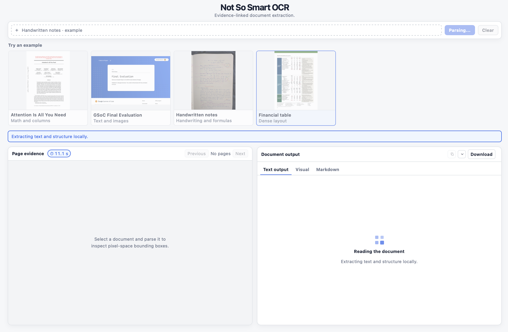
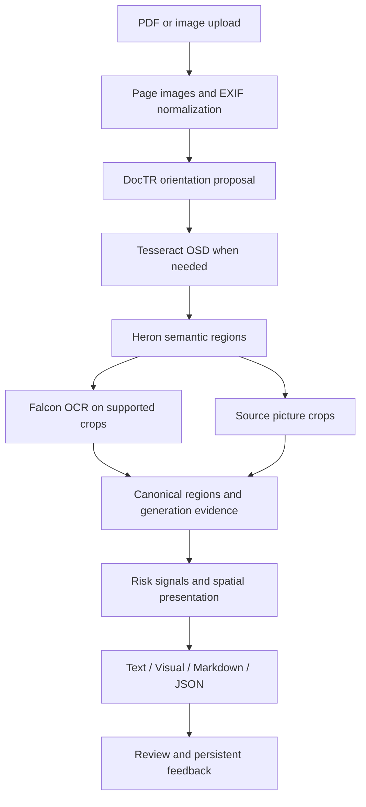

# From a photograph to a document: inside Not So Smart OCR

*Part 1 of 3 · Implementation and public sources checked on 9 September 2026*

[Examples](../../README.md#examples) · [Part 2: layout and the Falcon contributions](02-layout-tables-and-crops.md) · [Part 3: confidence and delivery](03-confidence-exports-and-review.md)

A document parser has to answer several different questions. Where is the page? Which way is it facing? Which rectangle contains a formula? What does the handwriting say? Which numbers belong in the same table row? A model can answer one of these correctly while the final document is still wrong.

Not So Smart OCR separates these responsibilities and keeps their evidence together. This series follows an image through the actual serving path, explains the upstream Falcon contributions, and ends with 50 additional engineering questions distributed across the three posts.

## 1. What the demo actually runs

The live composition endpoint reports Falcon as the primary reader, DocTR with Tesseract OSD for orientation, and two subsequent stages: `evidence-risk` and `evidence-layout`. Inspection of the serving command and its construction code confirms the following path:

| Component | Responsibility in this deployment |
| --- | --- |
| Poppler and Pillow | Produce page pixels and normalize image orientation metadata |
| DocTR | Propose a right-angle page orientation |
| Tesseract | Supply OSD evidence and selected side-margin text |
| Heron-101 | Predict document region categories and boxes |
| Falcon-OCR | Transcribe crops into text, formulas, or table markup |
| Application code | Preserve evidence, build presentation, export, and store feedback |
| KaTeX | Display mathematical notation in the browser |

The application uses a **Docling model, Heron**, without running the complete Docling document-conversion pipeline. The restored route does not execute the experimental Docling layout postprocessor, separate text-instance detector, Microsoft Table Transformer, or Docling TableFormer. Optional adapters existing in the repository do not make them active. The `word_reader` branch in [the composition code](../../experiments/serve_gpu_demo.py) controls the separate table specialist path.

## 2. Start with pixels and preserve their coordinates

A PDF upload is rendered into page images with Poppler. The default rendering resolution is 300 DPI. An image upload passes through EXIF normalization and image decoding. The system checks resource limits before treating a compressed file as a safe amount of work. A small file can expand into a very large image.

From this point onward, geometry has a declared frame: a box belongs to a particular page image. Model inputs may be resized, and the orientation stage may rotate a processing view. Those transformations must be accounted for when the result is displayed over the source. Reading the correct number and drawing its box over a different field is still a broken extraction.

For the active Falcon route, the old outer-page reread, general tiling wrapper, and wide-band fallback are bypassed. They were designed to recover gaps in the older word-detector route. Running them around a full layout reader repeated expensive work. This simplification does not remove the remaining overlap between Heron's individual region proposals. See [page preparation](../../src/ocr_pipeline/pipeline.py) and [composition](../../experiments/serve_gpu_demo.py).

## 3. Orientation is a separate prediction

DocTR's `mobilenet_v3_small_page_orientation` predicts page orientation. Our wrapper converts its result into a proposed correction angle and score. Tesseract's orientation-and-script detection, or OSD, is a second source of evidence. Neither is the transcription model. [Official DocTR implementation](https://github.com/mindee/doctr/blob/main/doctr/models/classification/zoo.py).

The active branch deliberately does **not** read all four rotations with Falcon and choose the most confident text. A generative model can assign high likelihood to fluent text from a badly oriented or ambiguous crop. That likelihood is not evidence that the page is upright.

The current selector works as follows:

1. Accept a sufficiently confident DocTR proposal. The default direct threshold is 0.9.
2. Skip OSD for a confident upright proposal. Otherwise consult OSD and its own confidence threshold.
3. Use the confident classifier angle if OSD is unavailable or agrees; use confident OSD if there is no confident classifier proposal.
4. If the available evidence conflicts or is insufficient, keep the zero-degree processing view and record orientation uncertainty.

This is explicit decision logic, not a learned fusion model. The thresholds do not guarantee correctness. Keeping an ambiguous page unchanged avoids an unsupported rotation, but may still leave it unreadable. Source-coordinate restoration and review metadata remain necessary. Right-angle orientation also does not solve arbitrary perspective distortion or curved notebook pages. The precise branch is in [`OrientationReader._candidate_angles`](../../src/ocr_pipeline/orientation.py).

## 4. Falcon is both vision-capable and specialized for OCR

Falcon-OCR is a roughly 300-million-parameter vision-language model from the Technology Innovation Institute. It consumes image patches and generates text tokens. Its training and task prompts target document transcription: ordinary text, mathematical notation, and tables. Vision-language capability describes how it processes information; OCR describes the task it is specialized to perform. Those descriptions are compatible. [Official model card](https://huggingface.co/tiiuae/Falcon-OCR).

The architecture is unusual compared with a separate vision encoder connected to a pretrained language decoder. Falcon-OCR uses **early fusion**: image patches and text tokens enter a shared Transformer. Image tokens have bidirectional attention, while output text is generated causally, conditioned on the image and preceding text. It is misleading to describe this deployment as a CLIP encoder feeding a Qwen decoder. Neither is the Falcon-OCR architecture documented by TII. [Model card](https://huggingface.co/tiiuae/Falcon-OCR).

The published Hugging Face configuration declares 22 layers, 768 model width, a 65,536-token vocabulary, 16-pixel spatial patches, and an 8,192-position maximum sequence length. Those are checkpoint configuration facts, not a promise that every native-engine setting has the same memory footprint. [Official configuration](https://huggingface.co/tiiuae/Falcon-OCR/raw/main/config.json).

The **Falcon-Perception repository** supplies the shared model and inference infrastructure, including paged inference and the OCR engine. That repository also supports perception tasks. Loading the Falcon-OCR checkpoint does not automatically give the application reliable object segmentation, signature identification, or word-level localization. Our document boxes come from Heron. [Official repository](https://github.com/tiiuae/Falcon-Perception).

## 5. From a region to a recognition request

Heron proposes a rectangle and category. The service clamps the crop to the source page, prepares its pixels, and chooses Falcon's native task prompt. A formula asks for formula content; a table asks for table content. Most ordinary text categories use the corresponding text task. Pictures retain their pixels instead of requiring a transcription.

The category changes the expected output representation. It does not select a separate set of recognition weights. The same Falcon backbone handles these tasks. Full expression crops matter because a fraction, subscript, matrix, or integral is two-dimensional. A collection of recognizable characters is not necessarily a recognizable formula. [Official prompt mapping](https://github.com/tiiuae/Falcon-Perception/blob/main/falcon_perception/paged_ocr_inference.py).

The service batches crop sequences through the native engine. Each sequence carries a request index, which maps its completion back to the originating page and detection. It checks that every scheduled request returns exactly once. This prevents output-assignment mistakes, but two overlapping detections can still schedule two different requests for the same ink. [Local service](../../experiments/serve_falcon_layout.py).

## 6. Why Nemotron was not the final serving choice

Nemotron OCR was useful in the earlier pipeline. It supplied positioned text that could support field inspection and cell assembly. NVIDIA describes its current v2 as a convolutional detector, Transformer recognizer, and relational document-structure model. It is a different decomposition from Falcon's crop-conditioned generation. [Current NVIDIA model card](https://huggingface.co/nvidia/nemotron-ocr-v2).

Our historical local investigations found that text detection and crop coverage became limiting factors on the target forms: tiny or faint entries, control glyphs, and some handwriting were missed or poorly localized. Text that never reaches recognition cannot be recovered by choosing a better output format. Recovery through tiles, wider bands, additional readers, and table specialists then increased the number of interacting paths. The current [composition code](../../experiments/serve_gpu_demo.py) still shows where those earlier mechanisms were needed.

Falcon plus Heron gave us a more direct way to read complete formula, paragraph, and table regions and retain detected controls. That is the reason for the serving choice. It is **not** evidence that Nemotron is universally inferior. The old reports also recorded improvements over a Tesseract baseline; they were not a current paired Falcon-versus-Nemotron benchmark.

The current model card distinguishes an English word-level configuration with a maximum recognition sequence length of 32 from a multilingual line-level configuration with a maximum of 128. A 32-character constraint should not be generalized across the family, and historical language flags alone do not establish which model files were loaded. The [technical companion](04-model-internals-and-hardware.md#77-how-does-nemotrons-recognition-approach-differ-from-falcons) explains the configurations and their different roles. [Current NVIDIA model card](https://huggingface.co/nvidia/nemotron-ocr-v2).

## 7. Why we restored region crops after the line experiment

The attempted replacement used text-instance detection and additional layout processing to reduce duplicate readings. It improved some repeated-label examples, but the supplied handwritten mathematics and clinical-form outputs deteriorated. Small fragments lost context; formula structure was split apart; some generated output became unreliable.

We therefore restored Heron plus Falcon on complete regions. The screenshots document that serving decision, including its remaining errors. This is a local regression finding, not a general verdict on the alternative models. A future replacement needs to improve coverage, exact content, structure, and geometry together. Reducing the number of output strings is not enough.

## Additional questions, 1-17

### 1. Why use a layout model if Falcon can read a whole page?

Region crops expose where each reading came from and let the task prompt match the content. Whole-page recognition can provide useful context, but it does not automatically provide trustworthy element boxes or complete structure.

### 2. Does the demo use embedded PDF text as the transcription?

The primary Falcon route reads rasterized page pixels. Other PDF handling code in the repository should not be confused with replacing this image-based transcription with the PDF's text layer.

### 3. Is 600 DPI always more accurate than 300 DPI?

No. Additional pixels cost time and memory, and the downstream model may resize them away. Compare the actual detector inputs, crop readability, and final errors before changing resolution.

### 4. What is the difference between rotation and deskew?

Rotation here selects among upright, sideways, and upside-down views. Deskew corrects a small angular tilt; perspective rectification handles a different geometric distortion. Success at one does not establish success at the others.

### 5. What happens if DocTR and OSD disagree?

In the active branch, conflicting confident predictions leave the page at zero correction and mark uncertainty. The application does not use Falcon's token score to break the tie.

### 6. Can Tesseract still contribute text?

Yes, the configured orientation wrapper has a side-margin reader, useful for material such as vertical margin text. That evidence has its own provenance; Falcon remains the main reader.

### 7. Is model inference sent to a hosted language-model API?

The inspected demo uses loopback services on the configured private GPU host. That is different from running entirely on the browser's computer, and different from sending documents to an external research-search service.

### 8. Does OCR require a prompt for every category?

The engine maps supported layout categories to native prompts. These are task instructions, not document-specific answers. Changing a prompt is not a guarantee that the model understands an unsupported task.

### 9. Does a smaller model necessarily need little VRAM?

No. Weights are only part of memory use. Image tokens, activations, KV cache, concurrent sequences, CUDA graphs, and other resident models can dominate deployment memory.

### 10. How much VRAM does this deployment use?

On 9 September, the live Falcon service occupied about 6,412 MiB in an `nvidia-smi` process snapshot on an A10G. It used bfloat16, a maximum crop batch of 32, and 384 cache pages. The GPU total was about 20,786 MiB because other processes were resident. This is an observed allocation, not peak end-to-end memory or proof that an 8 GB card is sufficient.

### 11. Can we derive the minimum GPU size from parameter count?

Only a weight-storage lower bound: 300 million parameters at two bytes each is roughly 0.6 GB before runtime overhead. Establish a deployment minimum by measuring peak memory on long tables, large crops, and the intended concurrency; that minimum has not been measured here.

### 12. Why use bfloat16?

It reduces storage relative to float32 and is supported by the current GPU. Numerical behavior and kernel support still need validation. The current process uses it; this series does not claim every supported dtype produces identical text.

### 13. Is the service using vLLM?

The inspected process uses Falcon's native paged inference engine. TII also documents a vLLM serving route, but availability upstream does not make it active in this deployment.

### 14. What does continuous crop batching change?

Several crops can progress through the engine together, improving utilization. Each still needs independent identity, stopping state, and output assignment. A batch is an execution strategy, not a new document region.

### 15. Can raising the output-token budget recover every missing row?

It can help a generation that stopped because of its budget, but cannot recover an omitted crop or guarantee correct structure. Context limits, model errors, and stopping behavior still apply.

### 16. Are retries independent confirmations?

No. A reread by the same model is another attempt. The service retains attempt history, and the reader treats completed retries as conflicting evidence rather than independent proof.

### 17. What would justify replacing the current reader?

A paired evaluation showing better source coverage, transcription, formulas, tables, controls, reading order, and acceptable latency. Failed pages and regressions must remain visible instead of being excluded from the comparison.

## Where to follow the implementation

[Page preparation](../../src/ocr_pipeline/pipeline.py), [orientation](../../src/ocr_pipeline/orientation.py), [Heron adapter](../../src/ocr_pipeline/heron_layout.py), [Falcon service](../../experiments/serve_falcon_layout.py), and [runtime composition](../../experiments/serve_gpu_demo.py) are the relevant entry points. Public source links above were read on 9 September 2026. Runtime observations are a snapshot of that deployment, not upstream benchmark results.

Continue to [Part 2: layout, structure, and the Falcon contributions](02-layout-tables-and-crops.md).
