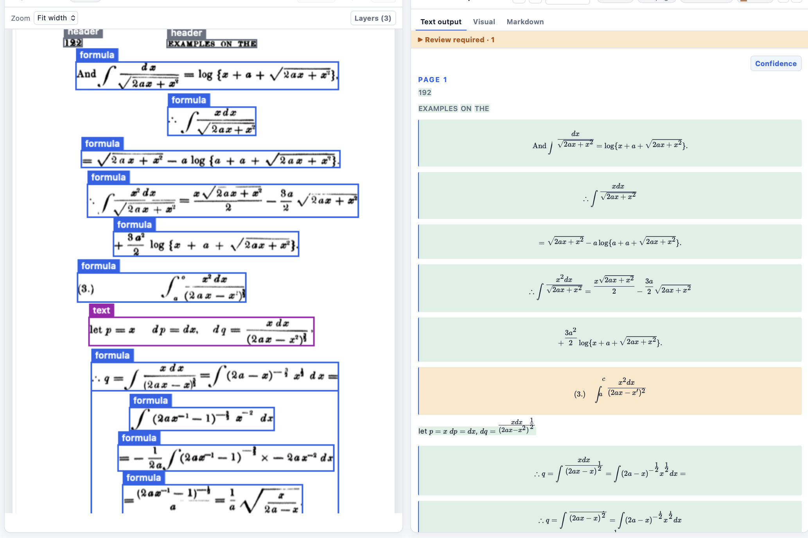

# Boxes are evidence: layout, structured content, and our Falcon contributions

*Part 2 of 3 · Implementation and GitHub status checked on 9 September 2026*

[Part 1: pixels and models](01-from-image-to-text.md) · [Part 3: confidence and delivery](03-confidence-exports-and-review.md)

A detected rectangle is not a finished document element. It may contain a paragraph, a picture with a caption, a mathematical expression, or a form wrapping several fields. Decisions made between detection and recognition determine whether content survives at all.

This is where two of our Falcon contributions began: preserving useful layout evidence and making recognition evidence cheaper to retrieve. They address different defects and should be described separately.


## 1. Heron predicts document roles, not transcriptions

Heron-101 is IBM's document-layout model used in the Docling ecosystem. Its released configuration uses RT-DETRv2 with a ResNet-101-style backbone and 300 detector queries. The image processor resizes its detector input to 640 by 640. A query predicts a box and category scores; it is a hypothesis about a document element, not a text token. [Model configuration](https://huggingface.co/docling-project/docling-layout-heron-101/raw/main/config.json), [image processor](https://huggingface.co/docling-project/docling-layout-heron-101/raw/main/preprocessor_config.json).

The backbone extracts visual features, and the detector's encoder/decoder machinery predicts region geometry and class scores. This decoder is a **detection decoder**, distinct from Falcon's autoregressive text generation. Heron does not read the words inside the rectangle.

The released label set contains 17 classes. The local routing uses them as follows:

| Heron labels | Treatment in the restored route |
| --- | --- |
| `text`, `caption`, `footnote`, `list_item` | Read with the corresponding OCR task |
| `title`, `section_header`, `page_header`, `page_footer` | Read and retain the semantic role |
| `formula` | Read a complete formula crop |
| `table` | Generate table markup from its crop |
| `picture` | Retain a source-image crop |
| `code` | Map to the engine's algorithm/text route |
| `checkbox_selected`, `checkbox_unselected` | Retain predicted state; transcribe associated crop text |
| `form`, `key_value_region`, `document_index` | Exclude these wrapping categories from additional OCR requests |

The last row prevents a wrapper from automatically becoming another transcription of its children. It also means a missed child can still cause missing content. This routing is not a complete document hierarchy or a guarantee of coverage. [Local category routing](../../experiments/serve_falcon_layout.py).

There is no native `handwriting`, `signature`, or `line` class in this Heron label set. A notebook example named “Handwritten notes” is an example label, not a classifier result. Handwritten words can appear in a text or formula region; a signature can be classified as a picture. The UI's ability to display a category must not be mistaken for the model's ability to detect it.

## 2. What changed in bounding-box handling

Three changes need different descriptions:

1. **Local query selection:** our Heron adapter selects the highest-scoring class for each query and retains its other class scores as provenance. Flattening every query/class pair can emit several categories for the same query. Selecting one primary class avoids that particular duplication; separate queries can still overlap.
2. **Local geometry handling:** normalized detector coordinates become pixel rectangles, and crop coordinates are clamped to the image. Coordinate restoration maps processing views back to the source. This is bookkeeping around learned boxes, not a new box predictor.
3. **Upstream proposal preservation:** PR #32 changes which detections are suppressed and which survive result assembly. It does not retrain Heron, improve learned coordinates, or create word-level boxes.

The distinction matters when explaining an apparent improvement. If a previously missing picture becomes visible because its record survives assembly, we fixed a software omission. We did not improve picture localization. [Heron adapter](../../src/ocr_pipeline/heron_layout.py), [PR #32](https://github.com/tiiuae/Falcon-Perception/pull/32).

## 3. Issue #33 and PR #32: stop dropping detected content

[Issue #33](https://github.com/tiiuae/Falcon-Perception/issues/33) reports two problems in layout-aware OCR. Overlap or containment filtering could remove legitimate text under a picture or grouping region, and output assembly could omit picture detections because those regions had no OCR sequence.

Consider a picture rectangle containing a small caption. “One rectangle is inside another” does not imply “one is a redundant reading.” Different categories can describe different document roles. Applying the same suppression rule across them can delete information before the recognizer sees it.

[PR #32, **fix: preserve OCR layout regions and expose token scores**](https://github.com/tiiuae/Falcon-Perception/pull/32), proposes three changes:

- Restrict overlap and containment suppression to detections of the same category. Where similar-sized boxes compete, prefer higher confidence and break equal-score ties by input order, replacing random selection.
- Initialize native results from the retained detections, then attach recognized text. Preserve picture geometry even when there is no text-bearing sequence. Apply the same principle to server responses, including picture-only requests.
- Add opt-in generation metadata containing token IDs, selected-token probabilities, temperature, and whether a stop token was seen. Keep it separate from layout detection scores and preserve the default string-returning interface when the option is not requested.

The implementation changes `paged_ocr_inference.py` and `server/engine_worker.py`. Its checks exercise native mixed picture/text output, picture-only server responses, sequence metadata, and deterministic same-category selection. The PR description reports paired runs with the same Heron detections and Falcon weights, preserving existing text while exposing pictures and generation evidence. Those are the PR's reported checks, not a new benchmark performed for this article.

**Status on 9 September: PR #32 is open and unmerged; issue #33 is open.** Do not describe this proposal as an upstream release. The current application has a local `DocumentLayoutEngine` that preserves detections and assembles text by request identity. It bypasses the upstream blanket filtering; it is not simply “upstream main with PR #32 installed.” [PR](https://github.com/tiiuae/Falcon-Perception/pull/32), [issue](https://github.com/tiiuae/Falcon-Perception/issues/33), [local engine](../../experiments/serve_falcon_layout.py).

## 4. Why preserving overlap does not end repetition

PR #32 still uses geometric thresholds within a category. It is a generic postprocessor repair, not a learned ownership model and not a heuristic-free duplicate solution. Even the same category can contain legitimate nested regions. That is a limit of the proposal, not something to hide in the blog.

The current pipeline has several distinct repetition risks:

| Mechanism | What must be inspected |
| --- | --- |
| One query emitted under multiple labels | Detector postprocessing and query identity |
| Different queries cover the same ink | Detection-to-recognition ownership and crop requests |
| One decoder repeats within a single completion | Generation tokens, stopping state, and source crop |
| Both a table and its text children are displayed | Evidence references and presentation ownership |
| The source prints the same label twice | Both real source locations must be preserved |

Deleting repeated strings cannot distinguish these cases. Two occurrences of “Notice Address” may belong to different columns. A phone number read from two overlapping crops may differ by one missing digit. Neither exact string matching nor indiscriminate box suppression establishes the right answer.

The local result assembly verifies that each **request** completes once. It does not yet establish that each **source instance** was requested once. That unresolved boundary explains why duplicate text can remain after a sound request-identity fix.

## 5. Issue #35 and PR #34: make evidence retrieval cheaper

[Issue #35](https://github.com/tiiuae/Falcon-Perception/issues/35) concerns output retrieval after decoding. `Sequence.output_ids`, `output_logits`, and `output_probs` previously built CPU tensors from lists of GPU scalar tensors. That construction extracts many scalars individually, introducing repeated transfer and synchronization overhead.

[PR #34, **batch sequence output transfers to CPU**](https://github.com/tiiuae/Falcon-Perception/pull/34), stacks each field into a tensor before moving it to the CPU. Empty outputs explicitly return the correct empty CPU tensor, and output dtypes and detached semantics are preserved. This is a repair at the shared `Sequence` properties, so their callers can benefit without each maintaining a separate workaround.

Conceptually:

```python
# Many GPU scalars materialized through CPU tensor construction
torch.tensor(gpu_scalar_list, dtype=desired_dtype)

# One stacked tensor, transferred as a field
torch.stack(gpu_scalar_list).to(device="cpu", dtype=desired_dtype).detach()
```

The PR reports the following A10G measurements for retrieving all three fields, using the median of 11 repetitions after warmup:

| Output tokens | Previous retrieval | Batched retrieval |
| ---: | ---: | ---: |
| 64 | 1.940 ms | 0.221 ms |
| 512 | 17.713 ms | 1.000 ms |
| 4,096 | 141.345 ms | 7.350 ms |

At 4,096 tokens that is about 19.2 times faster **for this retrieval operation**. It is not a 19.2-times end-to-end OCR speedup. Detection, crop preparation, prefill, decoding, serialization, transfer, and rendering still take time. [Reported measurements](https://github.com/tiiuae/Falcon-Perception/pull/34).

**PR #34 merged on 8 September 2026; issue #35 is closed.** The patch does not change the model's logits, token choices, or recognition quality. It reduces overhead in obtaining already-computed results. A deployed older environment still needs the relevant code update; upstream merge status alone does not prove a running service loaded it. Our local decoder already performs batched extraction when constructing generation evidence. [Merged PR](https://github.com/tiiuae/Falcon-Perception/pull/34), [closed issue](https://github.com/tiiuae/Falcon-Perception/issues/35).

## 6. Tables: detection, structure, and text are separate tasks

Heron detects a table rectangle. Falcon reads that crop and generates HTML-like table markup. The local parser converts rows, cells, `rowspan`, `colspan`, and header tags into the canonical grid. It bounds spans and grid size and preserves the model's raw output. The renderer subsequently validates topology. [Table parsing](../../src/ocr_pipeline/falcon_layout.py), [topology validation](../../src/ocr_pipeline/table_topology.py).

The active route does not run a second Table Transformer pass to locate individual cells. A generated HTML cell has a logical row and column, but generally does not have its own measured pixel box. The table's source rectangle remains the visual evidence. Drawing equal-width synthetic cell boxes would misrepresent that evidence.

Microsoft Table Transformer is a separate table detection/structure implementation. Docling TableFormer is another table-structure adapter present in this repository. Both are inactive in the restored serving composition. Their code or paths being present in a launch command does not override the conditional construction of stages. [TATR adapter](../../src/ocr_pipeline/tables.py), [TableFormer adapter](../../src/ocr_pipeline/tableformer_structure.py), [composition](../../experiments/serve_gpu_demo.py).

Structure validation cannot detect every recognition error. A rectangular table containing a wrong dollar amount is structurally valid. Conversely, every numeral may be correct but belong to the wrong year. Table evaluation must check exact cell content and row/column associations separately.

## 7. Formulas, pictures, controls, and handwriting



A formula crop retains the spatial context needed for fractions, superscripts, and aligned expressions. Falcon generates the notation; KaTeX displays it. Rendering success establishes that the markup can be displayed, not that the model recognized the source equation correctly.

Pictures are exported from source pixels. The visual inspector can download the selected region at source resolution without colored overlays. The category controls the UI color, but colors are presentation choices, not model confidence. A signature-like picture remains a picture unless independent evidence establishes its type.

Heron's selected/unselected classes supply control state. The UI displays checkbox symbols rather than the literal word “Unselected.” State confidence and crop transcription remain different evidence. A missed tick is a recognition/detection failure, not permission to guess a selected value.

The same principle applies to handwriting and visual diagrams. Handwriting can be read by Falcon without a separate handwritten-style classifier. Charts, chemical structures, and diagrams can be retained as images without claiming chart-to-data conversion or molecular graph recognition. The current route provides the latter tasks with source material; it does not implement them.

## Additional questions, 18-34

### 18. Is a detector query a word or a line?

No. It is a learned object hypothesis. Its rectangle can describe a multi-line paragraph, table, picture, or another supported region type.

### 19. Does choosing one class per query guarantee unique boxes?

No. It prevents alternate classes from the same query becoming separate primary detections. Other queries can still propose the same or overlapping content.

### 20. Why can a picture and text overlap legitimately?

A figure can contain labels, and a screenshot can contain both visual assets and text. Semantic roles and spatial containment are different relationships.

### 21. Did our PR improve the detector's learned coordinates?

No. PR #32 preserves or selects existing predictions and changes result assembly. It does not update the detector weights or train a better localization head.

### 22. Does the active application use PR #32's suppression rules?

Its local layout engine bypasses upstream blanket suppression and retains detections for assembly. The proposed upstream same-category rules are a distinct implementation and remain unmerged.

### 23. Why not use non-maximum suppression everywhere?

Suppression helps with redundant object proposals when its assumptions hold. Document regions can be nested, overlapping, or differently typed, so applying it indiscriminately can remove real content.

### 24. Does a heading's position determine its class?

Heron predicts the class from visual features. The application maps that class to a semantic kind; it does not establish heading status merely because text is near the top of a page.

### 25. Where does reading order come from?

The native detector enumeration is not a learned semantic reading order. `EvidenceLayoutStage` constructs spatial presentation blocks and ranks them using geometry. That rule-based presentation remains fallible on columns and forms.

### 26. Are all parts of the pipeline learned?

No. Detection and recognition are learned; coordinate transforms, class routing, spatial presentation, validation, and rendering use ordinary code. Calling the whole system heuristic-free would be inaccurate.

### 27. Can the system automatically identify signatures?

The UI supports that category, but the active Heron label set does not. A displayed image of a signature is not the same as verified signature detection or identity verification.

### 28. Do table cells have independent recognition confidence?

The parser can aggregate aligned token scores that overlap a cell's text range. That score is still decoder likelihood, not a separately trained cell-correctness probability. If alignment is unavailable, the application should not invent a score.

### 29. Can a filled-in table grid prove that blank cells were present?

No. The parser adds empty trailing positions to represent a rectangular grid when needed. Such a position is a structural placeholder, not independently localized proof of a blank source cell.

### 30. Why can an author list be mistaken for a table?

Authors and affiliations often form a regular visual grid. That resemblance can trigger the table category. Whether a table is the right representation must be assessed against the source, and rendering both it and its children can repeat the content.

### 31. Is a LaTeX equation the same thing as mathematical reasoning?

No. Recognition transcribes symbols and structure. Checking equivalence, deriving a result, or finding a mathematical mistake is a separate task.

### 32. Can a crop download show more detail than the browser preview?

Yes. The preview may be scaled to fit the pane; the download uses the source rectangle at its available resolution. It cannot recover detail absent from the uploaded or rasterized image.

### 33. Does PR #34 change the output API?

It preserves the CPU tensor properties and their dtypes, including empty cases, while changing how their values are transferred. It does not introduce a new OCR response format.

### 34. Do the two PRs solve the entire duplicate problem?

No. PR #32 addresses information loss and exposes generation evidence; PR #34 reduces retrieval overhead. Exclusive ownership of source instances across overlapping crop requests remains unresolved in the restored route.

Public sources and PR diffs were checked on 9 September 2026. PR statuses are dated observations; timings above are the contribution's reported microbenchmark, not a fresh measurement of the entire demo.

Continue to [Part 3: confidence, Markdown, and a reviewable result](03-confidence-exports-and-review.md).
