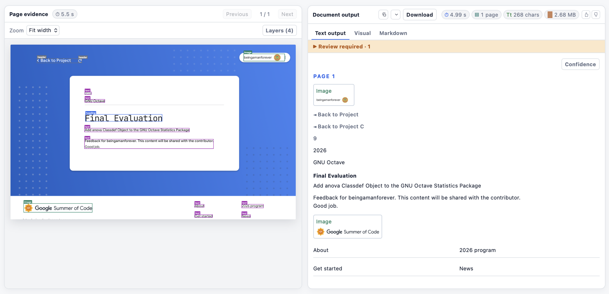
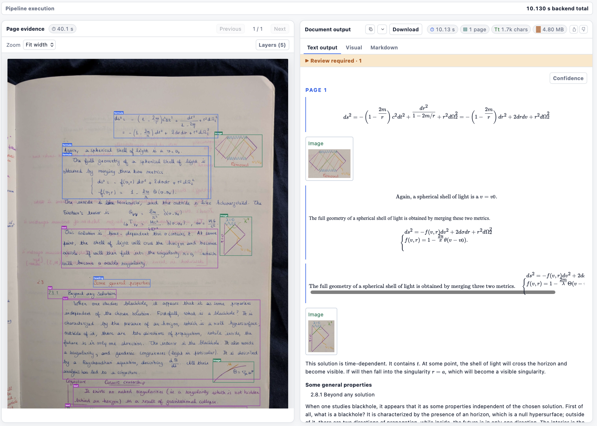

# A readable answer is not enough: confidence, Markdown, and review

*Part 3 of 3 · Implementation and public sources checked on 9 September 2026*

[Part 1: pixels and models](01-from-image-to-text.md) · [Part 2: layout and the Falcon contributions](02-layout-tables-and-crops.md)

The model has produced a string. It may look convincing, contain valid HTML, and end with a normal stop token. None of those facts proves that it matches the document. The final part of the pipeline must preserve what was read, expose what is uncertain, and render it without silently becoming a second author.



This screenshot deliberately shows actual output, including a repeated header. It is useful as an inspection example; it is not evidence that duplicate decoding has been solved.

## 1. Put evidence in one representation

The central record is `TextRegion`: an ID, semantic kind, text, bounding box, reading order, provider, optional confidence, resolution state, alternatives, structure, and provenance. `PageResult` groups these records and associates them with page dimensions and failures. `DocumentResult` collects the pages. [Contracts](../../src/ocr_pipeline/contracts.py).

The application can therefore distinguish the original model reading from a proposed correction, retain raw generation alongside parsed table structure, and link presentation blocks to their source regions. This does not make every reading correct. It makes errors traceable to a page, a box, a provider, and a transformation.

An important distinction is **evidence ownership versus recognition ownership**. A presentation block can refer to children that remain inspectable without printing them all again. That avoids one type of duplicate rendering. It does not undo two recognition requests that were created from overlapping source regions upstream. [Evidence layout](../../src/ocr_pipeline/evidence_layout.py), [rendering](../../src/ocr_pipeline/rendering.py).

## 2. Logits, probabilities, and log probabilities

At decoding step `t`, Falcon produces logits over its vocabulary. A logit is an unnormalized score. Softmax converts these scores to a probability distribution. The probability of the chosen token answers a conditional question:

```text
p_t = P(chosen token at step t | image, task prompt, preceding tokens)
```

In the official greedy path, token selection uses the largest logit, while the stored probability comes from the full float32 softmax. With nonzero temperature, the distribution is rescaled; top-k sampling can restrict and renormalize it further. Scores from these sampling distributions are not directly interchangeable. [Official sampling implementation](https://github.com/tiiuae/Falcon-Perception/blob/main/falcon_perception/sampling.py).

The native engine exposes selected-token probabilities. Our wrapper calculates their logarithms for aggregation. That is different from exposing the entire vocabulary distribution or asking the model to write “confidence: 95%” in its answer.

## 3. Why use logs, and what score do we display?

Multiplying hundreds of small probabilities is numerically fragile. Taking logs changes a product into a sum. A sequence score based on the geometric mean also avoids penalizing a longer output solely because it contains more factors:

```text
mean_log_probability = sum(log(p_t)) / N
displayed_token_score = exp(mean_log_probability)
```

For probabilities `0.9`, `0.8`, and `0.5`, the product is `0.36`; the geometric mean is approximately `0.711`. An arithmetic mean would be about `0.733`. These summarize the same token readings differently. Neither number is automatically the probability that the full extracted phrase is correct.

The local decoder excludes the final stop token from the content score and uses a small numerical floor when taking logs. It also retains the minimum token probability, which can expose one uncertain step hidden inside an otherwise high average. These details are implemented in [`DocumentLayoutEngine._decode_seq_text`](../../experiments/serve_falcon_layout.py).

We expose the aggregate recognition score only for the original greedy distribution. A retry at nonzero temperature still carries attempt and stopping information, but does not get a directly comparable greedy token score. A high-temperature retry is another reading, not a confidence upgrade.

## 4. Why a high score can still be wrong

Token likelihood measures the model's preference among possible next tokens. It does not observe an independent ground truth. A model can confidently complete a familiar name incorrectly, omit a digit, or generate plausible words from faint ink.

An omitted character is particularly difficult: it has no emitted token whose score can be highlighted as wrong. A field can therefore have high scores on every emitted token while still missing a crucial character. This is why the interface says **uncalibrated decoder token score**, not “probability correct.”

The pipeline keeps several meanings separate:

| Signal | What it describes | What it does not establish |
| --- | --- | --- |
| Heron detection score | A detector category/region hypothesis | Correct transcription |
| Falcon token score | Likelihood of emitted content tokens | Exact source agreement |
| Minimum token score | A locally uncertain emitted step | Detection of all omitted content |
| Stop-token evidence | How generation terminated | Completeness or correctness |
| Review reason | An explicit risk condition | A validated probability of error |

Calibration would require an independently reviewed calibration set, a clear target such as exact field correctness, and evaluation on separate data. Reliability diagrams, calibration error, and coverage-versus-error measurements would then show whether a predicted probability has its claimed meaning. The current demo has not established that calibration.

## 5. How token evidence reaches the UI

The service attempts to re-encode the raw decoded text with the tokenizer. It exposes character offsets only when the resulting IDs exactly reproduce the generated content IDs. Trimming whitespace also requires adjusting offsets. If the match fails, the aggregate can remain available without pretending that token-to-character alignment is known. [Local decoder](../../experiments/serve_falcon_layout.py).

These offsets locate a token in the output string. They do **not** locate it in the image. A word composed of several subword tokens can have a string-level score without an independently predicted word box. The visual evidence remains the source region unless another detector supplied finer geometry.

For generated tables, the parser uses aligned text ranges to associate selected-token scores with cell text. This is derived evidence from the same generation, not a second model voting that the cell is correct. It remains sensitive to tokenization and markup alignment. [Table parser](../../src/ocr_pipeline/falcon_layout.py).

## 6. Risk flags request review; they do not rewrite text

`EvidenceRiskStage` examines available scores and geometry. Its reasons include low decoder token scores, low mean confidence, small-text evidence, large uncertain regions, and table-related uncertainty. These are explicit rules, not a trained error classifier. The stage adds a risk record rather than guessing a replacement. [Risk stage](../../src/ocr_pipeline/risk.py).

The region contract separately represents `resolved`, `unreadable`, and `conflicting` states. In this contract, “resolved” means the current reading is the accepted representation, not that an independent human has certified it. Truncation, malformed table structure, and alternative attempts can affect that state.

When generation lacks a proper stop token, the service may retry the crop with a larger budget and subsequent temperature settings. It retains attempt history. A successful retry does not erase the fact that the first reading failed. Empty, failed, and malformed responses must not be relabeled successful merely to produce a polished page.

## 7. Markdown is generated from evidence, not another model call

The page renderer takes the canonical regions and their evidence references, selects the presentation records, orders them, and produces Markdown blocks. Source-only children remain available in JSON and inspection without becoming a second copy of a block. [Renderer](../../src/ocr_pipeline/rendering.py).

Different content needs different serialization:

- Text becomes escaped literal content with appropriate block structure.
- Headings and lists use their semantic roles.
- Formula markup is retained for mathematical display.
- Ordinary rectangular tables can use Markdown pipe tables.
- Tables with spans, or without a header row, use HTML so that Markdown's mandatory header convention does not invent structure.
- Pictures refer to extracted source assets, and controls preserve state with symbols.

Escaping matters. A pipe inside a cell is not a new column. An angle bracket in source text is not permission to inject arbitrary HTML. Generated table markup is parsed and rebuilt from accepted structure rather than trusted as arbitrary page code. Cell spans and overall grid size are bounded. Malformed topology needs an explicit diagnostic, not an apparently repaired but invented table.

This is deterministic rendering in the software sense: no extra LLM rewrites the recognized content. It does not imply all presentation choices are learned or perfect. Spatial ordering and grouping still contain rules, and a correct reading can be displayed in the wrong order.

## 8. Math rendering has its own failure modes



KaTeX turns recognized notation into typeset mathematics using local assets. It does not recognize the original image. Two-dimensional display can make a mistaken equation look authoritative, so the source crop should stay easy to inspect.

There is also a distinction between visual duplication and copied text. Math renderers can include both visual HTML and accessibility MathML. A copied selection that appears repeated is not sufficient evidence that the decoder ran twice; inspect the actual region records and rendered DOM. Conversely, repeated canonical regions cannot be fixed merely by hiding accessibility output. Each defect belongs at its responsible layer.

Literal model artifacts, missing symbols, and nonsense prose must remain recognizable as quality failures. A cosmetic cleanup that deletes suspicious strings cannot establish what the source actually said.

## 9. Feedback needs the image and the result

An isolated thumbs-down is weak training or debugging data. The useful record says which page was judged, what the model returned, what the user objected to, and which revision they saw.

The feedback handler saves the selected page image, the complete response, and a feedback record together. It writes into a temporary directory before renaming the completed record into place. Retention keeps the most recent 1,000 feedback records. Several records can refer to the same source image; this is a record limit, not a promise of 1,000 distinct images. [Feedback storage](../../src/ocr_pipeline/demo.py).

Feedback is durable storage, separate from the in-memory session registry. Restarting the application can invalidate an old interactive session even though its submitted feedback survives. Neither feedback nor private document images belong in the public example gallery. A reviewed correction is also not automatically a training update: dataset construction, isolation, and evaluation remain separate work.

## 10. Measure the whole path without confusing clocks

The browser's elapsed time can include upload, queuing, network transfer, and UI work. Backend stage timing measures a different interval. Falcon token-generation time measures a narrower interval again. PR #34's output-retrieval microbenchmark is narrower still.

A slow page can be dominated by duplicate crops, long generations, a full reread, a network tunnel, or browser work. Optimizing the shared retrieval properties is a valid improvement; it does not prove that every latency complaint is caused there.

The current composition endpoint and process arguments were inspected for this series. That establishes which path is configured. A new upload and model run are needed to prove a model-code update is reflected in output; refreshing HTML or inspecting files on disk alone does not prove that a long-running process loaded them.

## Additional questions, 35-50

### 35. Why not multiply all token probabilities and call it confidence?

The product rapidly becomes small and depends strongly on output length. Averaging log probabilities gives a more usable summary, but still does not make it an exact-match probability.

### 36. Can we compare scores across different OCR models?

Not as equivalent confidence without validation. Their tokenizers, objectives, decoding distributions, and score definitions differ. Compare observed errors on the same labeled examples.

### 37. Is the minimum token score always more useful than the average?

No. It highlights a weak step, but can overreact to unusual punctuation or a single token. Both are review signals whose usefulness should be measured against actual errors.

### 38. Can selected-token probabilities tell us the model's entropy?

No. Entropy needs the distribution over alternatives, not just the probability of the emitted token. The current generation evidence is not a full-vocabulary uncertainty report.

### 39. Why is the stop token excluded from content scoring?

Its probability concerns ending the response. Mixing it into content likelihood changes the meaning of the score. The service preserves stopping evidence separately.

### 40. What happens when a sampled retry has no displayed score?

Unknown confidence remains unknown. The text, attempt history, and termination metadata can still be inspected; the UI should not borrow the original reading's score for the retry.

### 41. Does green highlighting mean the content was verified?

No. Color visualizes the selected score or state. It is not an external fact check, and high-scoring recognition errors remain possible.

### 42. Can Markdown represent every table?

Plain pipe tables cannot express all merged cells or headerless structures faithfully. The renderer uses HTML for those cases instead of flattening spans into misleading columns.

### 43. Does changing the view run OCR again?

Text, Visual, and Markdown are presentations of the existing response. They do not inherently require another model call. Explicit rereads or correction operations are separate actions.

### 44. Why retain raw output after parsing it?

It allows a developer to distinguish recognition errors from parser or renderer errors. If a value exists in raw markup but disappears after parsing, the recognizer was not responsible for that loss.

### 45. Are bounding boxes and string offsets interchangeable?

No. Boxes describe image space; offsets describe positions in decoded text. Converting one to the other requires alignment evidence, not proportional spacing across a rectangle.

### 46. Does “Complete” mean the page is accurate?

It indicates processing completion, not a transcription guarantee. A page may complete with review flags, missing detections, or incorrect symbols.

### 47. Why store the whole response with page feedback?

The response contains the model reading, structure, provenance, and revision context needed to reconstruct the judgment. Saving only the latest mutable session could lose what the reviewer actually saw.

### 48. Does the 1,000-record policy prevent disk exhaustion in every case?

It bounds record count, not exact bytes. High-resolution pages and large results vary in size. Storage capacity still depends on permitted inputs and deployment limits.

### 49. What prevents stale UI updates from replacing newer results?

The application uses session/revision checks and client request ordering. Those mechanisms should be exercised at the API and browser boundaries; they do not substitute for restarting a backend after model-code changes.

### 50. What would count as a fundamental duplicate fix?

Demonstrating that each source instance is assigned to an appropriate recognition request and displayed through one owner, while legitimate repeated labels, table contents, formulas, pictures, and geometry survive. The restored route does not yet meet that full requirement. The two Falcon PRs improve specific boundaries; they do not establish that broader result.

## Further reading and implementation

The [Falcon sampling code](https://github.com/tiiuae/Falcon-Perception/blob/main/falcon_perception/sampling.py) and [PR #34](https://github.com/tiiuae/Falcon-Perception/pull/34) explain the native probability and transfer paths. Locally, follow [generation evidence](../../experiments/serve_falcon_layout.py), [canonical regions](../../src/ocr_pipeline/contracts.py), [table parsing](../../src/ocr_pipeline/falcon_layout.py), [risk](../../src/ocr_pipeline/risk.py), [rendering](../../src/ocr_pipeline/rendering.py), and [feedback/session handling](../../src/ocr_pipeline/demo.py).

These sources were inspected on 9 September 2026. No new model-quality benchmark was run for this documentation update. The distinction between model capability, local implementation, historical observations, and current limitations is part of the design.


## Optional crop refinement and comparison exports

[`refine_page`](../../src/ocr_pipeline/markdown_refinement.py) is an optional OpenRouter postprocessor used by the comparison runner. It sends one contact sheet per page containing individual source-region crops. Images, figures, signatures and handwriting are eligible; ordinary text and checkbox rows remain local unless an existing region-level failure requires review. Tables are eligible when existing table review flags, unresolved cells, invalid structure or merged cells require a specialist pass. It keeps original region IDs and boxes, checks that every requested crop has a response, and stitches the returned Markdown into the local OCR output. No crop means no request. This does not change the default workbench pipeline.

The request lists only crop IDs; source coordinates and region metadata stay local for reconstruction. The model reads the labeled pixels without repeating that geometry in its prompt. Each crop uses its original detected bounds, without expanding to a whole row or page. Every crop records its source ID and routing reasons locally. Existing repetition/date validation flags and unresolved recognition can route individual regions. An isolated low decoder token score does not trigger an API request: it is uncalibrated, and in the local routing audit that policy would have sent nearly every page. Scores remain diagnostic evidence until routing quality is measured against verified errors. A missed or undersized detection still needs a detector/ownership repair; selective cropping cannot recover pixels outside its input.

The caller supplies the model and `OPENROUTER_API_KEY`; zero-data retention remains enabled by default. Any retention exception must be explicitly authorized for the data being processed. Raw and refined outputs should be saved separately, including failed requests. Crop recognition can still misread handwriting, associate a note with the wrong row, or omit content. Replacement applies by source ID in a separate rendering view, refreshing affected layout owners while keeping source evidence unchanged. Incomplete crop responses and non-renderable table responses retain the original Markdown with an invalid status. Valid markup is not proof of correct cells or blank-row counts.

Crop requests share an OpenRouter `session_id` scoped by prompt version and retention policy, without document identifiers. This enables provider affinity from the first successful request, preserving the shared prompt prefix and original image pixels. Qwen3.7 advertises implicit caching; explicit cache breakpoints are not documented for this model. Session routing does not guarantee a cache hit, and no prompt padding or image compression is used. Inspect returned `usage.prompt_tokens_details.cached_tokens` and `cache_write_tokens` before attributing savings to caching. Missing values mean unknown. [OpenRouter caching documentation](https://openrouter.ai/docs/guides/best-practices/prompt-caching), accessed 9 September 2026.

The private comparison runner reuses saved completed pages and summarizes saved API responses after each batch. It includes billed failures, counts response copies once using generation IDs, and reports missing billing separately. Returned costs include cache pricing when applied; do not apply another discount. Cost per completed page includes failed attempts, and completion means parsed output, not source-verified accuracy. These reports remain with the private benchmark outputs.

[`normalize_table_headers`](../../src/ocr_pipeline/markdown_export.py), using `markdown-it-py`, preserves cells beyond the declared header width by adding unnamed headers. The comparison uses it for HTML and Markdown downloads. It leaves source responses unchanged and does not invent column names or reconstruct missing cells. It handles top-level Markdown tables; nested tables and recognition errors remain outside its scope.

Pass the upstream orientation selector's saved angle through `rotation_degrees` (0, 90, 180, or 270, counterclockwise). The contact sheet rotates only the image panels; original boxes remain in source coordinates, and the returned metadata records the rotation and panel positions. This reuses the existing orientation decision without another model call.
