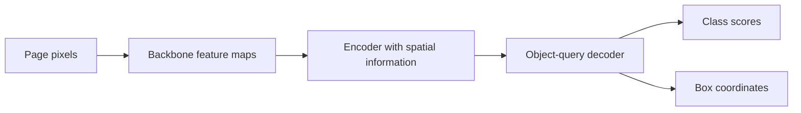
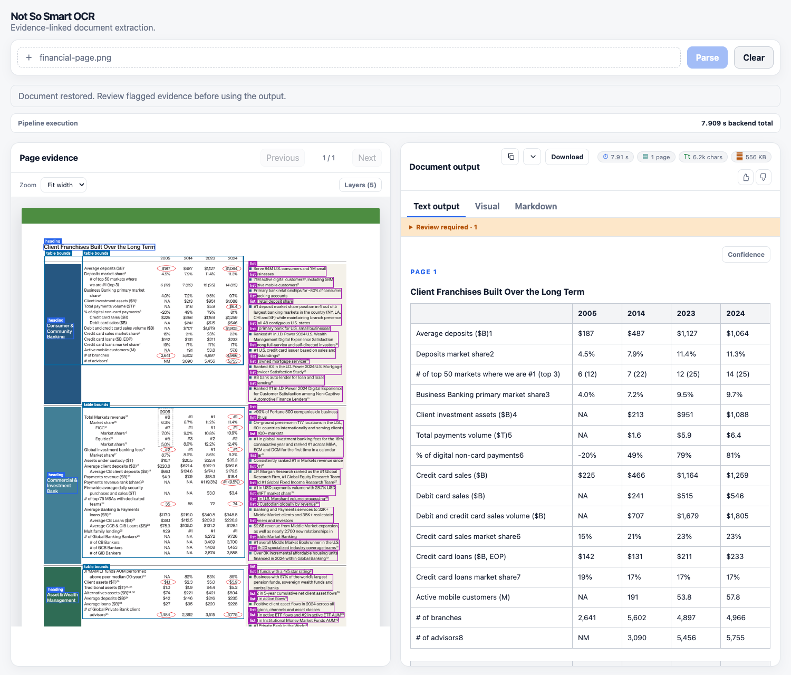

# Models, geometry, tables, and GPU memory

*Technical companion to the three walkthroughs · Code and public sources checked on 9 September 2026*

[Overview](../../README.md#pipeline) · [Pixels to text](01-from-image-to-text.md) · [Layout and Falcon contributions](02-layout-tables-and-crops.md) · [Confidence and exports](03-confidence-exports-and-review.md)

This companion answers 50 more questions, numbered 51-100. It distinguishes the models running in this demo from alternatives, explains the operations inside them, and separates measured deployment memory from estimates.

**The running system is a modular pipeline containing a specialized VLM:** DocTR and Tesseract handle orientation, Heron predicts semantic regions, and Falcon-OCR reads region crops. Falcon also generates table HTML and formula LaTeX. Microsoft Table Transformer, Docling TableFormer, Paddle orientation, Nemotron, Chandra, and olmOCR are comparisons or inactive adapters, not additional stages in that route.

## Contents

- [Architecture and interfaces](#architecture-and-interfaces)
- [Orientation](#orientation)
- [DETR, Heron, and alternative layout methods](#detr-heron-and-alternative-layout-methods)
- [Recognition, confidence, and reading order](#recognition-confidence-and-reading-order)
- [Table Transformer versus Falcon](#table-transformer-versus-falcon)
- [Page-level VLMs versus modular pipelines](#page-level-vlms-versus-modular-pipelines)
- [VRAM and performance](#vram-and-performance)
- [What our Falcon changes actually improved](#what-our-falcon-changes-actually-improved)

## Architecture and interfaces

### 51. Is this OCR or a VLM?

Both. **OCR is a task:** recover written content from pixels. **A vision-language model is an architecture and training category:** it relates visual input to language. An OCR system can use convolutional networks, CTC recognition, autoregressive Transformers, or a VLM. A VLM can specialize in OCR instead of general conversation.

Falcon-OCR is TII's approximately 300M-parameter VLM trained for document elements. Its image understanding supports transcription, formulas, and tables; it does not make every task supported by the separate Falcon-Perception checkpoint available to this application. [Falcon report, Section 6](https://arxiv.org/html/2603.27365#S6).

### 52. What are our encoder and decoder?

There is no single encoder-decoder pair covering the application.

| Component | Image processing | Prediction mechanism | Output |
| --- | --- | --- | --- |
| DocTR orientation | MobileNetV3-Small convolutional features | Four-class classifier | Right-angle orientation and score |
| Heron-101 | ResNet-101 backbone and RT-DETRv2 hybrid encoder | Detection decoder operating on object queries | Region categories, scores, boxes |
| Falcon-OCR | Image patches projected into a shared Transformer | The same early-fusion stack generates text causally | Text, LaTeX, or HTML tokens |
| Application | Coordinate transforms and evidence assembly | Deterministic parsers and renderers | Canonical JSON, Markdown, browser views |

Falcon does not have an independent CLIP encoder feeding a Qwen language decoder. Its image tokens attend bidirectionally; text generation is causal. Heron's detection decoder predicts objects, not sentences. [Falcon architecture](https://arxiv.org/html/2603.27365#S6), [Heron configuration](https://huggingface.co/docling-project/docling-layout-heron-101/raw/main/config.json), [DocTR implementation](https://github.com/mindee/doctr/blob/main/doctr/models/classification/mobilenet/pytorch.py).

### 53. How many decoders are there?

In the two central learned components, there is **one Heron detection-decoder stack and one Falcon autoregressive text-generation stack**. Heron's published configuration has six decoder layers; Falcon's shared stack has 22 layers. Layers are not separate models.

There are no separately loaded Falcon text, handwriting, formula, and table decoders. Task prompts condition the same weights. DocTR's classifier is not a language decoder; Python's HTML parser and tokenizer decoding are software operations, not extra neural decoders. Tesseract is a separate supporting engine, so this count should not be presented as a count of every internal module in every dependency.

### 54. What crosses each component boundary?

| Boundary | Input | Output and important constraint |
| --- | --- | --- |
| Page preparation | PDF/image bytes | RGB page images with known dimensions; PDFs are rasterized |
| Orientation | Page pixels | Correction angle, evidence, uncertainty, transformed processing view |
| Heron | Processor-prepared page tensor | Per-query class logits and normalized `cx, cy, width, height` |
| Crop preparation | Source image plus region coordinates/category | Crop pixels and native OCR task prompt |
| Falcon | Image patches, prompt tokens, generation settings | Generated token IDs, probabilities, stopping metadata, decoded string |
| Evidence assembly | Region geometry plus model output | Regions with provenance and optional table structure |
| Rendering | Canonical evidence | Text, visual overlays, Markdown, JSON, source crops |

Pixels are not sent to the text decoder as a base64 sentence. The model processor converts image content into its visual representation. A normalized model box is also not directly a browser pixel box. [Heron adapter](../../src/ocr_pipeline/heron_layout.py), [Falcon service](../../experiments/serve_falcon_layout.py), [result adapter](../../src/ocr_pipeline/falcon_layout.py).

### 55. What does Falcon learn during training?

The authors describe training Falcon-OCR **from scratch**, rather than initializing it from Falcon-Perception's multi-teacher distillation. The shared architecture remains, but fine glyph recognition is a different objective from object-level perception.

Training pairs element images with target text, LaTeX, or HTML. The loss is next-token cross-entropy on the output text; image tokens are excluded from that loss. The published recipe uses 250k pretraining iterations followed by 20k steps of cosine decay, and includes document text, handwriting, scenes, formulas, and tables. The report describes an English-focused model. It does not establish reliable support for every script that the tokenizer can encode. [Training recipe](https://arxiv.org/html/2603.27365#S6).

## Orientation

### 56. How does a small orientation classifier know which way is up?

It learns visual evidence associated with upright writing: stroke shapes, baselines, text-line organization, and page composition. Convolutions build features from local patches; pooling aggregates them; a classification head scores the four orientations. It need not transcribe every word first.

A standard training formulation rotates upright examples by known multiples of 90 degrees and trains the classifier to recover the orientation using cross-entropy. That explains the learning problem, not the complete unpublished data recipe of either checkpoint. Sparse diagrams, symmetric forms, or unusual scripts can make the class ambiguous.

### 57. What does DocTR do internally in our setup?

We load `mobilenet_v3_small_page_orientation`. MobileNetV3 uses efficient convolutional blocks, including depthwise operations and channel mixing, to compute an image representation. The orientation-specific classifier replaces general image categories with orientation classes. The official predictor handles preprocessing and returns orientation results with scores; our wrapper validates and normalizes them.

Our selector accepts a sufficiently confident proposal and consults Tesseract OSD when needed. It does not select an orientation by asking Falcon to read four rotated pages. This classifier is also unrelated to **Heron**: Heron is the subsequent document-layout detector. [DocTR source](https://github.com/mindee/doctr/blob/main/doctr/models/classification/mobilenet/pytorch.py), [local wrapper and selector](../../src/ocr_pipeline/orientation.py).

### 58. What is the small Paddle orientation model, and how is it different?

The inactive adapter uses `PP-LCNet_x1_0_doc_ori`, through its ONNX export. PP-LCNet uses depthwise separable convolutions, channel attention in selected blocks, global average pooling, and a classifier. It predicts the same four-way orientation task, not OCR strings.

The adapter follows the published preprocessing: resize the shorter edge to 256, center-crop 224 × 224, scale and normalize RGB values, arrange a `[1, 3, 224, 224]` tensor, then take the highest-scoring orientation. Its local confidence threshold differs from DocTR's and is a policy choice, not a calibration result.

The official page lists a **7 MB model artifact**. That does not establish “5 million parameters”; megabytes and parameter counts are different quantities. The vendor's reported accuracy is also not a measurement on our documents. This comparison does not switch the running orientation model. [Official orientation documentation](https://paddlepaddle.github.io/PaddleOCR/v3.0.0/en/version3.x/module_usage/doc_img_orientation_classification.html), [preprocessing configuration](https://huggingface.co/PaddlePaddle/PP-LCNet_x1_0_doc_ori/raw/main/inference.yml), [PP-LCNet implementation](https://github.com/PaddlePaddle/PaddleClas/blob/release/2.6/ppcls/arch/backbone/legendary_models/pp_lcnet.py).

### 59. Why keep Tesseract OSD, and what does it score?

OSD supplies orientation and script evidence from the page's text-like components. Its confidence is an engine-specific score, not the same probability scale as a neural classifier's softmax.

In the current selector, a confident upright DocTR proposal avoids OSD. Otherwise, agreement can support a rotation; confident OSD can supply the angle when DocTR is uncertain. Conflicting or insufficient evidence leaves the correction at zero and records uncertainty. These are explicit rules in the application. They do not guarantee upright output, deskew a tilted scan, or flatten a curved notebook. [Active selection logic](../../src/ocr_pipeline/orientation.py).

## DETR, Heron, and alternative layout methods

### 60. What is DETR?

**DETR means DEtection TRansformer.** It treats object detection as predicting a set of objects: for each object, produce a class and a box.

Original DETR extracts an image feature map with a convolutional backbone, adds positional information, processes the features with a Transformer encoder, and uses a decoder with a fixed collection of object queries. Each query can produce one object hypothesis or no object. The outputs are a set, not a text sequence and not an intended reading order. [Original DETR repository](https://github.com/facebookresearch/detr).



### 61. What is an object query? Is it a prompt such as “find a table”?

In original DETR, an object query is a learned vector representing a prediction slot. Through attention, it gathers image evidence and interacts with other slots. It is not a natural-language instruction or a permanent location such as “the top-left table.”

Modern variants can initialize decoder queries using selected encoder features. Heron's RT-DETRv2 lineage uses this more informed initialization. Query identity still identifies a prediction slot, not a stable document field across pages. Different queries can predict overlapping regions. [DETR](https://github.com/facebookresearch/detr), [RT-DETR](https://arxiv.org/abs/2304.08069).

### 62. How does DETR training discourage duplicate detections?

Training matches predicted objects to labeled objects using a **one-to-one bipartite assignment**, commonly solved with the Hungarian algorithm. Its matching cost combines classification and box agreement. The loss then rewards the matched class and coordinates and penalizes unmatched foreground predictions. Original DETR uses an explicit no-object class; focal-loss variants handle background differently.

This makes ten predictions for one labeled object an unattractive training solution. It is a learned set-prediction objective, not a rule deleting repeated OCR strings. It still cannot guarantee zero overlap or duplicates on unfamiliar documents, and different legitimate objects can overlap geometrically. [DETR training design](https://github.com/facebookresearch/detr), [Heron matching configuration](https://huggingface.co/docling-project/docling-layout-heron-101/raw/main/config.json).

### 63. What does RT-DETRv2 change, and is that really what Heron uses?

Yes: the Heron-101 checkpoint declares `RTDetrV2ForObjectDetection`.

Original DETR's dense attention and training behavior motivated faster variants. RT-DETR uses an efficient hybrid encoder for multi-scale features and selects promising encoder locations to initialize decoder queries. RT-DETRv2 adds refinements including scale-dependent deformable-attention sampling and training changes. Deformable attention samples selected spatial locations instead of attending densely to every image position at every step.

These are architecture-family explanations. The actual checkpoint configuration determines which options are used; mentioning an option in the RT-DETRv2 paper does not mean we enabled it locally. [RT-DETR paper](https://arxiv.org/abs/2304.08069), [RT-DETRv2 report](https://arxiv.org/abs/2407.17140), [Heron checkpoint](https://huggingface.co/docling-project/docling-layout-heron-101/raw/main/config.json).

### 64. How was Heron trained to distinguish a table from text?

Heron learns from annotated page images containing region boxes and semantic labels. The Docling layout report describes a roughly 150k-page training collection with 2.3 million objects, assembled from DocLayNet, DocLayNet v2, and WordScape. The training examples teach visual distinctions such as a table's aligned grid, a heading's typography, and a picture's appearance. This is supervised detection, not a hand-written list of words that count as headings.

The inspected Heron-101 configuration has a ResNet-101 backbone, 300 object queries, a six-layer detection decoder, and 17 categories. The report includes training and evaluation details; its detector metrics do not establish exact OCR fidelity for this demo. Some contributing data is proprietary, so we should not claim the entire training set is publicly reproducible. [Heron report](https://arxiv.org/html/2509.11720), [checkpoint configuration](https://huggingface.co/docling-project/docling-layout-heron-101/raw/main/config.json).

### 65. How do those predictions become the boxes on screen?

For each query, Heron returns class logits and a normalized box `(cx, cy, w, h)`. Our adapter applies sigmoid to the class logits, retains the best class for that query, and converts the box:

```text
left   = (cx - w / 2) × page_width
top    = (cy - h / 2) × page_height
right  = (cx + w / 2) × page_width
bottom = (cy + h / 2) × page_height
```

Coordinates are rounded and clamped to the page. Orientation transforms must also be accounted for before overlaying evidence. Scaling a correct box into the wrong coordinate frame can make a good detector look broken. This conversion preserves predicted geometry; it does not invent word boxes inside a paragraph. [Adapter](../../src/ocr_pipeline/heron_layout.py).

### 66. Where does bbox confidence come from? Does Falcon generate it?

The region's **detection score comes from Heron's class prediction**, alongside its box regression. The text's token score comes from Falcon. Neither score is a calibrated probability that all four coordinates are correct.

A detection score of 0.95 means the detector strongly supports that category/hypothesis under its scoring system. It does not mean the box has 95% overlap with ground truth, nor that 95% of enclosed characters are right. Localization quality requires labeled boxes and metrics such as IoU. Preserve detection and recognition scores separately rather than multiplying them into an unsupported “overall confidence.” [Heron scores](../../src/ocr_pipeline/heron_layout.py), [evidence fields](../../src/ocr_pipeline/falcon_layout.py).

### 67. If DETR is designed to avoid duplicates, why can our OCR still repeat text?

There are several separate boundaries:

1. Multiple class alternatives for one query can be incorrectly expanded into multiple regions. Our adapter retains one best label per query and preserves the alternatives as scores.
2. Distinct queries can still describe overlapping content. That remains possible after the first correction.
3. Legitimate nested objects can exist, such as text inside a table or an image with a caption. Semantic overlap is not automatically a detector error.
4. Scheduling an OCR crop for each overlapping region can expose the same ink to separate recognition requests.

A one-result-per-request check solves assignment errors, not source ownership. Removing every repeated phrase would also delete genuine repeated fields. The restored route still has unresolved duplicates; the documentation does not claim DETR makes them impossible. [Heron adapter](../../src/ocr_pipeline/heron_layout.py), [crop scheduling](../../experiments/serve_falcon_layout.py).

### 68. What other approaches exist for layout and text detection?

| Approach | Basic idea | Main distinction from Heron |
| --- | --- | --- |
| Connected components, projection profiles, ruling lines | Group foreground pixels or exploit page separators | Useful geometric evidence, but limited semantic understanding |
| Two-stage object detectors | Propose regions, then classify and refine them | Explicit proposal/refinement stages; commonly use suppression |
| Dense one-stage detectors | Predict objects across feature-map locations | Often generate many local candidates rather than a matched query set |
| Segmentation-based text detection, such as DB | Predict text probability maps and derive text polygons | Finds text shapes; does not inherently label tables, formulas, or headings |
| DETR-family layout detection | Predict a set of semantic objects with query-based decoding | Heron's family; geometry and category prediction are explicit |
| Multimodal document encoders, such as LayoutLMv3 | Combine text, positions, and image patches | Often solve labeling, relations, or understanding using OCR inputs |
| Generative document models | Predict serialized content and possibly layout from the image | Geometry can be generated as tokens rather than detector outputs |

These approaches can be combined. A CNN backbone inside Heron does not make it a purely CNN detector; a Transformer inside a recognizer does not make it a general-purpose assistant. The survey supplied for this project provides the broader taxonomy. [Document-parsing survey](https://arxiv.org/abs/2410.21169), [DB paper](https://arxiv.org/abs/1911.08947), [LayoutLMv3 paper](https://arxiv.org/abs/2204.08387).

### 69. Does Docling itself solve reading order, OCR, and tables?

Docling is a document-processing project with an assembled conversion pipeline and multiple model components. **Heron is one layout model from that project.** Importing Heron's weights does not import Docling's complete OCR, layout postprocessing, table assembly, or reading-order behavior.

The official layout report discusses additional processing involving detected regions and document text cells. Our restored route uses Heron directly and its own evidence assembly. Docling TableFormer and Microsoft Table Transformer are also different models from different projects. Their inactive adapters should not appear as running stages in the front-page diagram. [Docling layout report](https://arxiv.org/html/2509.11720), [actual composition](../../experiments/serve_gpu_demo.py).

## Recognition, confidence, and reading order

### 70. How does Falcon turn a crop into text?

The crop is prepared at a supported resolution and split into visual patches. Image representations and task-prompt tokens enter the shared Transformer. At each output step, a vocabulary projection produces logits for the next token, conditioned on the image, prompt, and preceding generated tokens. The selected token is appended, and generation continues until a stop condition or limit.

Text prompts produce transcription, formula prompts produce LaTeX, and table prompts produce HTML. The training targets teach these representations. An arbitrary prompt cannot turn the checkpoint into an independently validated signature detector or chemical-structure recognizer. [Falcon OCR pipeline and training](https://arxiv.org/html/2603.27365#S6).

### 71. How are token probabilities and log probabilities obtained?

For logits `z` over the vocabulary, `p_i = softmax(z)_i`. The probability attached to the selected token is conditional on everything already supplied or generated. Its log probability is `log(p_i)`.

In the official greedy path, token selection takes the largest logit while the stored probability comes from the full float32 softmax. Temperature and top-k sampling can change the scored distribution. Our user-facing token score is therefore restricted to the comparable greedy evidence rather than treating all retry scores as equivalent. [Native sampling code](https://github.com/tiiuae/Falcon-Perception/blob/main/falcon_perception/sampling.py), [local generation metadata](../../experiments/serve_falcon_layout.py).

### 72. Why use log probabilities rather than multiply probabilities?

The probability of a generated sequence, conditioned on the input, factors into a product of conditional token probabilities. Products of many small values underflow numerically; taking logs converts the product into a sum. Averaging log probabilities also makes a useful length-normalized diagnostic.

Our displayed token score uses the geometric mean of included token probabilities:

```text
mean_log_probability = sum(log(p_t)) / number_of_tokens
token_score = exp(mean_log_probability)
```

The stop token is excluded. A single low-confidence digit may be diluted in a long region, so token-level evidence and the minimum probability remain useful. The geometric mean is neither the probability that the entire string is correct nor a calibrated accuracy estimate. [Score implementation](../../experiments/serve_falcon_layout.py).

### 73. Can a token score become a word score or a word bbox?

A word can contain several tokens, and a token can include punctuation or whitespace. A word score needs a verified mapping between token IDs and character spans. Our service retains offsets only when retokenization agrees with the generated IDs; it does not invent an alignment when that check fails.

Even a correct text alignment supplies **no pixel coordinates**. A word bbox requires spatial evidence from a detector, aligner, or grounded output head. Falcon token likelihood does not create word geometry inside Heron's region. [Generation alignment](../../experiments/serve_falcon_layout.py).

### 74. How do we know the reading order?

In the current application, page presentation order is assigned from region geometry, spatial groups, and separators. The evidence records `presentation_order_method="spatial_sort"`. This is deterministic application logic, not a learned reading-order model and not sorting by confidence.

Falcon learns the sequence **inside a crop** from ordered training targets. That does not establish page-wide order across separately read crops. Two columns containing identical field labels can still be interleaved incorrectly. The source page and region identities remain essential for checking the result. [Presentation ordering](../../src/ocr_pipeline/evidence_layout.py).

### 75. How would a learned reading-order model be trained?

Training requires supervision for ordering: ordered blocks, predecessor/successor links, pairwise precedence labels, or a correct serialized page. A relation model can score links between blocks, a pointer-like decoder can select the next block, or a page-level VLM can learn the desired output sequence directly.

Every representation has constraints. Pairwise links can form cycles; a generated sequence can omit or repeat a block; a detector's labels alone provide no sequence supervision. NVIDIA's Nemotron OCR v2 includes a relational component for grouping and reading order. Our Heron adapter does not use that component or an equivalent learned ordering model. [Nemotron model card](https://huggingface.co/nvidia/nemotron-ocr-v2).

### 76. How do we label images, handwriting, signatures, controls, and text lines?

Heron's 17 categories include text, title, section header, formula, table, picture, caption, footnote, page header/footer, list item, document index, code, selected/unselected checkbox, form, and key-value region.

There is **no native handwriting, signature, or text-line class** in this checkpoint. Handwritten content may be inside text or formula regions; a signature may be detected as a picture or text. Successful handwriting transcription is different from predicting a handwriting label. A checkbox state comes from its corresponding detected class, while a crop download preserves the original pixels. The application should not call an arbitrary picture a verified signature. [Heron labels](https://huggingface.co/docling-project/docling-layout-heron-101/raw/main/config.json), [label and control adaptation](../../src/ocr_pipeline/falcon_layout.py).

### 77. How does Nemotron's recognition approach differ from Falcon's?

NVIDIA describes Nemotron OCR v2 as a convolutional detector, Transformer recognizer, and relational grouping/reading-order component. Its current English configuration is word-level, with a three-layer recognizer and maximum sequence length 32. Its multilingual configuration is line-level, with a six-layer recognizer and maximum sequence length 128. The current card reports approximately 53.8M and 83.9M parameters respectively across the components.

Those are configuration-specific recognition limits, not a universal “Nemotron can only read 32 characters” claim. The selected model directory also matters, not just a language argument. Falcon instead learns longer element-level structured outputs, including HTML and LaTeX, through its early-fusion text decoder. Nemotron's positioned text can be valuable for exact cell assignment; Falcon's structured generation is useful for complete expressions and table markup. [Current NVIDIA card](https://huggingface.co/nvidia/nemotron-ocr-v2), [Falcon report](https://arxiv.org/html/2603.27365#S6).

### 78. Why did we choose Falcon, and what remains unproven?

The local history favored keeping complete semantic crops after fragmented recognition degraded handwriting and mathematics. Falcon with Heron also simplified the main path compared with multiple coverage-recovery readers. That is an application decision based on the observed failures, not proof of universal model superiority.

No new paired Nemotron-versus-Falcon accuracy benchmark was run for this document. NVIDIA's crop-recognition results and TII's page-parsing results also use different units and protocols; their headline numbers should not be ranked as though they measured the same task. Numeric transcription, small symbols, overlaps, and page ordering remain failure modes in our chosen route. [Serving decision](01-from-image-to-text.md#6-why-nemotron-was-not-the-final-serving-choice), [NVIDIA evaluation description](https://huggingface.co/nvidia/nemotron-ocr-v2).

## Table Transformer versus Falcon



### 79. What does Microsoft Table Transformer do?

**Table Transformer, often called TATR, is an object-detection approach to table extraction.** Its detection model locates tables on a page. A separate structure-recognition model predicts objects within a table crop: rows, columns, column headers, projected row headers, and spanning cells, plus the table itself.

These objects describe the table's topology and geometry. TATR does **not** recognize the printed characters as text. Microsoft's extraction pipeline requires separately supplied OCR words or PDF text to produce populated HTML or CSV. [Official TATR repository](https://github.com/microsoft/table-transformer).

### 80. How does TATR's encoder-decoder work?

The published structure model uses a ResNet-18 image backbone, six Transformer encoder layers, six decoder layers, and 125 object queries. Its decoder emits classes and boxes in parallel. It is a DETR-style detector trained against labeled structural objects with classification and box losses, not an autoregressive HTML generator.

The original structure checkpoint was trained on PubTables-1M. Later TATR releases include other training mixtures, so a model filename and checkpoint version matter. These details should not be confused with Heron's ResNet-101/RT-DETRv2 configuration. [Microsoft structure configuration](https://github.com/microsoft/table-transformer/blob/main/src/structure_config.json), [published model configuration](https://huggingface.co/microsoft/table-transformer-structure-recognition/raw/main/config.json), [release history](https://github.com/microsoft/table-transformer).

### 81. How do row and column boxes become cells and a populated table?

The extraction code organizes predicted rows, columns, headers, and spanning cells into a coherent grid. Ordinary cell geometry follows row/column intersections; spanning-cell predictions indicate merged areas. Separately recognized text is assigned to those cells using its location, then ordered and serialized.

For example, a row box and a second-column box define a candidate position for a revenue value. OCR supplies the value and its coordinates. If the recognizer reads the wrong digit, correct TATR geometry cannot repair it. If the grid is wrong, perfectly read words can still enter the wrong cells. Structure assembly remains a separate algorithm after neural detection. [Official inference implementation](https://github.com/microsoft/table-transformer/blob/main/src/inference.py).

### 82. Why can Falcon handle tables without TATR?

Falcon is trained to **generate a table's representation and text together**. Given the table crop and its task prompt, the same text decoder that handles other OCR tasks generates tokens such as `<table>`, `<tr>`, `<td>`, cell contents, `rowspan`, and `colspan`.

It learns the relationship between two-dimensional visual arrangement and serialized HTML from paired training examples, including rendered HTML sources. It does not secretly run Table Transformer inside the decoder. An HTML table can therefore be produced by either geometric structure prediction plus OCR, or direct image-conditioned generation. Their evidence and error modes differ. [Falcon table training and output format](https://arxiv.org/html/2603.27365#S6).

### 83. How does our application turn Falcon's HTML into the displayed table?

The adapter parses the generated HTML using Python's `HTMLParser`, records rows, cell text, header flags, and spans, and builds logical row/column assignments. It checks structure rather than treating arbitrary generated markup as trusted browser code. The renderer uses this canonical structure across views.

A simple rectangular table with a suitable header can become a Markdown pipe table. Headerless or merged-cell tables retain HTML because plain Markdown cannot faithfully express their topology. The table keeps its source crop and region box. Cells generally lack individually measured pixel boxes in this route; logical cells must not be presented as detector-localized cells. [HTML parsing and cell construction](../../src/ocr_pipeline/falcon_layout.py), [export explanation](03-confidence-exports-and-review.md).

### 84. Which table approach is better?

| Property | TATR plus positioned OCR | Falcon table generation |
| --- | --- | --- |
| Recognition of characters | Supplied by another reader | Generated by Falcon |
| Structure | Predicted geometric objects assembled into a grid | Generated HTML relationships |
| Cell geometry | Can be derived from structural boxes | Not independently predicted in our route |
| Main benefit | Inspect structure and text positioning separately | One recognizer produces content and structure |
| Typical failure | Incorrect row/column assembly or text assignment | Omitted/repeated cells, wrong text, malformed markup |
| Active here | No | Yes |

The best choice depends on exact cell content, merged-cell correctness, source geometry, latency, and memory on the intended documents. A valid HTML tree is not evidence that every number is correct. A visually accurate grid is not evidence that its OCR text is correct. We have not measured a universal winner.

### 85. Why is TATR inactive, and would adding it automatically improve Falcon?

The restored serving path uses Falcon as the region reader. The separate TATR stage is constructed only in the older `word_reader` branch; passing TATR artifact paths on the command line does not make that branch execute.

Adding it would create another structure prediction needing reconciliation with Falcon's HTML and text. It could be useful when reliable cell geometry is required, but would not automatically improve recognition and might introduce conflicting grids. This document explains the option without enabling an unvalidated second table path. Docling TableFormer is another structure model, not an alias for TATR. [Composition](../../experiments/serve_gpu_demo.py), [inactive TATR adapter](../../src/ocr_pipeline/tables.py), [inactive TableFormer adapter](../../src/ocr_pipeline/tableformer_structure.py).

## Page-level VLMs versus modular pipelines

### 86. How does a page-level VLM pipeline such as Chandra work?

Conceptually, a page image and a parsing prompt enter a vision-language model, which generates a structured page in a desired reading order. Application code parses that output, converts formats, and can extract original image crops from generated coordinates. PDF rendering and output validation still exist around the model.

The current Chandra code passes an image and prompt through a multimodal chat processor, runs generation, removes input tokens from the completion, and decodes the generated text. Its layout prompt requests HTML blocks with `data-bbox` coordinates normalized to 0-1000 and `data-label` categories, alongside tables, math, forms, and images. The model's proposed coordinates need scaling and validation; they are not Heron detection results. [Chandra generation code](https://github.com/datalab-to/chandra/blob/master/chandra/model/hf.py), [output prompt](https://github.com/datalab-to/chandra/blob/master/chandra/prompts.py).

### 87. What encoder and decoder does Chandra 2 use?

The inspected `datalab-to/chandra-ocr-2` configuration declares `Qwen3_5ForConditionalGeneration`. It contains a 24-layer vision component with width 1024, visual output width 2560, and a 32-layer language component of width 2560. The language configuration alternates groups of linear-attention layers with full-attention layers.

That is a separate visual encoder and language-generation architecture, unlike Falcon's shared early-fusion stack. These facts describe **Chandra 2's inspected configuration**, not every Chandra release, and do not establish its complete training recipe or our measured performance. It is discussed here as an alternative, not loaded into the demo. [Official Chandra 2 configuration](https://huggingface.co/datalab-to/chandra-ocr-2/raw/main/config.json).

### 88. How do olmOCR, Donut, and LayoutLM differ from that?

They illustrate different ways to allocate document understanding:

- **olmOCR:** a toolkit for page linearization with VLM serving, document processing, supervised fine-tuning, and reinforcement-learning tooling. Its repository includes Qwen2.5-VL training code. It should be evaluated as a complete page-processing workflow, not just a recognizer name.
- **Donut:** an OCR-free document-understanding approach trained to generate structured answers directly from document images. “OCR-free” means it avoids a separate OCR engine, not that the task contains no visual reading.
- **LayoutLMv3:** a multimodal representation model trained with text/image masking and word-patch alignment. Its text-centric tasks commonly consume OCR text and positions; it is not a drop-in generator of an entire page's Markdown.

These families also evolve. A checkpoint and a concrete pipeline must be named before comparing results or hardware requirements. [olmOCR repository](https://github.com/allenai/olmocr), [Donut paper](https://arxiv.org/abs/2111.15664), [LayoutLMv3 paper](https://arxiv.org/abs/2204.08387).

### 89. What are the trade-offs between page generation and modular OCR?

| Question | Page-level structured VLM | Layout plus region recognition |
| --- | --- | --- |
| Who sees page-wide context? | The generation model | Primarily the layout and assembly stages |
| Where does reading order come from? | Generated sequence and learned serialization | Ordering model or explicit assembly logic |
| Where do boxes come from? | Generated coordinates or an auxiliary grounding component | Dedicated detector and coordinate transforms |
| How is tiny text exposed? | Limited by full-page visual resolution/token allocation | Crops can retain more detail per region |
| How can content repeat? | Autoregressive repetition or repeated generated blocks | Overlapping crop ownership and assembly errors |
| How can content disappear? | Generation omission, truncation, or visual loss | Missed detection, bad crop, or recognition omission |
| How are errors localized? | Inspect generated output against the page | Inspect detector, crop, recognition, and assembly separately |

Neither design guarantees faithfulness. Modularity improves observability but creates interfaces that can fail. Page generation retains context but can combine recognition, ordering, and localization mistakes in one completion. [Survey taxonomy and challenges](https://arxiv.org/abs/2410.21169).

### 90. Is our pipeline a hybrid, and does “end-to-end” mean one model?

Our application is modular, and one of its modules is a specialized VLM. “VLM pipeline” and “modular pipeline” are not mutually exclusive descriptions.

“End-to-end” is also overloaded. DETR can be trained end to end from an image to object predictions while the surrounding OCR application remains modular. Falcon learns crop-to-markup directly while relying on another model for page layout. A user-facing end-to-end evaluation includes upload, orientation, detection, recognition, ordering, and exports regardless of how many models are involved.

### 91. How should we compare these alternatives fairly?

Use the same source pages and record complete outputs, failures, cold/warm conditions, input resolution, latency, and GPU memory. Evaluate exact text and numeric content, omissions and duplication, reading order, table structure and cell content, formula fidelity, control states, and box localization separately.

Do not rank an English page-parsing benchmark against a multilingual crop-recognition score, or omit failed pages from the denominator. A replacement must improve the user's document outputs without hiding regressions in an average. The alternatives in this companion were researched, not newly benchmarked or deployed.

## VRAM and performance

### 92. How much VRAM should I provision for this setup?

**A 24 GB-class NVIDIA GPU matches the A10G host on which this deployment has been exercised. A minimum requirement has not been established.** The actual `nvidia-smi` capacity on that host is 23,028 MiB.

| Evidence | Observation | What it establishes |
| --- | --- | --- |
| Falcon service process snapshot, 9 September | 6,412 MiB, approximately 6.26 GiB | Resident process allocation at that instant |
| Inspected Falcon launch | BF16, maximum crop batch 32, 384 cache pages | Settings associated with that observation |
| Host memory snapshot | Approximately 20,786 MiB occupied across processes | Shared-host usage, including unrelated workloads |
| Minimum or worst-case peak for the complete app | Not measured | No verified 8, 12, or 16 GB requirement |

Do not turn the 6.26 GiB snapshot into “needs 6 GB.” It excludes a demonstrated worst-case workload and is not a complete per-component peak profile. For reproducing the exercised host class, provision 24 GB; for a smaller card, validate the intended batch size and long documents first. [Earlier deployment observation](01-from-image-to-text.md#10-how-much-vram-does-this-deployment-use).

### 93. Why can a 300M model occupy several gigabytes?

Two-byte weights for approximately 300M parameters have a rough storage lower bound of **0.6 GB decimal**, or about 0.56 GiB. The process also needs image representations, intermediate activations, attention workspaces, KV cache, allocator reserves, CUDA context, and potentially captured execution graphs.

The serving engine preallocates resources to support concurrency. Therefore, memory need is not just parameter count multiplied by dtype size. Heron runs on CPU by default in the inspected layout service; orientation and any optional GPU components must be accounted for separately. Disk weight size, system RAM, and VRAM are three different budgets. [Service defaults](../../experiments/serve_falcon_layout.py).

### 94. What is the KV cache, and why do crops and batches affect it?

Autoregressive attention reuses keys and values from earlier positions. Caching them avoids recomputing the entire prefix for every new token. More active sequences and longer image-plus-text contexts consume more cache capacity.

For a conventional unquantized attention cache, a useful conceptual estimate is:

```text
KV bytes ≈ 2 × layers × cached positions × KV heads × head dimension × bytes/value
```

The factor two accounts for keys and values. Native paged allocation, reserved capacity, tensor layout, and attention implementation determine the actual allocation. Do not substitute unrelated Hugging Face settings into this formula and call the result a measurement of our native engine. `n_pages=384` refers to cache pages, not 384 PDF pages.

### 95. What can reduce memory, and what else needs provisioning?

Lower concurrent crop batches and smaller cache reservations can reduce memory demand at a throughput cost. Reducing visual resolution can reduce work but may lose small symbols. Lower-precision or quantized execution needs supported kernels and a quality check; it is not automatically interchangeable with BF16.

CPU memory also holds decoded pages and model/runtime data. Poppler, orientation, image serialization, network transfer, and browser rendering contribute latency outside Falcon. This demo uses a private GPU service, so a browser timing includes more than backend model time. No CPU-only throughput claim or smaller-GPU validation is established here. [Runtime composition](../../experiments/serve_gpu_demo.py), [Falcon service options](../../experiments/serve_falcon_layout.py).

### 96. How should latency and memory be measured for a real deployment?

Measure a complete request while sampling each relevant process, and distinguish cold start, warmed inference, queueing, and concurrent users. Record peak allocated/reserved framework memory where available, process residency, image sizes, generated-token lengths, retries, and failures. Sampling `nvidia-smi` alone can miss short allocation peaks.

Long tables and math-heavy pages can generate more tokens than a short screenshot. Loading every comparison model at once also answers a different hardware question from running the selected pipeline. The snapshot above is useful deployment evidence, but it is not a hardware minimum or a new capacity benchmark.

## What our Falcon changes actually improved

### 97. What did the layout and generation-evidence PR change?

[PR #32](https://github.com/tiiuae/Falcon-Perception/pull/32), associated with [issue #33](https://github.com/tiiuae/Falcon-Perception/issues/33), preserves valid output regions across categories, makes same-area suppression deterministic, keeps picture records even when they have no OCR text, and exposes optional native generation evidence.

The practical improvement is preserving predictions and their evidence through software assembly. It does not retrain the detector, tighten learned box coordinates, create word boxes, or calibrate scores. As checked on 9 September, the PR remains open. The application's local engine also has its own request-preserving assembly path, which should not be described as simply installing that upstream PR. [Full contribution walkthrough](02-layout-tables-and-crops.md#3-issue-33-and-pr-32-stop-dropping-detected-content).

### 98. What did the GPU-to-CPU transfer PR change?

[PR #34](https://github.com/tiiuae/Falcon-Perception/pull/34), associated with [issue #35](https://github.com/tiiuae/Falcon-Perception/issues/35), stacks generated GPU tensors before transferring them to CPU, avoiding repeated scalar extraction. It preserves the output contract while reducing materialization overhead. The PR was merged, and the issue closed, when checked on 9 September.

For the reported 4,096-token retrieval measurement, the median went from 141.345 ms to 7.350 ms, approximately 19.2 times faster **for that retrieval operation**. This is not a 19-times faster document parser, an accuracy gain, or a reduction in the model's autoregressive compute. [Measurement and limitations](02-layout-tables-and-crops.md).

### 99. What did our Heron integration fix separately?

The adapter keeps one category per detection query instead of expanding several class alternatives for the same query into separate crop requests. It preserves the full class-score vector and query identity, converts coordinates explicitly, and exposes detection evidence independently of Falcon token scores.

That repairs a model-interface interpretation problem. It does not merge distinct queries, prove exclusive ownership of every source character, or solve all nested-region overlap. Changes in the Heron adapter, Falcon result assembly, and GPU transfer code operate at different boundaries and should be credited separately. [Heron adapter](../../src/ocr_pipeline/heron_layout.py).

### 100. What should readers conclude about the current design?

The current choice is **Heron for semantic geometry and Falcon for crop-level transcription, formulas, and table HTML**, surrounded by orientation and evidence-preserving assembly. It supports inspecting where output came from without pretending that generation scores prove correctness.

TATR is a potential source of geometric table structure; Chandra and other page-level VLMs are alternative allocations of recognition and layout work. They are not hidden stages of this deployment. The restored route's remaining overlap, ordering, handwriting, and numeric errors are documented. A future change should demonstrate a better complete result on the same inputs, not merely fewer output strings or a more impressive architecture name.

---

All linked public sources were accessed on 9 September 2026. Architecture and training descriptions are attributed to the linked implementations or papers. Runtime allocation and launch settings are local observations; comparative examples are explanations, not new benchmark results. This companion changes documentation only.
