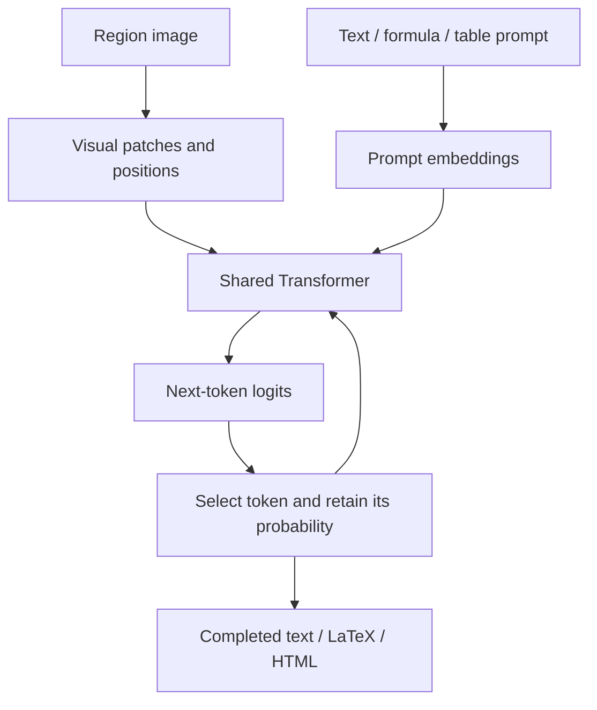

# Inside Falcon-OCR: one Transformer, several document tasks

*A guided reading of the Falcon technical report · Sources accessed 9 September 2026*

[All walkthroughs](../../README.md#walkthroughs) · [Model internals and VRAM](04-model-internals-and-hardware.md) · [Other OCR strategies](06-document-parsing-strategies.md)

Falcon-OCR's central idea is to give image patches and text tokens a shared Transformer, then specialize it for recognizing document elements. A separate layout stage decides which elements to read. This combination explains both its compact recognition model and the importance of getting crop ownership right.

This article follows **Sections 2 and 6 of the technical report** and relates them to our implementation. The report also describes a separate perception model with localization and segmentation heads. Those heads should not be mistaken for the source of the boxes in this OCR demo. [Technical report](https://arxiv.org/html/2603.27365).

## 1. An image becomes a sequence without becoming a sentence

The input to the backbone contains visual patches, prompt tokens, and subsequently generated output tokens. Each patch is projected into the same hidden dimensionality used by the text representation. The Transformer can then operate across both kinds of input.

The key detail is the **attention mask**. Visual patches can attend to other visual patches in both directions. An output text token can attend to the image and earlier text, but not future text. The paper explicitly keeps prompt text causal as well. One stack therefore performs the visual-context processing and the causal generation that many VLMs distribute across separate vision and language networks.

For a fraction, a patch containing the numerator can interact with patches containing the fraction bar and denominator. When generating the expression, the output token can use this visual context together with the preceding LaTeX tokens. The model is not limited to first recognizing isolated characters and then guessing their arrangement. [Architecture, Section 2](https://arxiv.org/html/2603.27365#S2).

This diagram describes OCR generation. It does not insert a learned detector into Falcon's text output path.

## 2. Spatial position survives patch flattening

Flattening patches into a sequence does not preserve two-dimensional relationships by itself. The report combines sequence and spatial positional information through rotary position embeddings. Its spatial component uses directions distributed across the image plane, rather than only treating an image as a left-to-right text sequence.

This gives attention access to relative spatial relationships. It does not make the model immune to rotation. A positional representation that supports visual geometry is different from demonstrating that an upside-down page will be transcribed correctly. Our orientation stage remains separate.

The report also describes preserving aspect ratio within a visual-token budget and packing valid patches instead of spending Transformer computation on padding. In its training description, attention is restricted across packed example boundaries. Packing unrelated crops must never allow one document's content to become another's context. [Position encoding and packing](https://arxiv.org/html/2603.27365#S2).

## 3. The OCR model and the perception model are different checkpoints

The broader Falcon-Perception design can generate task tokens associated with coordinates, sizes, and masks. Specialized heads interpret those task states. The report describes coordinate/size prediction and a mask mechanism using upsampled visual features and a segmentation-token representation.

Falcon-OCR reuses the shared architecture for text-heavy recognition. **It is not initialized through the perception model's multi-teacher distillation stage.** The authors train the OCR variant from scratch because glyph-level visual distinctions differ from the object-level features sought in the perception training.

This distinction answers a common question: “If Falcon-Perception has spatial heads, why do we use Heron?” We have loaded the OCR checkpoint and its crop-recognition path. Heron supplies the semantic document boxes. Exposing native OCR probabilities or changing result assembly does not enable an untrained word-localization head. [Perception heads](https://arxiv.org/html/2603.27365#S2), [OCR initialization](https://arxiv.org/html/2603.27365#S6).

## 4. Why the official OCR pipeline separates layout from recognition

The report's pipeline detects page elements, crops the original image, and recognizes each element according to its type. Its described upstream layout detector is **PP-DocLayoutV3**. Our application instead uses **Heron-101**. These are different compositions around Falcon-OCR.

Region processing allocates visual detail to a smaller area. A dense page resized to the OCR model's visual budget can make a small decimal point or subscript disappear. A source-resolution table or formula crop can preserve more useful detail within the same recognition budget.

The trade-off is that the reader only sees what the layout stage supplies. A missing detection cannot be repaired by perfect recognition of the remaining crops. Overlapping detections can produce repeated readings, and independent crops need page-wide ordering afterward. The paper describes the benefit of modularity; our observed failures show why the boundaries still need careful engineering. [Two-stage OCR pipeline](https://arxiv.org/html/2603.27365#S6), [our crop service](../../experiments/serve_falcon_layout.py).

## 5. Text, formulas, and tables share recognition weights

The element-type prompt selects the intended output format, not another model:

| Crop | Training target and generated representation | What the model must learn |
| --- | --- | --- |
| Text block | Transcribed text | Characters, words, punctuation, and line relationships |
| Mathematical expression | LaTeX | Spatial relationships such as fractions, scripts, matrices, and operators |
| Table | HTML | Cell contents, row/column arrangement, headers, and spans |

For tables, the decoder predicts both structural tokens and content tokens. It might emit a `<td>` opening tag, a number, and its closing tag within one sequence. TATR instead predicts structural objects and needs another source of recognized text. The two paths can reach similar output formats through different predictions. [Table comparison](04-model-internals-and-hardware.md#table-transformer-versus-falcon).

A syntactically valid answer can still be visually wrong. LaTeX can compile after a minus sign is lost. HTML can remain rectangular after a row is omitted. Structured generation expands what the recognizer can represent; it does not remove the need to compare that representation with the image.

## 6. Training teaches serialization, not a page-specific cleanup rule

The OCR recipe combines document text, formula and table examples, handwriting, and other text-bearing images. It includes synthetic supervision from rendered LaTeX and HTML. A model can therefore see an exact serialized structure alongside the pixels produced by rendering it.

The optimization is ordinary autoregressive cross-entropy on target text tokens. During training, preceding target tokens provide context; during generation, the model must rely on its own previous predictions. That difference helps explain why one mistaken structural token can affect later output.

The authors describe 250k iterations at a stable learning rate followed by a 20k-step decay, selecting a checkpoint on held-out parsing examples. They describe an English-focused OCR model. The report does not justify promising unrestricted multilingual performance simply because the architecture accepts image input. [Data, loss, and schedule](https://arxiv.org/html/2603.27365#S6).

## 7. Why compact weights do not imply negligible memory or latency

Falcon-OCR's approximately 300M parameters are only part of its inference footprint. Visual input positions, generated tokens, KV-cache capacity, batch size, and execution workspaces all matter. A table requiring thousands of output tokens can take much longer than a short header crop using the same weights.

The report discusses vLLM deployment. Our inspected service uses Falcon's **native paged inference engine**, with BF16, crop batching, and configured cache pages. A throughput figure in the paper should not be copied into the README as a local measurement of this route.

The native service tracks request identities, stopping state, and generation evidence. Its retries retain attempt history. A second attempt is another model output, not an independent witness proving the first or second transcription. [Native service](../../experiments/serve_falcon_layout.py), [measured memory and its limits](04-model-internals-and-hardware.md#vram-and-performance).

## 8. Three different causes of repeated output

Repeated text is not one error class:

| Cause | Example | Responsible boundary |
| --- | --- | --- |
| Repeated source exposure | A table region and an overlapping text region both contain the same name | Detection semantics and crop ownership |
| Autoregressive repetition | One crop completion generates a sentence twice | Recognition or decoding behavior |
| Repeated presentation | The same evidence record is rendered as both a parent and an independent child | Evidence assembly and rendering |

Checking that each scheduled crop returns once only addresses request accounting. Removing repeated strings addresses none of these causes reliably: a two-party form can legitimately contain “By:” twice.

The current Heron adapter avoids expanding multiple class alternatives for one query into multiple crop requests. It does not prevent distinct queries from overlapping. The restored system intentionally retains those unresolved cases instead of deleting text based on spelling similarity. [Heron adapter](../../src/ocr_pipeline/heron_layout.py), [local generation engine](../../experiments/serve_falcon_layout.py).

## 9. What our upstream contributions establish

The two contributions act on software boundaries around the model:

- **PR #32 / issue #33:** preserve layout-region records and optional generation evidence, retain pictures with empty OCR text, and make relevant suppression behavior deterministic. This changes preservation and selection, not learned localization.
- **PR #34 / issue #35:** batch GPU tensor transfers to CPU when materializing generated outputs. This reduces retrieval overhead while preserving the returned values, not the time spent computing every next token.

As checked on 9 September, #32 is open and #34 is merged. Neither is a new Falcon checkpoint or a universal duplicate fix. The detailed walkthrough reports the exact measurement boundary so an output-transfer improvement is not misrepresented as end-to-end OCR speed. [PR #32](https://github.com/tiiuae/Falcon-Perception/pull/32), [PR #34](https://github.com/tiiuae/Falcon-Perception/pull/34), [contribution explanation](02-layout-tables-and-crops.md).

## 10. What the report suggests for future improvements

The useful lesson is to train and evaluate the operation that is failing. If source regions overlap, better language likelihood alone does not establish ownership. If formulas fragment, preserving the complete expression may matter more than recognizing more isolated characters. If output structure collapses, consistent serialization targets and structure-aware evaluation matter.

The report supports Falcon's crop-level architecture and training recipe. It does not demonstrate that our application has solved every handwritten form, correctly localized every word, or beaten all competing pipelines. Those are separate claims requiring corresponding evidence.

Continue to [the comparison of document-parsing strategies](06-document-parsing-strategies.md), which shows how other systems move these responsibilities between data, detectors, visual encoders, decoders, and orchestration.
