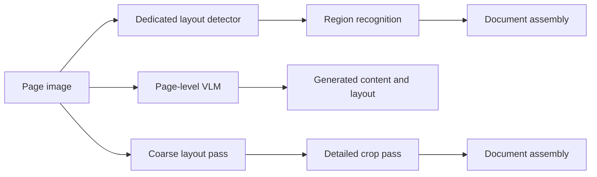

# Different ways to turn a document into structured text

*LightOnOCR, FireRed-OCR, Unlimited-OCR, MinerU, PaddleOCR, Chandra, and Surya · Sources accessed 9 September 2026*

[All walkthroughs](../../README.md#walkthroughs) · [Inside Falcon-OCR](05-falcon-technical-report.md) · [DETR, tables, confidence, and VRAM](04-model-internals-and-hardware.md)

Document parsers differ most in **where they resolve structure and preserve visual detail**. Some explicitly locate regions before reading them. Others generate a page in one sequence. Some invest mainly in training data and rewards, while others change visual compression or attention memory.

This article compares those strategies using primary sources. “Fire OCR” is interpreted as **FireRed-OCR**, and “Unlimited OCR” as **Baidu's Unlimited-OCR**. None of these comparisons changes the current Heron + Falcon deployment. Model versions matter: in particular, current Surya 2 is substantially different from descriptions of the older Surya stack.

## 1. A map of the design choices

| System or route | Main strategy | Where the design concentrates effort |
| --- | --- | --- |
| Our Heron + Falcon route | Semantic detector, then crop-conditioned VLM | Explicit source regions and element-specific recognition |
| LightOnOCR-2 | Compact page-to-text VLM | Distillation, visual resolution, serialization, and localization variants |
| FireRed-OCR | Specialize a general VLM for document structure | Staged supervision and format/content rewards |
| Unlimited-OCR | Compressed visual reference plus bounded output attention | Long-output KV-cache growth |
| MinerU2.5 model route | Coarse layout, then detailed crop recognition | Allocate resolution separately to structure and content |
| PaddleOCR families | Conventional OCR, structure pipelines, and layout + VLM routes | Multiple task-specific compositions under one project |
| Chandra 2 | Page-level structured HTML generation | Joint content, semantic blocks, layout coordinates, and markup |
| Surya 2 | Shared VLM with page, block, layout, and table modes | Reuse one model through different task interfaces |

The supplied [document-parsing survey](https://arxiv.org/abs/2410.21169) organizes the field around modular systems and unified VLMs. This is a useful starting point, but real products often combine them. A two-stage parser can use a VLM, and one VLM can be called in several stages.



These are workflow families, not a claim that every implementation in a family uses the same weights, decoding, or postprocessing.

## 2. LightOnOCR-2: compact page generation through data and initialization

### How the model works

LightOnOCR is an approximately 1B-parameter VLM with a vision encoder, a multimodal projector, and a language decoder. The report initializes the native-resolution vision encoder from Mistral-Small-3.1's visual weights and the decoder from Qwen3. A two-layer projector connects them. Spatial merging groups 2 × 2 patch features, reducing the number of visual tokens by a factor of four.

The model learns to generate naturally ordered page text without a task prompt at inference. Version 2 increases the permitted longest image edge from 1024 to 1540 pixels and improves its data mixture. This makes “compact” a combination of model size, visual-token handling, and learned specialization, not simply using a smaller language model. [Architecture and version changes](https://arxiv.org/html/2601.14251v2).

### What is different from Falcon?

Falcon shares a Transformer across raw visual patches and text and is used here on semantic crops. LightOnOCR connects pretrained visual and language components and learns page-level serialization. That moves more of the ordering and completeness responsibility into one generation.

The report describes teacher-generated transcriptions, scientific sources, scans, document crops, and explicit blank-page examples. It also describes reinforcement learning with verifiable rewards, checkpoint averaging, and model merging. These are changes to the learned system, not a runtime list of phrases to remove.

The **bbox variants predict embedded-image locations**. That is not a promise of word boxes for all text. Localization is introduced and refined with coordinate supervision and IoU-based rewards. The OCR-first and bbox variants have different objectives, so the checkpoint choice matters. [Technical report](https://arxiv.org/html/2601.14251v2), [official model card and variants](https://huggingface.co/lightonai/LightOnOCR-2-1B).

### What the strategy does not prove

Rendering a generated formula successfully proves syntax compatibility, not that it matches the image. Teacher annotations can also transfer systematic errors. The report uses explicit reward checks, including repetition-related rules; it would be inaccurate to describe the complete training recipe as rule-free. Its published speed measurements are not measurements on our GPU or our documents.

## 3. FireRed-OCR: teach structure explicitly, then optimize it

### How the model works

FireRed-OCR uses the Qwen3-VL family and focuses on what its authors call structural hallucination: output that looks plausible but corrupts table rows, formula notation, or document hierarchy.

The reported curriculum has three stages:

1. **Multi-task alignment:** detection with text, region OCR, and page-to-Markdown tasks connect location with content.
2. **Specialized supervised fine-tuning:** consistent high-quality target serialization teaches page structure and formatting.
3. **Format-constrained GRPO:** sample candidate outputs, score them for properties such as formula syntax, tag closure, table integrity, and text agreement, then update the model using relative rewards.

Its data system balances layout and semantic categories, supplements rare structures with rendered examples, and refines difficult annotations. The strategy places substantial effort in supervision quality rather than expecting a generic visual assistant to become a faithful parser from a prompt alone. [Technical report](https://arxiv.org/html/2603.01840v1), [official repository](https://github.com/FireRedTeam/FireRed-OCR).

### What is different from Falcon?

Falcon-OCR's described training starts the OCR model from scratch with next-token supervision. FireRed starts from a general VLM and progressively specializes it, including reinforcement learning for structural properties. Both generate structured text, but the initialization and optimization strategies differ.

This provides a direction for malformed output: train on correct structure and score the intended behavior. It does not establish that adding GRPO automatically fixes source overlap in our crop scheduler.

### What the rewards do not prove

A table can be rectangular and still omit a row. A formula can compile and contain the wrong sign. A text-agreement reward can reinforce errors in a pseudo-label. The report itself discusses alternating supervised learning and GRPO to balance content and structure.

These rewards are **rule-based training signals**, not a mathematical guarantee of faithful extraction. Their adequacy must be tested against independently labeled content, including legitimate repetition and difficult layouts. [Training and reward definitions](https://arxiv.org/html/2603.01840v1#S3).

## 4. Unlimited-OCR: make long decoding depend on a bounded recent history

### How the model works

Unlimited-OCR addresses a different bottleneck: ordinary autoregressive attention stores an expanding history as output grows. It starts from DeepSeek-OCR's visual compression approach and replaces decoder attention with **Reference Sliding Window Attention**, or R-SWA.

Every generated token can attend to the fixed reference prefix, including visual tokens and the prompt, plus a recent window of output tokens. The paper uses a default recent-output window of 128. Older generated tokens leave that local window; the visual reference remains available. [Technical report](https://arxiv.org/html/2606.23050v1).

```text
Allowed attention for a new output token:
    all fixed visual/prompt reference tokens
    + the most recent n generated tokens

Not retained as full attention history:
    every older generated token since the document began
```

### What does “constant KV cache” actually mean?

For a **fixed input reference**, cache demand stops growing with output length once the recent-output window is full. It is not constant across arbitrarily large input documents. More pages or higher visual resolution increase reference storage. Model weights, image encoding, and other workspaces still need memory.

“One-shot” means a multi-page parsing request, not generating all text in one non-autoregressive computation. The output still proceeds token by token. The name “Unlimited” also does not remove context, output, or resource limits: the published usage examples specify a 32,768 maximum output length. [Attention definition](https://arxiv.org/html/2606.23050v1), [official examples](https://github.com/baidu/Unlimited-OCR).

### Does this solve duplicate text?

It targets memory growth and attention cost. It does not by itself prove exclusive ownership of source text or eliminate generation loops. The repository examples also configure n-gram repetition restrictions. Those are decoding rules and must be distinguished from the attention architecture.

For forms with repeated labels or repeated table content, repetition restrictions deserve special scrutiny. A useful long-context design is not evidence that every duplicate string is erroneous. The structural lesson for us is to separate memory management, crop ownership, and output fidelity.

## 5. MinerU: a project with several backends, including a coarse-to-fine VLM

### How MinerU2.5 works

The MinerU2.5 report describes an approximately 1.2B-parameter VLM using two stages. It first processes a downsampled page to identify global structure. It then reads native-resolution crops selected from the original page. The first stage needs enough detail to locate elements; the second needs enough detail to resolve glyphs, formulas, and cell contents.

This is a direct response to the tension between page-wide context and high-resolution cost. It avoids making one full-page visual pass carry all fine-grained recognition. [MinerU2.5 report](https://arxiv.org/abs/2509.22186).

### How it differs from our pipeline

Both approaches separate global layout from local recognition. In the reported MinerU2.5 design, the VLM is trained for that decoupled procedure. We pair a dedicated RT-DETRv2 layout detector with a separately trained Falcon recognizer.

The wider MinerU project also has pipeline, VLM, and hybrid backends, and later releases extend the original report. A `pipeline` backend can use conventional OCR components; a VLM backend is a different composition. It is misleading to label all MinerU versions “one end-to-end model.” [Current project and backend history](https://github.com/opendatalab/MinerU).

### What remains difficult

Coarse detection can miss tiny elements. Crop recognition still requires correct ownership, orientation, identity, and assembly. More detailed crops help only if the right source region reaches recognition. Cross-page tables and interrupted paragraphs also need explicit handling beyond accurate isolated crops.

## 6. PaddleOCR: distinguish the toolkit from the VLM

“PaddleOCR” can refer to several different systems:

| Family | Responsibility | Characteristic workflow |
| --- | --- | --- |
| PP-OCR recognition/detection models | Locate and recognize text | Text detection, crop preparation, recognition, optional orientation |
| PP-Structure | Assemble document structure | Layout, OCR, tables, formulas, and related processing |
| PaddleOCR-VL | Recognize document elements with a compact VLM | Layout-guided visual recognition and structured assembly |
| Small document-orientation classifier | Select a right-angle orientation | Image classification, not transcription |

The original PaddleOCR-VL report describes a 0.9B model combining a NaViT-style dynamic-resolution visual encoder with ERNIE-4.5-0.3B for language generation. Dynamic resolution accommodates different visual sizes instead of requiring every crop to fit the same information budget. It recognizes text, tables, formulas, and charts within a document-parsing workflow. [PaddleOCR-VL report](https://arxiv.org/abs/2510.14528).

PaddleOCR-VL-1.5 extends the task coverage and evaluates difficult physical conditions such as skew, warping, scanning, illumination, and screen photographs. Its system introduces PP-DocLayoutV3 for layout/shape handling and adds tasks such as text spotting. Those changes differ from simply placing a conventional text recognizer behind a new UI. [VL-1.5 report](https://arxiv.org/abs/2601.21957), [official project](https://github.com/PaddlePaddle/PaddleOCR).

The small orientation model discussed in the [technical companion](04-model-internals-and-hardware.md#58-what-is-the-small-paddle-orientation-model-and-how-is-it-different) is another component entirely. Neither its presence in an experiment nor upstream Falcon's use of a Paddle layout detector makes it active in our Heron-based demo.

## 7. Chandra 2: generate content and layout in one page representation

Chandra's page prompt requests HTML blocks with semantic labels and normalized coordinates. Math is represented with LaTeX-compatible markup, tables with HTML structure, and controls with suitable form markup. Application code converts the generated representation into user-facing HTML, Markdown, and JSON.

The current Chandra 2 checkpoint declares a Qwen3.5 conditional-generation architecture with separate vision and language components. Its code prepares multimodal chat inputs and generates the completion. This is different from Falcon's early-fusion architecture and from Heron's detector-produced region boxes. [Configuration](https://huggingface.co/datalab-to/chandra-ocr-2/raw/main/config.json), [generation code](https://github.com/datalab-to/chandra/blob/master/chandra/model/hf.py), [layout prompt](https://github.com/datalab-to/chandra/blob/master/chandra/prompts.py).

The benefit is a shared page context for content, order, and layout. The cost is that generated coordinates, categories, and text can fail together. Image captions and chart descriptions are also generated interpretations, while an extracted source crop is pixel evidence. They should not be presented as equivalent observations.

Chandra's public materials describe capabilities and benchmark results, but the inspected sources do not establish a complete reproducible training recipe for every behavior. This article does not fill that gap by assuming it uses another project's distillation or reward strategy. [Official repository](https://github.com/datalab-to/chandra), [model card](https://huggingface.co/datalab-to/chandra-ocr-2).

## 8. Surya 2: one VLM, multiple task modes

Older descriptions of Surya emphasize separate detection, recognition, layout, and table components. The **current Surya 2 repository says it runs layout, OCR, and table recognition through one shared VLM**. Its settings name `datalab-to/surya-ocr-2` as the checkpoint.

Two recognition modes share an output schema:

- **Page mode:** one VLM request per page returns ordered content blocks.
- **Block mode:** run layout first, then recognize the individual blocks.

Blocks include categories, HTML, polygons/boxes, reading order, and decoding confidence. Table interfaces can return geometric rows/columns and their cell intersections, or fuller HTML structure. The choice of mode changes source exposure and the possibility of crop-overlap problems even though the model weights are shared. [Current Surya interfaces](https://github.com/datalab-to/surya), [default checkpoint and serving settings](https://github.com/datalab-to/surya/blob/master/surya/settings.py).

This is a useful counterexample to “modular means many models.” One model can be orchestrated through several task-specific calls. Conversely, a function named `recognition` does not establish that it uses the same architecture as an older release.

Surya reports mean per-token decoding probabilities. Our Falcon display uses a geometric mean for aligned greedy token evidence. These scores should not be compared as calibrated probabilities of correctness, even when both are displayed on a zero-to-one scale.

## 9. Which strategy addresses which failure?

| Observed problem | Relevant strategy | What still needs checking |
| --- | --- | --- |
| Tiny text disappears after resizing | Native-resolution crops, dynamic resolution, or more visual detail | Whether the detector covered the text and the final reader preserved it |
| Table structure becomes invalid | Consistent structural supervision, dedicated structure models, format-aware learning | Exact cells, spans, numbers, and omitted rows |
| Page order is wrong | Ordered page supervision or an explicit relation/ordering model | Multi-column transitions and repeated labels |
| Output memory grows with document length | Paged caching or bounded-history attention | Fixed-reference memory, output limits, and retained dependencies |
| A paragraph is decoded twice | Correct source ownership and request construction | Legitimate overlapping regions and genuine repeated text |
| A single completion loops | Better training, stopping behavior, and examined decoding constraints | Whether a constraint suppresses real content |
| An image crop is wrong | Grounded coordinate supervision or detector localization | Coordinate scaling, rotation, and actual IoU |
| Rendered output is malformed | Safe parsing and faithful serialization | Whether valid formatting conceals recognition errors |

This mapping is engineering analysis drawn from the mechanisms above, not a benchmark ranking of the models. A strategy can address one bottleneck while making another worse.

## 10. What “fundamental improvement” means here

A fundamental repair changes the responsible model objective, interface, or computation. It might correct one-class-per-query interpretation, train on complete table structures, preserve visual resolution, or change how attention memory grows.

That does not mean every rule is forbidden. HTML syntax validation and coordinate conversion enforce explicit contracts. A rule that deletes a repeated name because it looks suspicious instead guesses what the source should have said. Training rewards, postprocessing, and decoding constraints must each be described honestly; labeling an entire system “learned” does not make all its decisions learned or correct.

For this repository, the conclusion remains a documented, inspectable Heron + Falcon route. The alternatives provide concrete hypotheses for the next measured change. This documentation does not claim that any was newly benchmarked, adopted, or proven superior on the user's documents.

## Further reading

The [document-parsing survey](https://arxiv.org/abs/2410.21169) supplies the broad taxonomy. Read the [Falcon technical walkthrough](05-falcon-technical-report.md) for our chosen recognizer, and the [model internals companion](04-model-internals-and-hardware.md) for DETR, orientation, TATR, token scores, reading order, and VRAM. All external sources in this article were accessed on 9 September 2026; provider results remain provider claims, separate from our local observations.
